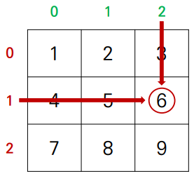
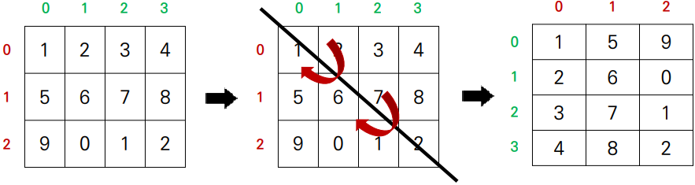
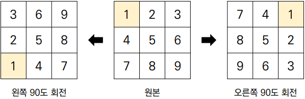

# algorithm 이차원 리스트
## 이차원 리스트
> 리스트를 원소로 가지는 리스트

```python
#          0  1  2    0  1  2    0  1  2
matrix = [[1, 2, 3], [4, 5, 6], [7, 8, 9]]
#             0          1          2

# 보기 좋게 변경 -> 행렬의 형태
matrix = [
#    0  1  2
    [1, 2, 3], # 0
    [4, 5, 6], # 1
    [7, 8, 9]  # 2
]
```
```python
print(matrix[1][2])
# 6
```


### 특정 값으로 초기화 된 이차원 리스트 만들기
- 직접 작성
```python
matrix1 = [[0, 0, 0], [0, 0, 0], [0, 0, 0], [0, 0, 0]]
matrix2 = [
    [0, 0, 0],
    [0, 0, 0],
    [0, 0, 0],
    [0, 0, 0]
]
```
- 반복문으로 작성
```python
n = 4 # 행
m = 3 # 열
matrix = []

# n번 반복
for _ in range(n):
    # 길이가 m인 리스트 추가
    matrix.append([0] * m)

print(matrix)
# [[0, 0, 0], [0, 0, 0], [0, 0, 0], [0, 0, 0]]
```
- 리스트 컴프리헨션으로 작성
```python
n = 4 # 행
m = 3 # 열

# [0]이 m번 들어간 리스트를 n번 반복
matrix = [[0] * m for _ in range(n)]

print(matrix)
# [[0, 0, 0], [0, 0, 0], [0, 0, 0], [0, 0, 0]]
```
### 입력 받기
- 행렬의 크기가 미리 주어지는 경우
```python
matrix = []

# 방법1
# 생성하고 싶은 행만큼 반복
for _ in range(8):
    # input을 리스트 형태로 한줄로 입력 받음
    line = list(input())
    # 입력 받은 line을 matrix에 추가
    matrix.append(line)

# 방법2 - 리스트 컴프리헨션
matrix = [list(input()) for _ in range(8)]
```
- 행렬의 크기가 입력으로 주어지는 경우
```python
n, m = map(int, input().split()) # 행:8 열:7
matrix = []

# 방법1
# 행만큼 반복
for _ in range(n):
    # 한 줄 입력받기때문에 열을 명시할 필요 없음
    line = list(map(int, input().split()))
    matrix.append(line)

# 방법2 - 리스트 컴프리헨션
n, m = map(int, input().split()) # 행:8 열:7
matrix = [list(map(int, input().split())) for _ in range(n)]
```
### 순회
- 이중 for문을 이용한 **행 우선 순회**
```python
matrix = [
    [1, 2, 3, 4],
    [5, 6, 7, 8],
    [9, 0, 1, 2]
]

# 행 탐색
for i in range(3):
    # 열 탐색
    for j in range(4):
        print(matrix[i][j], end=" ")
    print()

# 1 2 3 4
# 5 6 7 8
# 9 0 1 2
```
- 이중 for문을 이용한 **열 우선 순회**
```python
matrix = [
    [1, 2, 3, 4],
    [5, 6, 7, 8],
    [9, 0, 1, 2]
]

# 열 탐색
for i in range(4):
    # 행 탐색
    for j in range(3):
        print(matrix[j][i], end=" ")
    print()

# 1 5 9
# 2 6 0
# 3 7 1
# 4 8 2
```
### 전치
> 전치(transpose)란 행렬의 행과 열을 서로 맞바꾸는 것을 의미



```python
matrix = [
    [1, 2, 3, 4],
    [5, 6, 7, 8],
    [9, 0, 1, 2]
]

# 전치 행렬을 담을 이차원 리스트 초기화
# 행과 열의 크기가 반대
transposed_matrix = [[0] * 3 for _ in range(4)]

# 행 탐색
for i in range(4):
    # 열 탐색
    for j in range(3):
        # 행, 열 맞바꾸기
        transposed_matrix[i][j] = matrix[j][i]

"""
transposed_matrix = [
    [1, 5, 9],
    [2, 6, 0],
    [3, 7, 1],
    [4, 8, 2]
]
"""
```
### 회전
> 문제에서 이차원 리스트를 왼쪽, 오른쪽으로 90도 회전하는 경우 존재


- 왼쪽으로 90도 회전하기
```python
matrix = [
    [1, 2, 3],
    [4, 5, 6],
    [7, 8, 9]
]

n = 3
rotated_matrix = [[0] * n for _ in range(n)]

for i in range(n):
    for j in range(n):
        rotated_matrix[i][j] = matrix[j][n-i-1]

"""
rotated_matrix = [
    [3, 6, 9],
    [2, 5, 8],
    [1, 4, 7]
]
"""
```

- 오른쪽으로 90도 회전하기
```python
matrix = [
    [1, 2, 3],
    [4, 5, 6],
    [7, 8, 9]
]

n = 3
rotated_matrix = [[0] * n for _ in range(n)]

for i in range(n):
    for j in range(n):
        rotated_matrix[i][j] = matrix[n-j-1][i]

"""
rotated_matrix = [
    [7, 4, 1],
    [8, 5, 2],
    [9, 6, 3]
]
"""
```
## 잡담
점점 어려워지는 알고리즘 ..... 🔥