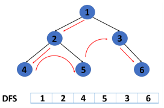

# algorithm 깊이우선탐색(DFS)
## 그래프 탐색 알고리즘
### 깊이우선탐색(Depth-First Search, DFS)
> 그래프의 깊이를 우선으로 탐색하기 위해 **스택**의 개념 활용


### 너비우선탐색(Breadth-First Search, BFS)
> 그래프의 너비를 우선으로 탐색하기 위해 **큐**의 개념 활용


## 깊이우선탐색(DFS)
> 시작 정점으로부터 갈 수 있는 하위 정점까지 가장 깊게 탐색하고, 더 이상 갈 곳이 없다면 마지막 갈림길로 돌아와서 다른 정점을 탐색하며 결국 모든 정점을 방문하는 순회 방법
### 특징
- 모든 정점을 방문할 때 유리하다. 따라서 경우의 수, 순열과 조합 문제에서 많이 사용한다.
- 너비우선탐색(BFS)에 비해 코드 구현이 간단하다. 단, 모든 정점을 방문할 필요가 없거나 최단 거리를 구하는 경우에는 너비우선탐색(BFS)
이 유리하다.
## DFS의 동작 과정
- DFS를 하기 전, 탐색을 진행할 **그래프**가 필요하다.
  - 그래프는 인접 행렬 혹은 인접 리스트 방식으로 표현할 수 있다.


```python
# 인접 행렬
graph = [
    [0, 1, 1, 0, 0, 0, 0],
    [1, 0, 0, 1, 1, 0, 0],
    [1, 0, 0, 0, 1, 1, 0],
    [0, 1, 0, 0, 0, 0, 0],
    [0, 1, 1, 0, 0, 0, 1],
    [0, 0, 1, 0, 0, 0, 0],
    [0, 0, 0, 0, 1, 0, 0]
]

# 인접 리스트
graph = [
    [1, 2],
    [0, 3, 4],
    [0, 4, 5],
    [1],
    [1, 2, 6],
    [2],
    [4]
]
```
- **각 정점을 방문했는지 여부를 판별**할 방문 체크 리스트가 필요하다.
  - 인덱스는 각 정점의 번호
  - 방문한 정점은 `True`, 방문하지 않은 정점은 `False`


```python
visited = [False] * n # n은 정점의 개수
```
## DFS의 동작 과정


## DFS의 구현
> 인접 리스트로 표현한 그래프 기준

```python
graph = [
    [1, 2],
    [0, 3, 4],
    [0, 4, 5],
    [1],
    [1, 2, 6],
    [2],
    [4]
]

# 방문 처리 리스트 만들기
visited = [False] * n 

def dfs(start):
    # 돌아갈 곳을 기록
    stack = [start] 
    # 시작 정점 방문 처리
    visited[start] = True 

    # 스택이 빌 때까지(돌아갈 곳이 없을때까지) 반복
    while stack:
        # 현재 방문 정점(후입선출)
        cur = stack.pop() 

        # 인접한 모든 정점에 대해
        for adj in graph[cur]: 
            # 아직 방문하지 않았다면
            if not visited[adj]: 
                # 방문 처리
                visited[adj] = True 
                # 스택에 넣기
                stack.append(adj) 
# 0번 정점에서 시작
dfs(0) 
```
## REFERENCE
[DFS, BFS](https://www.simplilearn.com/tutorials/data-structure-tutorial/graphs-in-data-structure)