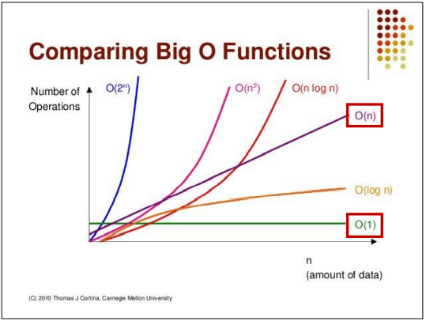
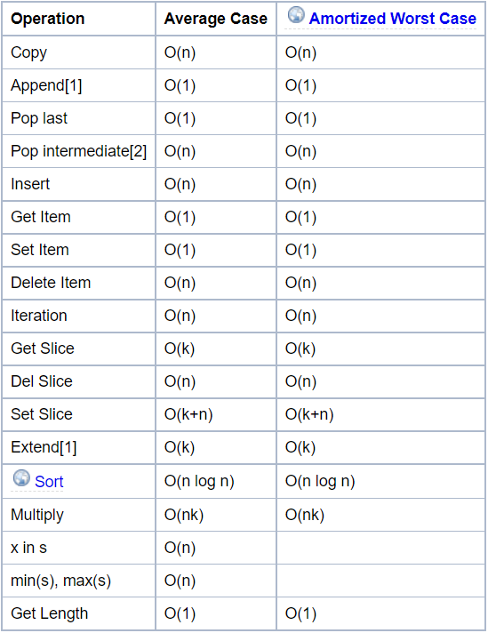

# algorithm 시간 복잡도 & 빅오 표기법
## 알고리즘의 시간 복잡도
> 시간복잡도(Time Complexitiy)란?
>
> 계산 복잡도 이론에서 시간 복잡도는 문제를 해결하는데 걸리는 시간과 입력의 함수 관계를 가리킨다.
>
> -> 알고리즘의 수행 시간
- 효율적인 알고리즘을 구현한다는 것은 바꾸어 말해 입력값이 커짐에 따라 증가하는 시간의 비율을 최소화한 알고리즘을 구성함을 말한다.
- 효율적인 알고리즘 방법을 고민하는 것 = 시간 복잡도를 고민하는 것
- 이 시간 복잡도는 주로 빅-오 표기법을 사용해 나타낸다.
## 빅오(Big-O) 표기법

### 빅오 알고리즘 예시
- O(1): 단순계산 -> a + b, 100 * 200
- O(logN): 이진탐색(Binary Search), 분할정복(Divide & Conquer)
- O(N): 리스트 순회, 1중 for 문
- O(NlogN): 높은 성능의 정렬(Merge/Quick/Heap Sort)
- O(N^2): 2중 리스트 순회, 2중 for 문
- O(N^3): 3중 리스트 순회, 3중 for 문
- O(2^N): 크기가 N인 집합의 부분 집합
- O(N!): 크기가 N인 순열
### 1초가 걸리는 입력의 크기
- O(N): 1억 (기준)
- O(NlogN): 500만
- O(N^2): 1만
- O(N^3): 500
- O(2^N):20
- O(N!): 10
### 리스트의 내장 함수, 메서드의 시간 복잡도 확인
> 파이썬에 있는 여러 내장 함수를 잘못 남용했다가는 시간 초과의 원인이 되기도 한다.

 
 - **Insert 연산, Del 연산, Remove 연산, 특정 원소의 여부를 검사하는 x in s 같은 경우** 모두 Time Complexity가 O(1)이 아니라 O(N)이다.
 - 이런 함수의 Time Complexity를 고려한 상태에서 더 효율적으로 코드를 바꾸면 시간 초과가 해결되는 경우도 있다.
 - 같은 Output을 만드는 알고리즘이라도 시간 복잡도에 따라 성능이 달라질 수 있고 시험에서 정답 여부가 갈리는 포인트가 된다.
## REFERENCE
- [Comparing Big O functions](http://devwebcl.blogspot.com/2016/12/big-o-comparison.html)
- [Python Wiki - TimeComplexity](https://wiki.python.org/moin/TimeComplexity)