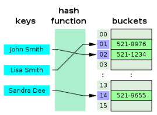

# algorithm 딕셔너리
## HashTable
> (Key, Value)로 데이터를 저장하는 자료구조 중 하나로 빠르게 데이터를 검색할 수 있는 자료구조


- 내부적으로 배열(버킷) 사용하여 데이터를 저장한다.
- 이러한 구조로 데이터를 저장하면 Key값으로 데이터를 찾을 때 해시 함수를 1번만 수행하면 되므로 매우 빠르게 데이터를 저장/삭제/조회할 수 있다.
- 해시테이블의 평균 시간복잡도는 O(1)이다.
  - 해시 함수 : 임의 길이의 데이터를 고정 길이의 데이터로 매핑하는 함수
  - 해시 : 해시 함수를 통해 얻어진 값
  - 파이썬의 딕셔너리(Dictionary)는 해시 함수와 해시 테이블을 이용하여 **삽입, 삭제, 수정, 조회 연산의 속도가 리스트보다 빠르다.**
## 딕셔너리 기본 문법
### 선언
- `변수 = { key1: value1, key2: value2 … }`
```python
a = {
    "name" : "kyle"
    "gender" : "male"
    "address" : "Seoul"
}
print(a)
# {'name' : 'kyle', 'gender' : 'male', 'address' : 'Seoul'}
```
### 삽입/수정
- `딕셔너리[key] = value`
  - 내부에 해당 key가 없으면 삽입, 있으면 수정
```python
a = {
    "name" : "kyle"
    "gender" : "male"
    "address" : "Seoul"
}
a["job"] = "coach"
print(a)
# {'name' : 'kyle', 'gender' : 'male', 'address' : 'Seoul', 'job' : 'coach'}
a["name"] = "justin"
# {'name' : 'justin', 'gender' : 'male', 'address' : 'Seoul', 'job' : 'coach'}
```
### 삭제
- `딕셔너리.pop(key)`
  - 내부에 존재하는 key에 대한 value 삭제 및 반환, 존재하지 않는 key에 대해서는 KeyError 발생
```python
a = {
    "name" : "kyle"
    "gender" : "male"
    "address" : "Seoul"
}
gender = a.pop("gender")
print(a)
print(gender)
# {'name' : 'kyle', 'address' : 'Seoul'}
# male
```
- `딕셔너리.pop(key, default)`
  - 두 번째 인자로 default(기본)값을 지정하여 KeyError 방지 가능
```python
a = {
    "name" : "kyle",
    "gender" : "male",
    "address" : "Seoul"
}
phone = a.pop("phone", "010-1234-5678")
print(a)
print(phone)
# {'name' : 'kyle', 'gender' : 'male', 'address' : 'Seoul'}
# 010-1234-5678
```
### 조회
- `딕셔너리[key]`
```python
a = {
    "name" : "kyle",
    "gender" : "male",
    "address" : "Seoul"
}
print(a["name"])
# kyle
```
- `딕셔너리.get(key, default)`
```python
a = {
    "name" : "kyle",
    "gender" : "male",
    "address" : "Seoul"
}
print(a.get["name"])
# kyle
```
## 딕셔너리 메서드
- `.keys()`
> 딕셔너리의 key 목록이 담긴 dict_keys 객체 반환
```python
a = {
    "name" : "kyle",
    "gender" : "male",
    "address" : "Seoul"
}
print(a.keys())
# dict_keys(['name', 'gender', 'address'])
```
- `.values()`
> 딕셔너리의 value 목록이 담긴 dict_keys 객체 반환
```python
a = {
    "name" : "kyle",
    "gender" : "male",
    "address" : "Seoul"
}
print(a.values())
# dict_values(['kyle', 'male', 'Seoul'])
```
- `.items()`
> 딕셔너리의 (key, value) 쌍 목록이 담긴 dict_items 객체 반환
```python
a = {
    "name" : "kyle",
    "gender" : "male",
    "address" : "Seoul"
}
print(a.items())
# dict_items([('name', 'kyle'), ('gender', 'male'), ('address', 'Seoul')])
```
## 리스트 vs 딕셔너리 시간복잡도
|연산 종류|닥셔너리|리스트|
|---|---|---|
|Get Item|O(1)|O(1)|
|Insert Item|O(1)|O(1) or O(N)|
|Update Item|O(1)|O(1)|
|Delete Item|O(1)|O(1) or O(N)|
|Search Item|O(1)|O(N)|
## REFERENCE
[해시 테이블](https://ko.wikipedia.org/wiki/%ED%95%B4%EC%8B%9C_%ED%85%8C%EC%9D%B4%EB%B8%94)