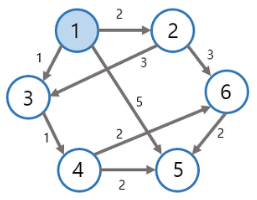
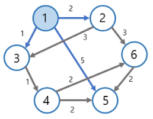
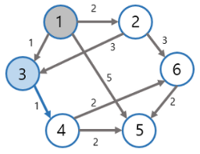
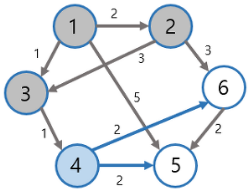
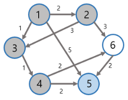
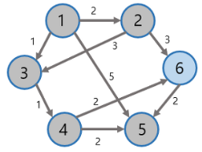

# algorithm 다익스트라
> 하나의 출발 노드로부터 다른 모든 노드까지의 최단거리를 구하는 알고리즘
>
> 매번 비용이 가장 적은 노드를 선택하는 과정을 반복하기때문에 그리디 알고리즘으로 분류

## 동작과정
1. 출발 노드를 설정한다.
2. 최단거리 테이블을 초기화한다.
  - 다른 모든 노드로 가는 최단거리를 무한으로 초기화한다.
3. 방문하지 않은 노드 중에서 최단거리가 가장 짧은 노드를 선택한다.
  - 이때 선택된 노드의 최단거리는 확정된다.
4. 해당 노드를 거쳐 다른 노드로 가는 비용을 계산하여 최단 거리 테이블을 갱신한다.
5. 3~4 과정을 반복한다.

- 출발 노드 : 1



|노드|1|2|3|4|5|6|
|----|----|----|----|----|----|----|
|거리|0|INF|INF|INF|INF|INF|

- 방문하지 않은 노드 중 가장 거리가 짧은 노드 : 1



|노드|1|2|3|4|5|6|
|----|----|----|----|----|----|----|
|거리|0|**2**|**1**|INF|**5**|INF|

- 방문하지 않은 노드 중 가장 거리가 짧은 노드 : 3



|노드|1|2|3|4|5|6|
|----|----|----|----|----|----|----|
|거리|0|2|1|**2**|5|INF|

- 방문하지 않은 노드 중 가장 거리가 짧은 노드 : 2


|노드|1|2|3|4|5|6|
|----|----|----|----|----|----|----|
|거리|0|2|1|2|5|**5**|

- 방문하지 않은 노드 중 가장 거리가 짧은 노드 : 4



|노드|1|2|3|4|5|6|
|----|----|----|----|----|----|----|
|거리|0|2|1|2|**4**|**4**|

- 방문하지 않은 노드 중 가장 거리가 짧은 노드 : 5



|노드|1|2|3|4|5|6|
|----|----|----|----|----|----|----|
|거리|0|2|1|2|4|4|

- 방문하지 않은 노드 중 가장 거리가 짧은 노드 : 6



|노드|1|2|3|4|5|6|
|----|----|----|----|----|----|----|
|거리|0|2|1|2|4|4|

## 순차탐색
> 방문하지 않은 노드 중 최단 거리가 가장 짧은 노드를 선택하기 위해 순차 탐색을 이용
>
> 시간 복잡도 : O(N^2) -> 총 O(N)번에 걸쳐 가장 짧은 노드를 매번 선형탐색하고 현재 노드와 연결된 노드를 매번 일일히 확인해야하기때문

```python
import sys

input = sys.stdin.readline
INF = int(1e9) # 10억을 설정하여 무한을 의미

# 노드의 개수, 간선의 개수 입력받기
n, m = map(int, input().split())
# 시작 노드 번호 입력받기
start = int(input())
# 방문 체크
visited = [False] * (n+1)
# 최단거리 테이블
distance = [INF] * (n+1)

# 노드 연결정보
graph = [[] for i in range(n+1)]

for _ in range(m):
    # a 노드에서 b 노드로 가는 비용 c
    a, b, c = map(int, input().split())
    graph[a].append((b, c))

def get_smallest_node():
    min_value = INF
    index = 0
    for i in range(1, n+1):
        if distance[i] < min_value and not visited[i]:
            min_value = distance[i]
            index = i
    return index

# 다익스트라 알고리즘
def dijkstra(start):
    # 시작 노드
    distance[start] = 0
    visited[start] = True
    # 출발노드와 인접노드에 대해 최단거리 테이블 갱신
    for j in graph[start]:
        distance[j[0]] = j[1]
    
    # 모든 노드에 대해 반복
    for i in range(n-1):
        # 현재 최단거리가 가장 짧은 노드를 꺼내서 방문처리
        now = get_smallest_node()
        visited[now] = True
        # 선택된 노드와 연결된 다른 노드 확인
        for j in graph[now]:
            # 선택된 노드를 통해 가는 비용을 다시 계산
            # 선택된 노드의 비용 + 연결된 노드로 가는 비용
            cost = distance[now] + j[1]
            # 선택된 노드를 거쳐서 가는 비용이 더 짧은 경우
            if cost < distance[j[0]]:
                distance[j[0]] = cost # 최단거리 테이블 갱신

# 다익스트라 알고리즘수행
dijkstra(start)

# 모든 노드로 가기 위한 최단 거리 출력
for i in range(1, n+1):
    # 도달할 수 없는 경우
    if distance[i] == INF:
        print("infinity")
    else:
        print(distance[i])
```

## 최소힙
> 방문하지 않은 노드 중 최단거리가 가장 짧은 노드를 선택하기 위해 최소 힙 사용
>
> heapq의 원소로 튜플을 받으면 튜플의 첫번째 원소를 기준으로 우선순위 큐 구성, **(거리, 노드 번호)** 순서대로 튜플 데이터를 구성해 우선순위 큐에 넣으면 **거리순으로 정렬**

```python
import heapq
import sys

input = sys.stdin.readline
INF = int(1e9) # 10억을 설정하여 무한을 의미

# 노드의 개수, 간선의 개수를 입력받기
n, m = map(int, input().split())
# 시작 노드 번호 입력받기
start = int(input())
# 최단거리 테이블
distance = [INF] * (n+1)

# 노드 연결정보
graph = [[] for i in range(n+1)]

for _ in range(m):
    # a 노드에서 b 노드로 가는 비용 c
    a, b, c = map(int, input().split())
    graph[a].append((b, c))
    
# 다익스트라 알고리즘
def dijkstra(start):
    q = []
    # 시작 노드
    heapq.heappush(q, (0, start))
    distance[start] = 0

    while q:
        # 가장 최단거리가 짧은 노드에 대한 정보 꺼내기
        dist, now = heapq.heappop(q)

        # 이미 처리된 노드였다면 무시
        # 별도의 visited 테이블 필요 없이 최단거리테이블을 이용해 방문여부 확인
        if distance[now] < dist:
            continue
        # 선택된 노드와 인접한 노드 확인
        for i in graph[now]:
            cost = dist + i[1]
            # 선택된 노드를 거쳐 이동하는 것이 더 빠른 경우
            if cost < distance[i[0]]:
                distance[i[0]] = cost
                heapq.heappush(q, (cost, i[0]))
                
# 다익스트라 알고리즘수행
dijkstra(start)

# 모든 노드로 가기 위한 최단 거리를 출력
for i in range(1, n+1):
  # 도달할 수 없는 경우
  if distance[i] == INF:
    print("infinity")
  else:
    print(distance[i])
```