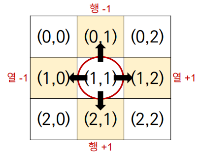
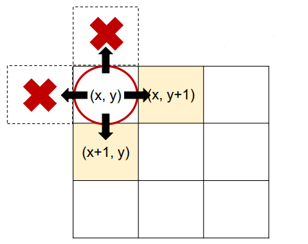

# algorithm 완전탐색1
## 무식하게 다해보기(Brute-force)
> 모든 경우의 수를 탐색하여 문제를 해결하는 방식
- 브루트포스(Brute-force)라고도 하며, 무식하게 밀어붙인다는
뜻이다.
- 가장 단순한 풀이 기법이며, 단순 조건문과 반복문을 이용해서 풀
수 있다.
- 복잡한 알고리즘 보다는, 아이디어를 어떻게 코드로 구현할 것인지가 중요하다.
## 델타 탐색 (Delta Search)
> (0, 0)에서부터 이차원 리스트의 모든 원소를 순회하며 (완전탐색)
각 지점에서 상하좌우에 위치한 다른 지점을 조회하거나 이동하는 방식
`델타(delta)` : 행과 열의 변량인 -1, +1

- 델타 값을 이용해 상하좌우로 이동하기
```python
dx = [-1, 1, 0, 0]
dy = [0, 0, -1, 1]

# 방법1
# 상(x-1, y)
nx = x + dx[0]
ny = y + dy[0]
# 하(x+1, y)
nx = x + dx[1]
ny = y + dy[1]
# 좌(x, y-1)
nx = x + dx[2]
ny = y + dy[2]
# 우(x, y+1)
nx = x + dx[3]
ny = y + dy[3]

# 방법2 - for문
# 상하좌우
for i in range(4):
nx = x + dx[i]
ny = y + dy[i]
```

- 상하좌우로 이동 후 범위를 벗어나지 않는지 확인 및 갱신하기

```python
# 1. 델타값을 이용해 상하좌우 이동
for i in range(4):
    nx = x + dx[i]
    ny = y + dy[i]
# 2. 범위를 벗어나지 않으면 갱신
if 0 <= nx < 3 and 0 <= ny < 3:
    x = nx
    y = ny
```

- 8방향 델타값
```python
# 상, 하, 좌, 우, 좌상, 좌하, 우상, 우하
dx = [-1, 1, 0, 0, -1, 1, -1, 1]
dy = [0, 0, -1, 1, -1, -1, 1, 1]
```