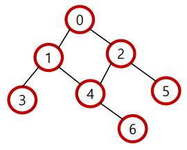
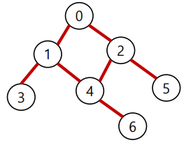
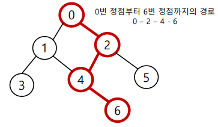
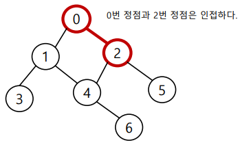
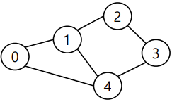
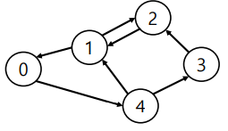
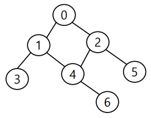
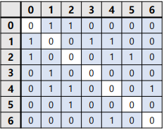
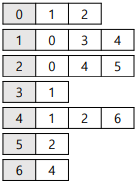

# algorithm 그래프
## 그래프
> 정점(Vertex)과 이를 연결하는 간선(Edge)들의 집합으로 이루어진 비선형 자료구조
>
> ex) 소셜 네트워크, 지하철 노선도

### 그래프 관련 용어
- `정점(Vertex)` : 간선으로 연결되는 객체이며, 노드(Node)라고도 한다.

- `간선(Edge)` : 정점 간의 관계(연결)를 표현하는 선을 의미한다.

- `경로(Path)` : 시작 정점부터 도착 정점까지 거치는 정점을 나열한 것을 의미한다.

- `인접(Adjacency)` : 두 개의 정점이 하나의 간선으로 직접 연결된 상태를
의미한다.


## 그래프의 종류
### 무방향 그래프(Undirected graph)
- 간선의 방향이 없는 가장 일반적인
그래프
- 간선을 통해 양방향의 정점 이동
가능
- 차수(Degree) : 하나의 정점에 연결된 간선의 개수
- 모든 정점의 차수의 합 = 간선 수 x 2


### 유방향 그래프 (Directed graph)
- 간선의 방향이 있는 그래프
- 간선의 방향이 가리키는 정점으로 이동
가능
- 차수(Degree)
  - 진입 차수(In-degree) : 외부 정점에서 한 정점으로 들어오는 간선의 수
  - 진출 차수(Out-degree) : 한 정점에서 외부 정점으로 나가는 간선의 수



## 그래프의 표현
### 인접 행렬(Adjacent matrix)
> 두 정점을 연결하는 간선이 없으면 0, 있으면 1을 가지는 행렬로 표현하는 방식

예제)



```python
"""
입력
0 1
0 2
1 3
1 4
2 4
2 5
4 6
"""
# 인접 행렬 만들기
n = 7 # 정점 개수
m = 7 # 간선 개수

graph = [[0] * n for _ in range(n)]

for _ in range(m):
    v1, v2 = map(int, input().split())
    graph[v1][v2] = 1
    graph[v2][v1] = 1
"""
인접 행렬 결과
graph = [
    [0, 1, 1, 0, 0, 0, 0],
    [1, 0, 0, 1, 1, 0, 0],
    [1, 0, 0, 0, 1, 1, 0],
    [0, 1, 0, 0, 0, 0, 0],
    [0, 1, 1, 0, 0, 0, 1],
    [0, 0, 1, 0, 0, 0, 0],
    [0, 0, 0, 0, 1, 0, 0]
]
"""
```

### 인접 리스트(Adjacent list)
> 리스트를 통해 각 정점에 대한 인접 정점들을 순차적으로 표현하는 방식

예제)



```python
"""
입력
0 1
0 2
1 3
1 4
2 4
2 5
4 6
"""
# 인접 리스트 만들기
n = 7 # 정점 개수
m = 7 # 간선 개수

graph = [[] for _ in range(n)]

for _ in range(m):
    v1, v2 = map(int, input().split())
    graph[v1].append(v2)
    graph[v2].append(v1)
"""
인접 리스트 결과
graph = [
    [1, 2],
    [0, 3, 4],
    [0, 4, 5],
    [1],
    [1, 2, 6],
    [2],
    [4]
]
"""
```
### 인접 행렬 vs 인접 리스트
**`인접 행렬`은 직관적이고 만들기 편하지만, 불필요하게 공간이 낭비된다.**

**`인접 리스트`는 연결된 정점만 저장하여 효율적이므로 자주 사용된다.**