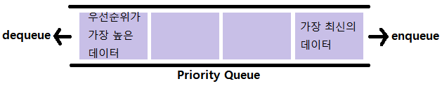
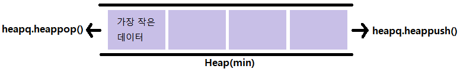

# algorithm 힙, 셋
## 힙(Heap)
> 최대값 또는 최소값을 빠르게 찾아내도록 만들어진 데이터구조
>
> 완전 이진 트리의 형태로 느슨한 정렬 상태를 지속적으로 유지
>
> 힙 트리에서는 중복 값을 허용
### 우선순위 큐(Priority Queue)
> 우선순위(중요도, 크기 등 순서 이외의 기준)를 기준으로 가장 우선순위가 높은 데이터가 가장 먼저 나가는 방식



- 우선순위 큐를 구현하는 방법
  - 배열(Array)
  - 연결 리스트(Linked List)
  - 힙(Heap)

- 우선순위 큐 구현 별 시간 복잡도

|연산 종류|Enqueue(추가)|Dequeue(제거)|
|---|---|---|
|배열|O(1)|O(N)|
|정렬된 배열|O(N)|O(1)|
|연결리스트|O(1)|O(N)|
|정렬된 연결리스트|O(N)|O(1)|
|힙|O(log N)|O(log N)|

### 힙이 사용되어야 할 때
- 데이터가 지속적으로 정렬되어야 하는 경우
- 데이터에 삽입/삭제가 빈번할 때
### 파이썬의 heapq 모듈
- Minheap(최소힙)으로 구현되어 있다.
- 삽입, 삭제, 수정, 조회 연산의 속도가 리스트보다 빠르다.
```python
import heapq
```
### 큐 vs 힙


- 가장 오래된 데이터부터 가장 최신의 데이터 차례대로 리스트에 들어간다.
- 가장 오래된 데이터를 뺄 수 있고, 가장 최신의 데이터를 넣을 수 있다.


- 데이터를 넣으면 가장 작은 데이터가 가장 왼쪽으로 정렬된다.
- 나머지 값들은 순서대로 정렬되지 않는다.
- 가장 작은 데이터를 뺄 수 있다.

### 힙 메서드
```python
heapq.heapify( )
# 최소값이 0번째 인덱스에 위치한 자료구조로 생성
heapq.heappop(heap)
# heap의 맨 왼쪽에 위치한 최소값 제거
heapq.heappush(heap, item)
# heap에 item을 추가하면 최소값을 맨 왼쪽으로 정렬
```

## 셋(Set)
> 수학에서의 '집합'을 나타내는 구조로 파이썬에서는 기본적으로 제공되는 데이터 구조이다.
### 힙이 사용되어야 할 때
- 데이터의 중복이 없어야 할 때 (고유값들로 이루어진 데이터가 필요할때)
- 정수가 아닌 데이터의 삽입/삭제/탐색이 빈번히 필요할때

### 셋 연산의 시간 복잡도

|연산 종류|Enqueue(추가)|
|---|---|
|탐색|O(1)|
|제거|O(1)|
|합집합|O(N)|
|교집합|O(N)|
|차집합|O(N)|
|대칭 차집합|O(N)|

### 셋의 연산
```python
set.add()
# set에 요소 추가
set.remove()
# set에서 요소 삭제
set1 + set2
# 합집합
set1 - set2
# 차집합
set1 & set2
# 교집합
set1 & set2
# 대칭 차집합
```