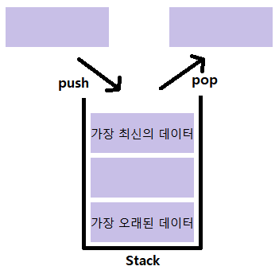
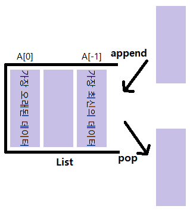
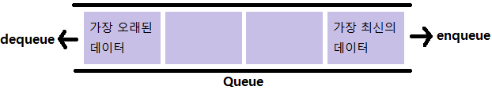
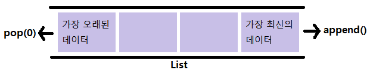
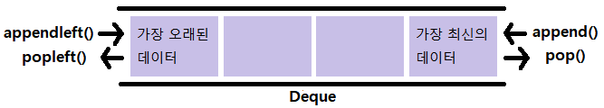

# algorithm 스택 & 큐
## 스택(Stack)
> Stack은 쌓는다는 의미로, 마치 접시를 쌓고 빼듯이 데이터를 한쪽에서만 넣고 빼는 자료구조
>
> 가장 마지막에 들어온 데이터가 가장 먼저 나가므로 LIFO(Last-in First-out, 후입선출) 방식


### 스택을 써야하는 이유
- 뒤집기, 되돌리기, 되돌아가기 가능
  - ex) 브라우저 히스토리, ctrl + z, 단어 뒤집기
- 마무리되지 않은 일 임시 저장 가능
  - ex) 괄호 매칭, 함수 호출, 백트래킹(미로찾기, 체스 등), DFS(깊이 우선 탐색)
### 파이썬에서의 스택
> 파이썬은 리스트(list)로 스택을 간편하게 사용할 수 있다.


- `append()` : 리스트의 마지막 요소 값 추가
- `pop()` : 리스트의 마지막 요소 값을 제거
## 큐(Queue)
> Queue는 한 쪽 끝에서 데이터를 넣고, 다른 한 쪽에서만 데이터를 뺄 수 있는 자료구조
>
> 가장 먼저 들어온 데이터가 가장 먼저 나가므로 FIFO(First-in First-out, 선입선출) 방식


### 파이썬에서의 큐
> 파이썬은 리스트(list)로 큐를 간편하게 사용할 수 있다.


- `append()` : 리스트의 마지막 요소 값 추가
- `pop(0)` : 리스트의 첫번째 요소 제거
#### 단점
- 데이터를 뺄 때 큐 안에 있는 데이터가 많은 경우 비효율적
- 맨 앞의 데이터가 빠지면서 리스트의 인덱스가 하나씩 당겨지기 때문이다.
### 덱(Deque, Double-Ended Queue)
> 양 방향으로 삽입과 삭제가 자유로운 큐
>
> 덱은 양 방향 삽입, 추출이 모두 큐보다 훨씬 빠르다.


- `append()` : 리스트의 마지막 요소 값 추가
- `pop()` : 리스트의 마지막 요소 값 제거
- `appendleft()` : 리스트의 첫번째 요소 값 추가
- `popleft()` : 리스트의 첫번째 요소 값 제거
```python
from collections import deque
# collections 모듈을 사용해서 deque을 활용할 수 있다.
```
## 잡담

```

누가 이 짤을 보내줬는데 너무 웃기고, 스택과 큐의 개념에 딱 적당한 짤이라서 가져와봤다.