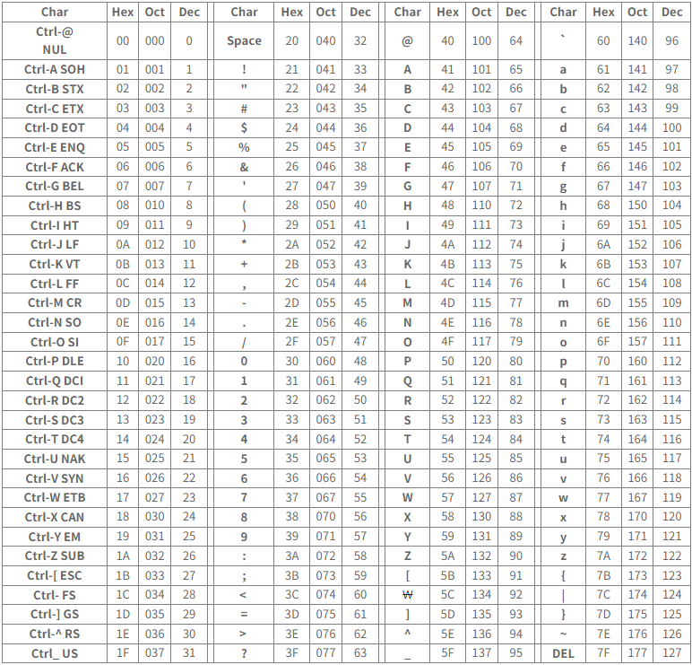

# algorithm 문자열
## 문자열 슬라이싱

```python
s = 'abcdefghi'
s[2:5:2] # 'ce'
s[-6:-1:3] # dg
s[2:5:-1] # '' 역순이면 start, end도 역순이여야함!
s[5:2:-1] # 'fed'
```
💡 꿀TIP! **순차 idex = 문자열 길이 - 역순 index**

## 문자열 메서드
### `.split(기준 문자)`
- 문자열을 일정 기준으로 나누어 리스트로 반환
- 괄호 안에 아무것도 넣지 않으면 자동으로 공백을 기준으로 설정
```python
word = "appe, banana, orange, grape"
print(word.split(","))
# ['apple', 'banana', 'orange', 'grape']
```
### `.strip(제거할 문자)`
- 문자열의 양쪽 끝에 있는 특정 문자를 모두 제거한 새로운 문자열 반환
- 괄호 안에 아무것도 넣지 않으면 자동으로 공백을 제거 문자로 설정
- 제거할 문자를 여러 개 넣으면 해당하는 모든 문자들을 제거
```python
word = "aHello Worlda"
print(word.strip("a"))
# Hello Wrold
```
### `.find(찾는 문자)`
- 특정 문자가 처음으로 나타나는 위치(인덱스)를 반환
- 찾는 문자가 없다면 -1을 반환
```python
word = "apple"
print(word.find("p"))
# 1
```
### `.index(찾는 문자)`
- 특정 문자가 처음으로 나타나는 위치(인덱스)를 반환
- 찾는 문자가 없다면 오류 발생
```python
word = "apple"
print(word.find("p"))
# 1
```
### `.count(개수를 셀 문자)`
- 문자열에서 특정 문자가 몇 개인지 반환
- 문자 뿐만 아니라, 문자열의 개수도 확인 가능
```python
word = "banana"
print(word.count("na"))
# 2
```
### `.replace(기존 문자, 새로운 문자)`
- 문자열에서 기존 문자를 새로운 문자로 수정한 새로운 문자열 반환
- 특정 문자를 빈 문자열("")로 수정하여 마치 해당 문자를 삭제한 것 같은 효과 가능
```python
word = "Hello World"
print(word.replace("Hello", "Hi"))
# Hi World
```
### `삽입할 문자.join(iterable)`
- iterable의 각각 원소 사이에 특정 문자를 삽입한 새로운 문자열 반환
- 공백 출력, 콤마 출력 등 원하는 출력 형태를 위해 사용
```python
word = "HelloWorld"
print(".".join(word))
# H.e.l.l.o.W.o.r.l.d
```
## 아스키(ASCII) 코드
> 컴퓨터는 문자를 아스키 코드로 저장한다.


### `ord(문자)`
- 문자를 아스키코드로 변환하는 내장함수
```python
print(ord("A"))
# 65
```
### `chr(아스키코드)`
- 아스키코드를 문자로 변환하는 내장함수
```python
print(chr(65))
# A
```
## REFERENCE
[아스키 코드표](http://cafe.daum.net/flowlife)