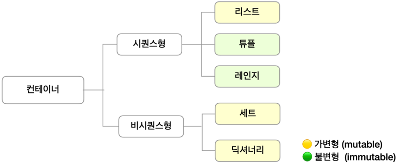
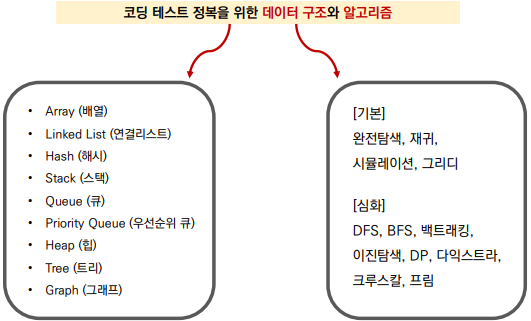

# algorithm 인트로 & 입출력
## 데이터 구조 & 알고리즘
- 파이썬의 기본 데이터 구조




## 입력 & 출력
### 입력 활용 예시 (input)
#### `input()` : 사용자의 입력 한 줄을 문자열로 받는 함수
```python
word = input()
```
#### `map(function, iterable)` : 파이썬의 내장 함수
- map으로 입력 받는 과정 1
```python
a, b = map(int, input().split())
>>> 1 2
```

- map으로 입력 받는 과정 2
```python
a, b = map(int, "1 2".split())
```

- map으로 입력 받는 과정 3
```python
a, b = map(int, ["1", "2"])
```

### 출력 활용 예시 (print)
#### `print()` : 데이터를 출력할 수 있는 함수이며, 자동적으로 줄 바꿈 발생
```python
print("happy")
print("hacking")
>>> happy
>>> hacking
```
- 콤마(,)를 이용해 여러 인자를 넣으면 공백을 기준으로 출력
```python
a = "happy"
b = "hacking"

print(a, b)
>>> happy hacking
```
- end, sep 옵션을 사용하여 출력 조작하기
```python
a = "happy"
b = "hacking“

print(a, end="@")
print(b)
>>> happy@hacking

print(a, b, sep="\n")
>>> happy
>>> hacking
```