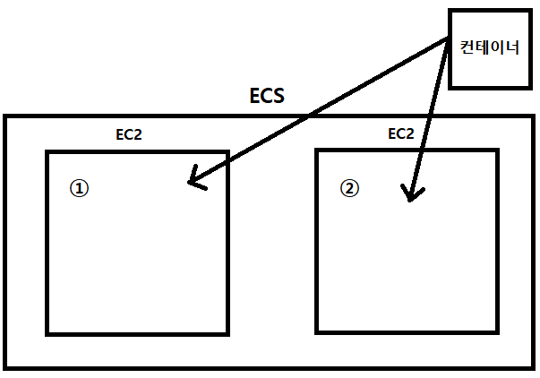
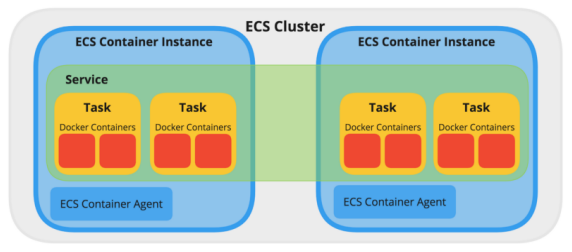
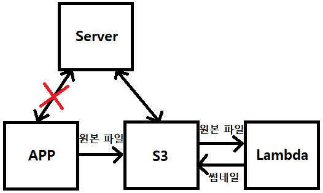
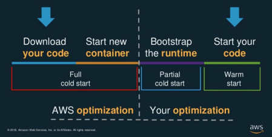

# AWS 컴퓨팅 파워
## AWS EC2 (Elastic Compute Cloud)
- 가장 기본적인 형태의 클라우드 컴퓨팅 (= 클라우드 컴퓨터 한 대)
- CPU, 메모리, 저장소(스토리지), 네트워킹 용량을 원하는데로 설정할 수 있다.
- 플랜
  - 온디맨드: 선결제 금액이나 장기 약정 없이 저렴하고 유연하게 Amazon EC2를
사용하기 원하는 사용자
  - 스팟 인스턴스: 시작 및 종료 시간이 자유로운 애플리케이션
  - Saving Plans: 1년 또는 3년 기간의 일정 사용량 약정을 조건으로 EC2 및 Fargate
사용량에 대해 저렴한 요금을 제공하는 유연한 요금
## AWS Elastic Beanstalk
- AWS 클라우드에서 애플리케이션을 신속하게 배포하고 관리할 수 있는 서비스
(애플리케이션 코드를 업로드하기만 하면 작동)
- Elastic Beanstalk = EC2 + 배포 버전 관리 (롤백) + Elastic Load Balancer +
모니터링 + 로그 트래킹 + 오토 스케일링 (EC2에 설정해줘야하는 VPC와 보안그룹 모두 합쳐서 사용 할 수 있도록 함)
- 다양한 언어 지원: .NET / PHP / Java / Ruby / Node.js / Python / Docker / Go
## AWS ECR (Elastic Container Registry)
- Amazon Elastic Container Registry(Amazon ECR)는 안전하고 확장 가능하고 신뢰할 수 있는 AWS 관리형 컨테이너 이미지 레지스트리 서비스
- 도커 이미지를 저장하는 장소
## AWS ECS (Elastic Container Service)
- AWS에서 제공하는 컨테이너 오케스트레이션 서비스로 여러 어플리케이션 컨테이너를 쉽고 빠르게 실행하고, 컨테이너를 적절하게 분배 및 확장 & 축소 할 수 있도록 도와주는 서비스 (이용자의 사용 시간에 따라)
- AWS EC2 와 AWS Fargate 중 원하는 환경에서 실행 가능

> EC2 두대가 있다고 생각하면 ECS는 컨테이너를 각각의 EC2에 분배하는 역할을 한다. 만약 새벽시간이라 필요가 없다면 2번 EC2는 없애고 1번 EC2에 컨테이너를 옮겨준다.

- 용어
  - Task Definition: 컨테이너의 이미지, CPU/메모리 리소스 할당 설정, port 매핑,
volume 설정
  - Task: Task 안에는 한 개 이상의 컨테이너들이 포함되어 있으며 ECS에서
컨테이너를 실행하는 최소 단위는 Task이다. (인스턴스화)
  - Service: Task 들의 Life cycle 을 관리하며, 오토스케일링과 로드밸런싱을 관리
  - Cluster: Task 가 배포되는 Container Instance 들은 논리적인 그룹

## AWS Fargate
- Fargate를 사용하면 더 이상 컨테이너를 실행하기 위해 가상 머신의 클러스터를
프로비저닝, 구성 또는 조정할 필요가 없다. 따라서 서버 유형을 선택하거나,
클러스터를 조정할 시점을 결정하거나, 클러스터 패킹을 최적화할 필요가 없다.
- 이전에는 컨테이너를 실행하기 위해서는 컨테이너를 실행할 Instance(EC2)를
실행시켜야하였지만, AWS Fargate는 이러한 수고를 덜어준다.

## AWS Lambda
- 서버 없이도 코드를 실행시킬 수 있는 서버리스 컴퓨팅 서비스
- 코드를 돌리기위한 리소스를 임의로 지정할 수 있으며, 사용 리소스 x 사용 시간에 따라 과금이 된다. (ex. 메모리 용량 / 코어 갯수)
- 최대 30분 / 최대 10GB / 최대 6개의 Core
- 짧은 시간동안만 사용 가능한 점이 단점이다.
- 사용 예시
  - 비동기 처리 (이미지 썸네일 생성)
  - 예측이 불가능 한 리소스 사용 (대용량 처리 / 머신러닝)

### Cold Start / Warm Start

- 기본적으로 EC2와 같은 인스턴스보다는 Latency가 높다. -> 일반적인 서버에서는 사용을 하지 않고 배치성으로 사용한다.
- 콜드 스타트: 배포 패키지의 크기와 코드 실행 시간 및 코드의 초기화 시간에 따라 새
실행 환경으로 호출을 라우팅할 때 지연 시간이 발생하는 람다 호출 시작
(겨울에 자동차 시동 걸때에서 유래 됨)
- 5분이 지나면 aws 서비스 내에 있는 컨테이너가 꺼진다. (그 5분이 warm한 상태)
- 계속 warm하게 유지하기 위해선 지속적으로 사용해야 하는 방법밖에 없다.

## AWS Lambda - Serverless
- AWS, Azure, GCP 등의 클라우드 컴퓨팅에서 서버리스 서비스를 쉽게 사용할 수 있도록 도와주는 오픈소스 프레임 워크
- 사용 가능 서버
  - Node 계열 – ExpressJS, NestJS 등..
  - Java 계열 – Spring(Spring Cloud Function),
  - Python 계열 – FastAPI, Flask 등..
- 소규모 / 이용자가 많지 않은 서비스에서 가격 효율적으로 이용 가능
