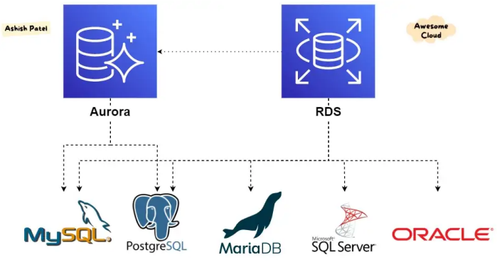
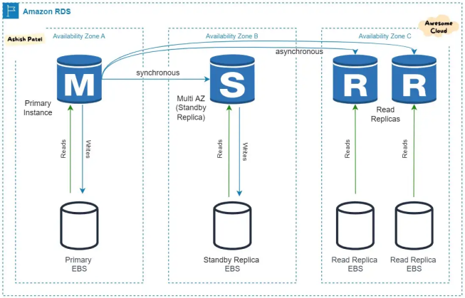
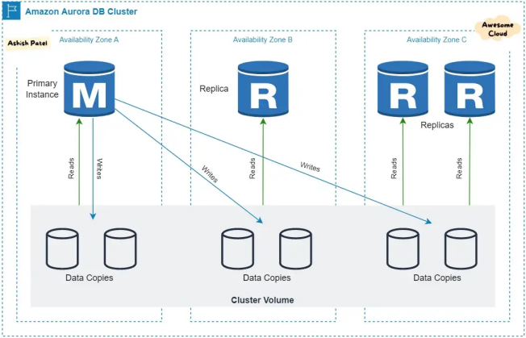

# AWS database
## AWS RDS (Relational Database Service)
- 클라우드에서 관계형 데이터베이스를 간편하게 설정, 운영 및 확장할 수 있는 관리형 서비스 모음
- 주요 기능
  - RDS 백업: 자동 백업, DB 스냅샷
  - 멀티 AZ: 두개 이상의 AZ에 걸쳐 DB를 구축하고 원본과 다른 DB(standby)를 자동으로 동기화(Snyc), 읽기 전용 복제본
  - CloudWatch 연동: DB 인스턴스의 모니터링 (디테일 모니터링, CPU, Storage 사용량, 그 이외의 Error Log)

- RDS DB 엔진
  - PostgreSQL : 오픈 소스 관계형 데이터베이스가 되었고, 비즈니스 및 모바일 어플리케이션을 실행할 때 사용
  - MySQL : 세계적으로 가장 많이 사용되는 오픈 소스 관계형 데이터베이스로, Amazon RDS를 통해 비용 효율적이고 크기 조정이 가능한 MySQL 서버를 몇 분 안에 생성할 수 있다. 백업, 소프트웨어 패치, 모니터링, 확장 & 축소, 복제 같은 시간이 걸리는 작업은 모두 관리되므로 사용자는 개발에만 집중할 수 있다.
  - MariaDB : MySQL을 개발한 개발자가 만든 오픈 소스 관계형 데이터베이스로서 MySQL과 동일하게 Amazon RDS를 통해 효율적인 MariaDB 데이터베이스를 생성할 수 있고, 모든 시간 소모적 작업을 대신 처리해준다.
  - Oracle Database : Amazon RDS를 사용해 클라우드에서 손쉽게 배포, 설정, 운영 할 수 있는 완전 관리형 상용 데이터베이스로, 시간 소모적인 작업을 모두 대신 처리해주어 사용자는 개발에만 몰두할 수 있다.
  - SQL Server : Microsoft에서 개발한 관계형 데이터베이스 관리 시스템으로 Amazon RDS를 통해 손쉽게 배포, 운영, 확장이 가능하고, RDS는 '라이선스 포함' 라이선스 모델을 지원해, 따로 Microsoft SQL Server 라이선스를 구매할 필요가 없다.

## AWS Aurora
- Aurora 플랫폼은 MySQL 및 PostgreSQL과 호환되는 AWS만의 완전 관리형 관계형 데이터베이스로써 기존의 소스를 커스터마이징하여 AWS에 최적화 시킨 분산형 저장 아키텍처
- RDS에서 사용하는 EBS 대신 NVMe SSD 드라이브 위에 구축되어 훨씬 빠름
(MySQL보다 최대 5배 많은 처리량과 PostgreSQL보다 3배 많은 처리량)
  - EBS : EC2 instance 에 직접 붙혀서 사용하는 볼륨형 스토리지
  - NVMe SSD : 기존 일반 SSD보다 속도가 약 6배 빨라진 차세대 저장매체
- 서버리스 기능과 Auto Scaling을 기본적으로 지원

### AWS RDS VS AWS Aurora

- 자신의 EBS로 데이터를 쌓고 쌓은 데이터를 EBS로 미러링 한 다음 Replication을 통해 Replica로 데이터를 보내고 Replica는 받는 데이터를 자신의 스토리지로 쌓는다.
- Read replica도 binlog를 받아서 처리해야하기 때문에 Read 뿐만 아니라 Write도 같이 처리해야한다는 단점이 있다.

- 4/6 쿼럼을 사용해서 스토리지에 저장하며 Replica로 보내는 것은 frm 및 redo log이다. 따라서 network bandwidth 사용자도 적으며 빠르게 변경분을 저장하고 반영할 수 있다.
- Read Replica가 binlog를 읽어서 싱크를 맞추는 것이 아니라 redo log를 받아서 동기화 하기 때문에 read에만 집중할 수 있다.

## AWS DynamoDB
- 완전관리형 NoSQL 데이터베이스 서비스로서 원활한 확장성과 함께 빠르고 예측 가능
한 성능을 제공
- 서버리스이므로, 따로 유지비용 없이 사용한 만큼한 지불
- 보조 인덱스를 통한 빠른 조회를 지원(쿼리 가능)
- NoSQL 특성상 관계가 없기 때문에 일반적으로 데이터를 찾기에는 인덱싱이 없으면
속도가 느려지지만 그 부분을 해결해줍니다.
- 서버리스(람다) 서버와의 궁합이 매우 잘 맞는다.

## AWS Elasticache
- 클라우드에서 분산된 인 메모리 데이터 스토어 또는 캐시 환경을 손쉽게 설정, 관리 및
확장할 수 있는 웹 서비스
- 밀리초 미만의 응답 시간을 필요로 하는 가장 까다로운 애플리케이션을 위한 완전관리형 Redis와 및 Memcached을 지원한다.
- 캐시 노드 실패에서 자동 감지 및 복구
- 사용 예시: 캐싱 / 세션 스토어 / AI ML 모델 / 실시간성이 높은 작업들