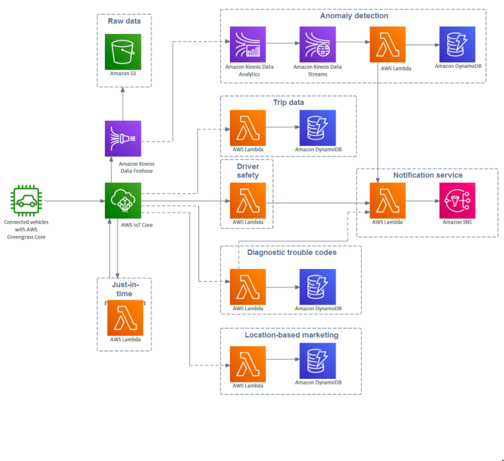
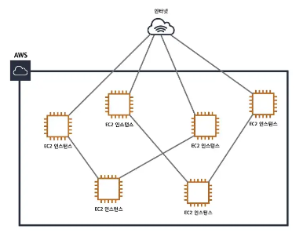
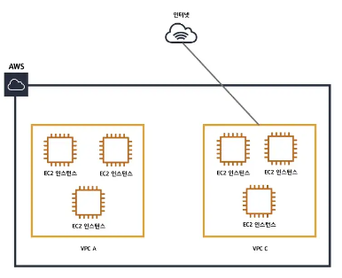
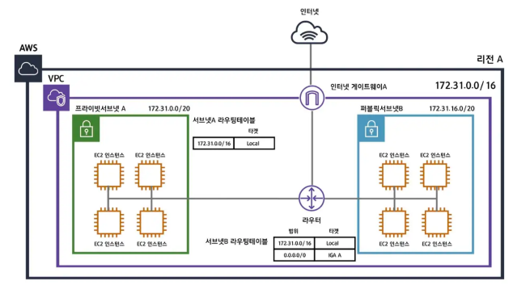

# AWS 인프라 관련 요소
## AWS란?
- Amazon Web Services는 아마존(Amazon)에서 제공하는 클라우드 컴퓨팅 플랫폼으로, 네트워킹을 기반으로 가상 컴퓨터와 스토리지, 네트워크 인프라 등 다양한 서비스를 제공
### On-premise
> 기업의 클라우드 같은 원격 환경에서 운영하는 방식이 아닌 자체적으로 보유한 전산실 서버에 직접 설치해 운영하는 방식
### Cloud Computing
- 클라우드 컴퓨팅은 인터넷을 통하여 데이터를 저장하거나 데이터베이스, 서버, 네트워킹, 소프트웨어와 같은 도구, 애플리케이션 등 다양한 서비스를 제공하는 방식
#### Iaas(Infrastructure as a Service)
- AWS, 네이버플랫폼 과 같은 인프라스트럭쳐를 제공하는 서비스
- 가상 서버 또는 스토리지, 가상 네트워크 등의 리소스를 서비스 형태로 제공
- 사용자는 물리적인 하드웨어를 직접 관리할 필요가 없으며, 직접적으로 서비스 이용을 통해 컴퓨터 리소스를 사용 할 수 있다.
#### PaaS(Platform as a Service)
- DB 또는 Application 서버 등의 미들웨어 제공
- 하드웨어/OS/미들웨어 에 대한 관리는 서비스 제공자가 하며, 사용자는 제공된 미들웨어만 사용 할 수 있다.
- 주로 개발 환경과 관련한 서비스를 제공 (OS, DB, WAS, JDK)
- 기본 인프라 (하드웨어와 운영 체제 등)를 관리할 필요 없이 애플리케이션을 실행할 수 있게 해준다.
#### SaaS(Software as a Service)
- 소프트웨어 또는 애플리케이션의 기능만 제공

### Cloud Computing을 쓰는 이점
- 저렴한 비용
- 속도 및 민첩성 개선
- 즉각적 융통성
- 용량추정불필요 하며 데이터 센터 운영 및 유지관리에 비용 투자 불필요
- 몇 분 만에 전 세계에 배포 가능

### AWS 인프라의 전체적인 모습

## AWS VPC
### VPN(Virtual Private Network)
만약 회사에서 보안상의 이유로 직원간의 네트워크를 분리하고싶다면 기존 인터넷 선공사도 다시 해야하고 건물의 내부선을 다 뜯어고쳐 다시 전용선을 깔아주어야한다. 이를 위해 가상의 망 VPN을 사용하게 된다. VPN은 서로 다른 네트워크가 실제로 같은 네트워크상에 있지만 논리적으로 다른 네트워크인 것처럼 동작할 수 있도록 한다.

### VPC(Virtual Private Cloud)
- 가상 네트워크 서비스로 퍼블릭 네트워크와 프라이빗 네트워크를 분리하고 모니터링
할 수 있도록 해주는 서비스
- 네트워크 구성과 관련된 사실상 모든 기능을 담당하며, 자체 데이터 센터에서 운영하
는 기존 네트워크와 매우 유사한 형태

VPC가 없는 구조

- VPC가 없다면 EC2 인스턴스들이 서로 거미줄처럼 연결되고 인터넷과 연결된다. 이런 구조는 시스템의 복잡도를 야기할 뿐만 아니라 하나의 인스턴스만 추가되도 모든 인스턴스를 수정해야하는 불편함이 생긴다. 이는 마치 인터넷 전용선을 다시 까는 것과 같다.

VPC를 적용한 구조

- VPC를 적용하면 VPC 별로 네트워크를 구성할 수 있고 각각의 VPC에 따라 다르게 네트워크 설정을 줄 수 있다.
- 각각의 VPC는 완전히 독립된 네트워크처럼 작동한다.

#### 서브넷
> VPC를 잘게 쪼개는 과정

- 서브넷을 나누는 이유는 더 많은 네트워크망을 만들기 위함이다.
- 각각의 서브넷은 가용영역안에 존재하며 서브넷안에 RDS, EC2와같은 리소스들을 위치시킬 수 있다.

#### 라우팅 테이블과 라우터
> 라우터 : 데이터의 목적지
>
> 라우팅테이블 : 각 목적지에 대한 이정표

#### 인터넷게이트웨이
> VPC와 인터넷을 연결해주는 하나의 관문

#### 네트워크 ACL과 보안그룹
> 방화벽과 같은 역할을 하며 인바운드 트래픽과 아웃바운드 트래픽 보안정책 설정 가능

#### NAT 게이트웨이
> 프라이빗서브넷이 인터넷과 통신하기위한 아웃바운드 인스턴스

## AWS API Gateway
- 어떤 규모에서든 개발자가 API를 손쉽게 생성, 게시, 유지 관리, 모니터링 및 보안 유지
할 수 있도록 하는 완전관리형 서비스
- 서버의 대문과 같은 역할
- 예) 트래픽 관리 (제한), CORS 지원, 권한 부여 및 액세스 제어, 제한, 모니터링
API 버전 관리, 인증관련 등…

## AWS ELB (Elastic Load Balancing)
- 다수의 컴퓨팅 리소스(EC2, Lambda, 등)를 부하 분산시켜주는 아주 중요한 서비스
- 총 3가지 종류의 Balancer (Application Load Balancer, Gateway Load Balancer, Network Load Balancer) 가 있으며, Application Load Balancer가 일반적인 상황에서 가장 많이 쓰인다.

## AWS S3 (Simple Storage Service)
- 가장 오래된 AWS 서비스중 하나로 엄청난 내구성과 가용성을 자랑하며 이미지,동영상,오디오 파일과 같은 정적파일들을 용이하게 관리하도록 돕는 스토리지 서비스
- 단순 파일의 저장 공간을 넘어서서 데이터를 저장하는 스토리지 플랫폼
  - 데이터 처리: S3에 저장되는 Trigger를 이용해 람다를 실행 시킬 수도 있음
  - 로그: AWS 안에서 이뤄지는 대부분의 로그는 S3에 저장 됨
  - 쿼리 지원: AWS Athena를 통하여 S3에 저장된 파일을 쿼리할 수도 있음
  - 호스팅: Single Page Application (React)를 호스트 할 수도 있음
- 보안성이 뛰어나고, 속도가 빠르다.

## AWS CloudFront
- 전 세계에 있는 AWS 엣지 로케이션을 통하여 CDN(Content Delivery Network) 서비스를 제공한다.
  - CDN : 콘텐츠 전송 네트워크로써 지리, 물리적으로 떨어져 있는 사용자에게 컨텐츠를 더 빠르게 제공하는 시스템
- 현재 48개국 90개가 넘는 도시에서 410개가 넘는 접속 지점 (엣지 로케이션
400개 이상, 리전별 중간 티어 캐시 13개)로 구성된 글로벌 네트워크를 지원
- 속도는 높이고, 가격은 내리며, 서버 부하는 줄일 수 있다.

## AWS Secret Manager / Parameter Store
- 데이터베이스 보안 인증 정보 및 API 키와 같은 보안 정보를 안전하게 암호화하고
중앙 집중식으로 감사할 수 있도록 도와주는 서비스
- .env 파일을 서버 별로 따로 관리하기 보다는 한 곳에서 집중적으로 관리
- DB 정보와 같은 민감한 정보는 암호화가 지원이 되는 Secret Manager에 저장
- 간단한 정보 (ex. Endpoint)는 Parameter Store에 저장하여 사용