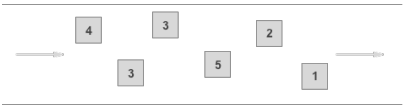
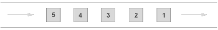
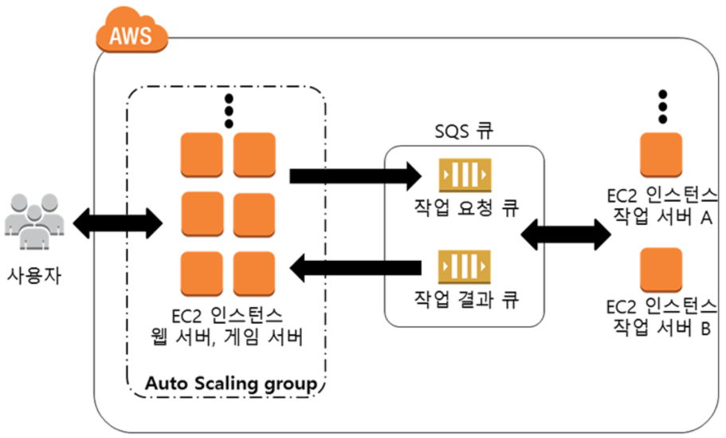

# AWS Message Queue
## AWS SQS (Simple Queue Service)
- 서버들끼리 사용할 수 있는 메세지 큐를 제공하는 서비스
- 해야할 일을 나중에 처리하거나, 다른 시스템이 처리할 수 있도록 하기위한 비동기 메세징 서비스 (시스템이 처리해야할 TO-DO List)
- 애플리케이션 간 비동기 처리를 도와줌
- 마이크로서비스, 분산 시스템 및 서버리스 애플리케이션을 위한 완전관리형 메시지 대기열
- 표준 대기열
  - 
  - 무제한 처리량 / 최소한 한 번 전달 (여러번 전달 될 수도 있음) / 최선 노력 순서
- FIFO(First-In-First-Out) 대기열
  - 
  - 초당 최대 300개의 메시지 / 정확히 한 번 처리 / 선입선출 전달



- 사례
```
1. 예를들어 Youtube를 AWS에서 구축한다고 해보자. Youtube는 대규모의 사용자가 전송하는 대용량의 데이터를 수신해서 처리해야 하는 서비스다. 이런 서비스는 여러개의 독립적인 시스템을 구축하고 각각의 시스템이 서로 협력하는 방식으로 구현하는 것이 보다 효율적이다. 예를들어 아래와 같은 시스템들이 있을 것이다.

사용자가 업로드한 동영상을 수신하는 시스템 - 수신자
업로드된 동영상을 전달 받아서 이를 인코딩하는 시스템 - 인코더
인코딩이 끝났음을 업로더에게 이메일로 발송하는 시스템  - 메일러

이러한 시스템들이 서로 협력하기 위해서는 서로의 진행상황을 공유해야 할 필요가 있다. 우선 수신자가 SQS 서비스에 업로드된 동영상을 추가한다. 인코더는 정기적으로 SQS를 확인한다. SQS에 추가된 동영상 파일이 발견되면 인코딩을 시작한다. 인코딩이 끝나면 SQS에 인코딩이 끝난 동영상을 추가한다. 메일러는 SQS에 인코딩이 끝난 동영상이 존재하는지 확인한다. 동영상이 발견되면 해당 동영상의 업로더에게 이메일을 발송한다.
```
```
2. 신규글을 작성하면 그 글을 구독하는 사람들에게 새로운 글이 작성되었음을 이메일로 알려야 하는 시스템이 있다. 그런데 신규글을 작성했을 때 모든 구독자에게 이메일을 발송한다면 구독자가 많은 글의 경우에는 매우 오랜시간 사용자를 대기하게 해야 할 것이다. 이런 경우 신규글이 작성되었을 때 신규글이 작성되었음을 SQS에 발행하고, 백그라운드에서 SQS를 처리하도록하면 사용자의 대기 시간을 줄일 수 있을 것이다.
```

## AWS Kinesis
- Amazon Kinesis는 모든 규모의 스트리밍 데이터를 비용 효율적으로 처리할 수 있는 핵심 기능과 더불어 애플리케이션 요구 사항에 가장 적합한 도구를 선택할 수 있는 유연성을 제공
- 예시:
- 실시간으로 비디오 및 데이터 스트림을 손쉽게 수집, 처리 및 분석
- 모든 규모에서 쉽게 데이터 스트리밍
- 안정적으로 실시간 스트림을 데이터 레이크, 웨어하우스, 분석 서비스에 로드
- 스트리밍 데이터에서 실행 가능한 인사이트 확보

### AWS SQS VS Kinesis
- AWS Kinesis : 빅데이터 스트림의 실시간 처리에 적합
  - 로그, 모바일, click stream 데이터 수집/분석
  - real-time 분석
  - 여러 application이 하나의 스트림을 동시에 사용
  - 처리된 메시지를 다른 applications이 다시 처리해야 하는 경우
- AWS SQS : 분산 시스템 간의 메시지 전송에 적합
  - application 통합, 분산 시스템 연계
  - 개별 메시지 별로 확인/실패가 필요한 경우
  - 메시지의 지연시간 지정이 필요한 경우
  - consumer의 처리량을 동적으로 증가하고자 할 경우

||Kinesis| SQS|
|----|----|----|
|Record Size| 1MB| 256KB|
|Independancy Shard |레벨에서 나뉨 |메세지 별로 independent|
|Auto-scale |따로 설정을 해줘야 함 |자동으로 됨|
|Retention |최대 7일| 최대 14일|
|DLQ| 지원 X |기본 지원|
|잔류| 소모되어도 Queue에 잔존 |소모되면 Queue에서 삭제|