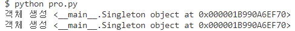
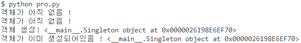

# CS 디자인 패턴
## 디자인 패턴
> 프로그램을 설계할 때 발생했던 문제점들을 객체 간의 상호 관계 등을 이용하여 해결할 수 있도록 하나의 규약 형태로 만들어 놓은 것
>
> 디자인 패턴을 기반으로 만들어지는 것) 라이브러리, 프레임워크

### 라이브러리
- 공통으로 사용될 수 있는 특정한 기능들을 모듈화한 것을 의미
- 폴더명, 파일명 등에 대한 규칙이 없고 프레임워크에 비해 자유롭다.
- 예) 무언가를 자를 때 도구인 가위를 사용해서 내가 직접 컨트롤하여 자르는것과 비슷하다. axios 등

### 프레임워크
- 공통으로 사용될 수 있는 특정한 기능들을 모듈화한 것을 의미
- 폴더명, 파일명 등에 대한 규칙이 있으며 라이브러리에 비해 좀 더 엄격하다.
- 예) 다른 곳으로 이동할 때 도구인 비행기를 타고 이동하지만 비행기가 컨트롤하고 나는 가만히 앉아있어야하는 것과 비슷하다. react, vue js 등

## 싱글톤 패턴
> 하나의 클래스에 오직 하나이 인스턴스만 가지는 패턴
>
> 하나의 클래스를 기반으로 여러 개의 개별적인 인스턴스를 만들 수 있지만 그렇게 하지 않고 하나의 클래스를 기반으로 단 하나의 인스턴스를 만들어 이를 기반으로 로직을 만드는데 쓰이며 보통 데이터베이스 연결모듈에 많이 사용한다.

### 싱글톤 패턴 구현 (파이썬)
```python
class Singleton(object):
    """
    하나의 싱글톤 인스턴스를 생성
    이미 생성된 인스턴스가 있다면 재사용
    """
    def __new__(cls, *args, **kwargs):
        if not hasattr(cls, 'instance'):
            cls.instance = super(Singleton, cls, *args, **kwargs).__new__(cls, *args, **kwargs)
        return cls.instance

if __name__ == '__main__':
    s = Singleton()
    print("객체 생성", s)
    s1 = Singleton()
    print("객체 생성", s1)
```

- `__new__` 매직메서드를 오버라이딩해 객체 생성
- `__new__` 메서드는 s 객체가 이미 존재하는지 확인한 후, `hasattr` 함수는 cls 객체가 instance 속성을 가지고 있는지 확인
- cls.instance 라는 어트리뷰트가 없는 경우에 한해서 생성자를 호출해 객체를 찍어냄
- cls.instance 가 이미 있을 경우, 기존 객체를 재사용

<hr>

- 게으른 초기화 (Lazy instantiation)
  - 싱글톤 패턴을 기반으로 초기화 방식
  - 모듈을 임포트 할 때, 아직 필요하지 않은 시점에 객체를 미리 생성하는 경우에 사용
  - 인스턴스가 필요한 시점에 생성하는 방법

```python
class Singleton(object):
    __instance = None

    def __init__(self):
        if not Singleton.__instance:
            print("객체가 아직 없음 !")
        else:
            print("객체가 이미 생성되어있음 !", self.get_instance())

    @classmethod
    def get_instance(cls):
        if not cls.__instance:
            cls.__instance = Singleton()
        return cls.__instance


if __name__ == "__main__":
    s = Singleton()
    print("객체 생성!", Singleton.get_instance())
    s1 = Singleton()
```


### 장단점
- 장점
  - 하나의 인스턴스를 기반으로 해당 인스턴스를 다른 모듈들이 공유하여 사용하기 때문에 인스턴스를 생성할 때 드는 비용이 줄어든다. 그렇게 때문에 인스턴스 생성에 많은 비용이 드는 I/O 바운드 작업에 많이 사용한다.
- 단점
  - 의존성이 높아지며 TDD(Text Driven Development)를 할 때 걸림돌이 된다. TDD를 할 때 단위 테스트를 주로 하는데, 단위 테스트는 테스트가 서로 독립적이어야 하며 테스트를 어떤 순서로든 실행할 수 있어야한다.
  - 하지만 싱글톤 패턴은 미리 생성된 하나의 인스턴스를 기반으로 구현하는 패턴이므로 각 테스트마다 독립적인 인스턴스를 만들기 어렵다.