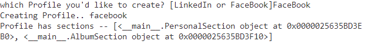
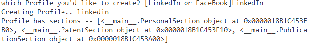
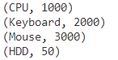
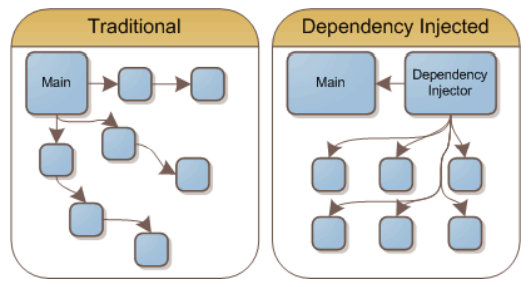
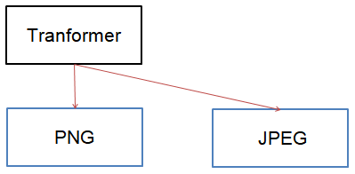
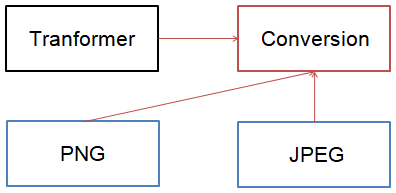

# CS 디자인 패턴
## 디자인 패턴
> 프로그램을 설계할 때 발생했던 문제점들을 객체 간의 상호 관계 등을 이용하여 해결할 수 있도록 하나의 규약 형태로 만들어 놓은 것
>
> 디자인 패턴을 기반으로 만들어지는 것) 라이브러리, 프레임워크

### 라이브러리
- 공통으로 사용될 수 있는 특정한 기능들을 모듈화한 것을 의미
- 폴더명, 파일명 등에 대한 규칙이 없고 프레임워크에 비해 자유롭다.
- 예) 무언가를 자를 때 도구인 가위를 사용해서 내가 직접 컨트롤하여 자르는것과 비슷하다. axios 등

### 프레임워크
- 공통으로 사용될 수 있는 특정한 기능들을 모듈화한 것을 의미
- 폴더명, 파일명 등에 대한 규칙이 있으며 라이브러리에 비해 좀 더 엄격하다.
- 예) 다른 곳으로 이동할 때 도구인 비행기를 타고 이동하지만 비행기가 컨트롤하고 나는 가만히 앉아있어야하는 것과 비슷하다. react, vue js 등

## 싱글톤 패턴
> 하나의 클래스에 오직 하나이 인스턴스만 가지는 패턴
>
> 하나의 클래스를 기반으로 여러 개의 개별적인 인스턴스를 만들 수 있지만 그렇게 하지 않고 하나의 클래스를 기반으로 단 하나의 인스턴스를 만들어 이를 기반으로 로직을 만드는데 쓰이며 보통 데이터베이스 연결모듈에 많이 사용한다.

### 싱글톤 패턴 구현 (파이썬)
```python
class Singleton(object):
    """
    하나의 싱글톤 인스턴스를 생성
    이미 생성된 인스턴스가 있다면 재사용
    """
    def __new__(cls, *args, **kwargs):
        if not hasattr(cls, 'instance'):
            cls.instance = super(Singleton, cls, *args, **kwargs).__new__(cls, *args, **kwargs)
        return cls.instance

if __name__ == '__main__':
    s = Singleton()
    print("객체 생성", s)
    s1 = Singleton()
    print("객체 생성", s1)
```

- `__new__` 매직메서드를 오버라이딩해 객체 생성
- `__new__` 메서드는 s 객체가 이미 존재하는지 확인한 후, `hasattr` 함수는 cls 객체가 instance 속성을 가지고 있는지 확인
- cls.instance 라는 어트리뷰트가 없는 경우에 한해서 생성자를 호출해 객체를 찍어냄
- cls.instance 가 이미 있을 경우, 기존 객체를 재사용

<hr>

- 게으른 초기화 (Lazy instantiation)
  - 싱글톤 패턴을 기반으로 초기화 방식
  - 모듈을 임포트 할 때, 아직 필요하지 않은 시점에 객체를 미리 생성하는 경우에 사용
  - 인스턴스가 필요한 시점에 생성하는 방법

```python
class Singleton(object):
    __instance = None

    def __init__(self):
        if not Singleton.__instance:
            print("객체가 아직 없음 !")
        else:
            print("객체가 이미 생성되어있음 !", self.get_instance())

    @classmethod
    def get_instance(cls):
        if not cls.__instance:
            cls.__instance = Singleton()
        return cls.__instance


if __name__ == "__main__":
    s = Singleton()
    print("객체 생성!", Singleton.get_instance())
    s1 = Singleton()
```


### 장단점
- 장점
  - 하나의 인스턴스를 기반으로 해당 인스턴스를 다른 모듈들이 공유하여 사용하기 때문에 인스턴스를 생성할 때 드는 비용이 줄어든다. 그렇게 때문에 인스턴스 생성에 많은 비용이 드는 I/O 바운드 작업에 많이 사용한다.
- 단점
  - 의존성이 높아지며 TDD(Text Driven Development)를 할 때 걸림돌이 된다. TDD를 할 때 단위 테스트를 주로 하는데, 단위 테스트는 테스트가 서로 독립적이어야 하며 테스트를 어떤 순서로든 실행할 수 있어야한다.
  - 하지만 싱글톤 패턴은 미리 생성된 하나의 인스턴스를 기반으로 구현하는 패턴이므로 각 테스트마다 독립적인 인스턴스를 만들기 어렵다.

## 팩토리 패턴
> 객체를 사용하는 코드에서 객체 생성 부분을 떼어내 추상화한 패턴
>
> 상속 관계에 있는 두 클래스에서 상위 클래스가 중요한 뼈대를 결정하고, 하위 클래스에서 객체 생성에 관한 구체적인 내용을 결정하는 패턴

- 상위 클래스와 하위 클래스가 분리되기 때문에 느슨한 결합을 가지며 상위 클래스에서는 인스턴스 생성 방식에 대해 전혀 알 필요가 없기 때문에 더 많은 유연성을 갖게 된다.
- 객체 생성 로직이 따로 떼어져 있기 때문에 코드를 리팩토링하더라도 한 곳만 고칠 수 있게 되니 유지 보수성이 증가된다.


### 팩토리 패턴 구현 (파이썬)
- 커리어 서비스와 앨범 서비스가 개별적으로 존재한다.
- 두 서비스는 공통적으로 PersonalSection을 입력해야한다.
- 서비스 종류에 따라 알맞는 내용을 포함하는 프로필을 생성한다.

```python
from abc import ABCMeta, abstractmethod

# Product 인터페이스
# Section 추상 클래스
class Section(metaclass=ABCMeta):
    @abstractmethod
    def describe(self):
        pass
class PersonalSection(Section):
    def describe(self):
        print("Personal Section")
class AlbumSection(Section):
    def describe(self):
        print("Album Section")
class PatentSection(Section):
    def describe(self):
        print("Patent Section")
class PublicationSection(Section):
    def describe(self):
        print("Publication Section")

# Creator 추상 클래스
class Profile(metaclass=ABCMeta):
    def __init__(self):
        self.sections = []
        self.createProfile() # profile 인스텐스 생성과 동시에 메서드를 실행시킴
    @abstractmethod
    def createProfile(self):
        pass
    def getSections(self):
        return self.sections
    def addSections(self, section):
        self.sections.append(section)

# ConcreateCreator 클래스
class linkedin(Profile):
    def createProfile(self): # 해당하는 Section을 sections에 담음
        self.addSections(PersonalSection())
        self.addSections(PatentSection())
        self.addSections(PublicationSection())
class facebook(Profile):
    def createProfile(self):
        self.addSections(PersonalSection())
        self.addSections(AlbumSection())

# Creator 클래스를 호출하는 클라이언트
if __name__ == '__main__':
    profile_type = input("which Profile you'd like to create? [LinkedIn or FaceBook]")
    profile = eval(profile_type.lower())()
    print("Creating Profile..", type(profile).__name__)
    print("Profile has sections --", profile.getSections())
```




## 이터레이터 패턴
> 이터레이터를 사용하여 컬렉션의 요소들에 접근하는 디자인 패턴

- 순회할 수 있는 각기 다른 자료형의 구조와는 상관없이 이터레이터라는 하나의 인터페이스로 순회가 가능해서 코드의 효율화, 숫자형 index가 아닌 string 등 다양한 인덱스를 기반으로 순회를 쉽게 할 수 있음

### 이터레이터 패턴 구현 (파이썬)
```python
class Item:
    def __init__(self, name, cost):
        self._name = name
        self._cost = cost

    def __str__(self):
        return "(" + self._name + ", " + str(self._cost) + ")"

class Array:
    def __init__(self, items):
        self._items = items

    def __iter__(self):
        return ArrayIterator(self)

    def get_item(self, index):
        return self._items[index]

    def get_count(self):
        return len(self._items)

class ArrayIterator:
    def __init__(self, array):
        self._array = array
        self._index = -1

    def __next__(self):
        self._index += 1
        if self._index >= self._array.get_count():
            raise StopIteration
        return self._array.get_item(self._index)

if __name__ == "__main__":
    items = [Item("CPU", 1000), Item("Keyboard", 2000), Item("Mouse", 3000), Item("HDD", 50)]

    array = Array(items)

    for item in array:
        print(str(item))
```


- 파이썬의 list 자료구조는 어떤 객체든 삽입될 수 있어 굳이 이렇게 iterable한 클래스를 만들 필요는 없어보인다.

<hr>

## 의존성주입과 의존관계역전원칙
### 의존성주입 (Dependency Injection)
> 메인 모듈(main mudule)이 ‘직접’ 다른 하위 모듈에 대한 의존성을 주기보다는 중간에 의존성 주입자(dependency injector)가 이 부분을 가로채 메인 모듈이 ‘간접’적으로 의존성을 주입하는 방식

- 이를 통해 모듈간의 결합을 조금 더 느슨하게 만들 수 있으며 모듈을 쉽게 교체 가능한 구조로 만든다.



### 의존관계역전원칙
> 의존성 주입을 할 때는 의존관계역전원칙(Dependency inversion principle)이 적용된다.
>
> 1. 상위 모듈은 하위 모듈에 의존해서는 안 된다. 둘 다 추상화에 의존해야 한다.
> 2. 추상화는 세부사항에 의존해서는 안 된다. 세부 사항은 추상화에 따라 달라져야한다.

### 의존한다
> A가 B에 의존한다 = B가 변하면 A에 영향을 미치는 관계 **A->B**

### DIP 미적용 사례 (파이썬)
```python
class PngConversion:
  def converse(data: Data):
    # png conversion algorithm
    return data

class JPEGConversion:
  def converse(data: Data):
    # jpeg conversion algorithm
    return data

class Transformer:
  def __init__(self, data: Data):
    self.converser = PngConversion()
    self.data = data
  def converse(self):
    self.converser.converse(self.data)
```

- 현재 코드 에서는 Conversion 객체의 메서드를 사용하고 싶은 경우에 Transformer 클래스에 있는 코드를 수정해야한다.
- 또한 상위 클래스의 동작이 하위 클래스의 구현에 영향을 받아 상위 클래스와 하위 클래스 사이의 강한 결합이 생긴다.
- 의존관계역전원칙을 적용하기 위해 상위 클래스를 추상 클래스에 의존하게 만들어야 한다.

### 위 사례에 DIP 적용1 (파이썬)
```python
from abc import ABCMeta, abstractmethod
class Conversion(metaclass=ABCMeta):
  @abstractmethod
  def converse(data: Data):
    pass

class PngConversion(Conversion):
  def converse(data: Data):
    # png conversion algorithm
    return data

class JPEGConversion(Conversion):
  def converse(data: Data):
    # jpeg conversion algorithm
    return data

class Transformer:
  def __init__(self, data: Data, converser: Conversion):
    self.converser = converser
    self.data = data

  def converse(self):
    self.converser.converse(self.data)

Transformer(data, PngConversion()).converse()
Transformer(data, JPEGConversion()).converse()
```

- Tranformer의 생성자 인자로 추상클래스를 상속받은 클래스를 넘겨줌으로써 DI를 구현할 수 있다.

### 위 사례에 DIP 적용2 (파이썬)
```python
import inject
from abc import ABCMeta, abstractmethod
class Conversion(metaclass=ABCMeta):
  @abstractmethod
  def converse(data: Data):
    pass

class PngConversion(Conversion):
  def converse(data: Data):
    # png conversion algorithm
    return data

class JPEGConversion(Conversion):
  def converse(data: Data):
    # jpeg conversion algorithm
    return data

class Transformer:

  @inject.autoparams()
  def __init__(self, data: Data, converser: Conversion):
    self.converser = converser
    self.data = data

  def converse(self):
    self.converser.converse(self.data)

transformer = Transformer(data)
transformer.converse()
```
- python-inject 라이브러리 사용
### 의존성 주입의 장단점
- 장점
  - 모듈들을 쉽게 교체할 수 있는 구조가 된다.
  - 단위 테스팅과 마이그레이션이 쉬워진다.
  - 애플리케이션 의존성 방향이 좀 더 일관되어 코드를 추론하기가 쉬워진다.
- 단점
  - 모듈이 더 생기게 되므로 복잡도가 증가한다.
  - 종속성 주입자체가 컴파일을 할 때가 아닌 런타임 때 일어나기 때문에 컴파일을 할 때 종속성 주입에 관한 에러를 잡기가 어려워질 수 있다.

<hr>