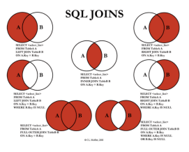

# database
## 데이터베이스란
- **체계화된 데이터의 모임**
- 여러 사람이 공유하고 사용할 목적으로 통합 관리되는 정보의 집합
- 논리적으로 연관된 (하나 이상의) 자료의 모음으로 그 내용을 고도로 구조화 함으로써 검색과 갱신의 효율화를 꾀한 것
- 몇개의 자료 파일을 조직적으로 통합하여 자료 항목의 중복을 없애고 자료를 구조화하여 기억시켜 놓은 자료의 집합체
### 데이터베이스의 장점
- 데이터 중복 최소화
- 데이터 무결성 (정확한 정보 보장)
- 데이터 일관성
- 데이터 독립성 (물리적/논리적)
- 데이터 표준화
- 데이터 보안 유지
## 관계형 데이터베이스 (RDB, Relational Database)
> 서로 관련된 데이터를 저장하고 접근할 수 있는 데이터베이스 유형
>
> 키(key)와 값(value)들의 간단한 관계(relation)를 표(table) 형태로 정리한 데이터베이스
### 스미카(schema)
- 데이터베이스에서 자료의 구조, 표현방법, 관계 등 전반적인 **명세를 기술**한 것

|column|datatype|
|---|---|
|id|INT|
|name|TEXT|
|address|TEXT|
|age|INT|

### 테이블(table)
- 열(컬럼/필드)과 행(레코드/값)의 모델을 사용해 조직된 데이터 요소들의 집합

|id|name|address|age|
|---|---|---|---|
|1|홍길동|제주|20|
|2|김길동|서울|30|
|3|박길동|부산|40|

### 열(column)
- 각 열에 고유한 데이터 형식 지정
- 열, 컬럼, 필드 등의 이름으로 불림
- 위의 예시에서는 name이란 필드에 고객의 이름(TEXT) 정보가 저장

### 행(row)
- 실제 데이터가 저장되는 형태
- 행, 로우, 레코드 등의 이름으로 불림
- 위의 예시에서는 총 3명의 고객정보가 저장

### 기본키(Primary Key)
- 각 행(레코드)의 고유 값
- 반드시 설정해야 하며, 데이터베이스 관리 및 관계 설정 시 주요하게 활용

## 관계형 데이터베이스 관리 시스템 (RDBMS)
> 관계형 모델을 기반으로 하는 데이터베이스 관리시스템을 의미
>
> ex) mySQL, SQLite, PostgreSQL, ORACLE, SQLServer 등

### SQLite
- 서버 형태가 아닌 파일 형식으로 응용 프로그램에 넣어서 사용하는 비교적 가벼운 데이터베이스이기 때문에 학습을 할 때는 이 시스템을 사용할 것이다.

#### SQLite의 데이터 타입
- NULL
- INTEGER
  - 크기에 따라 0, 1, 2, 3, 4, 6 또는 8바이트에 저장된 부호가 있는 정수
- REAL
  - 8바이트 부동 소수점 숫자로 저장된 부동 소수점 값
- TEXT
- BLOB
  - 입력된 그대로 정확히 저장된 데이터

|Example Typenames From The CREATE TABLE Statement|Resulting Affinity|
|---|---|
|INT, INTEGER, TINYINT, SMALLINT, MEDIUMINT, BIGINT, UNSIGNED BIG INT, INT2, INT8|INTEGER|
|CHARACTER(20), VARCHAR(255), VARYING CHARACTER(255), NCHAR(55), NATIVE CHARACTER(70), NVARCHAR(100), TEXT, CLOB|TEXT|
|BLOB (no datatype specified)|BLOB|
|REAL, DOUBLE, DOUBLE PRECISION, FLOAT|REAL|
|NUMERIC, DECIMAL(10,5), BOOLEAN, DATE, DATETIME|NUMERIC|

## SQL (Structured Query Language)
> 관계형 데이터베이스 관리시스템의 데이터 관리를 위해 설계된 특수 목적으로 프로그래밍 언어
>
> 데이터베이스 스키마 생성 및 수정
>
> 자료의 검색 및 관리
>
> 데이터베이스 객체 접근 조정 관리

- DDL - 데이터 정의 언어(Data Definition Language)
  - 관계형 데이터베이스 구조(테이블, 스키마)를 정의하기 위한 명령어
  - CREATE, DROP, ALTER
- DML - 데이터 조작 언어(Data Manipulation Language)
  - 데이터를 저장, 조회, 수정, 삭제 등을 하기 위한 명령어
  - INSERT: 새로운 데이터 삽입(추가), SELECT: 저장되어있는 데이터 조회, UPDATE: 저장되어있는 데이터 갱신, DELETE: 저장되어있는 데이터 삭제
- DCL - 데이터 제어 언어(Data Control Language)
  - 데이터베이스 사용자의 권한 제어를 위해 사용하는 명령어
  - GRANT, REVOKE, COMMIT, ROLLBACK

### 테이블 생성 및 삭제
- `.database` - 데이터베이스 생성하기
- `.tables` - csv 파일을 table로 만들기
- `.schema table` - 특정 테이블의 스키마 조회
#### CREATE - 테이블 생성
```sql
CREATE TABLE classmates (
    id INTEGER PRIMARY KEY,
    name TEXT
);
```
#### DROP - 테이블 삭제
```sql
DROP TABLE classmates;
```
#### 필드 제약 조건
- NOT NULL : NULL 값 입력 금지
- UNIQUE : 중복 값 입력 금지 (NULL 값은 중복 입력 가능)
- PRIMARY KEY : 테이블에서 반드시 하나. NOT NULL + UNIQUE
- FOREIGN KEY : 외래키. 다른 테이블의 Key
- CHECK : 조건으로 설정된 값만 입력 허용
- DEFAULT : 기본 설정 값

## CURD
### CREATE
- INSERT
```sql
-- 테이블에 단일 행 삽입
INSERT INTO 테이블_이름 (컬럼1, 컬럼2) VALUES (값1, 값2);

-- 테이블에 정의된 모든 컬럼에 맞춰 순서대로 입력
INSERT INTO 테이블_이름 VALUES (값1, 값2, 값3);
```
### READ
- SELECT
  - 테이블에서 데이터를 조회
  - SQLite에서 가장 기본이 되는 문이며 다양한 절과 함께 사용(ORDER BY, DISTINCT, WHERE, LIMIT, GROUP BY …)
```sql
SELECT * FROM 테이블이름 WHERE 조건;
```
- LIMIT
  - 쿼리에서 반환되는 행 수를 제한
  - 특정 행부터 시작해서 조회하기 위해 OFFSET 키워드와 함께 사용하기도 함
-WHERE
  - 쿼리에서 반환된 행에 대한 특정 검색 조건을 지정
- SELECT DISTINCT
  - 조회 결과에서 중복 행 제거
### UPDATE
- UPDATE
  - 기존 행의 데이터를 수정
  - SET cluase에서 테이블의 각 열에 대해 새로운 값 설정
```sql
UPDATE 테이블이름 SET 컬럼1=값1, 컬럼2=값2 WHERE 조건;
```
### DELETE
- DELETE
  - 테이블에서 행을 제거
  - 중복 불가능한(UNIQUE) 값은 rowid를 기준으로 삭제
  - AUTOINCREMENT : SQLite가 사용되지 않은 값이나 이전에 삭제된 행의 값을 재사용하는 것을 방지
```sql
DELETE FROM 테이블이름 WHERE 조건;
```
## WHERE
### WHERE 절에서 사용할 수 있는 연산자
- 비교 연산자
  -  =, >, >=, <, <= 는 숫자 혹은 문자 값의 대/소, 동일 여부를 확인하는 연산자
- 논리 연산자
  - AND : 앞에 있는 조건과 뒤에 오는 조건이 모두 참인 경우
  - OR : 앞의 조건이나 뒤의 조건이 참인 경우
  - NOT : 뒤에 오는 조건의 결과를 반대로
### SQL 사용할 수 있는 연산자
- `BETWEEN 값1 AND 값2`
  - 값1과 값2 사이의 비교 (값1 <= 비교값 <= 값2)
- `IN (값1, 값2, …)`
  - 목록 중에 값이 하나라도 일치하면 성공
- `LIKE`
  - 비교 문자열과 형태 일치
  - 와일드카드 (% : 0개 이상 문자, _ : 1개 단일 문자)
- `IS NULL / IS NOT NULL`
  - NULL 여부를 확인할 때는 항상 = 대신에 IS를 활용
- 부정 연산자
  - 같지 않다. (!=, ^=, <>)
  - ~와 같지 않다. (NOT 칼럼명 =)
  - ~보다 크지 않다. (NOT 칼럼명 >)
### 연산자 우선 순위
1순위 : `괄호 ()`

2순위 : `NOT`

3순위 : `비교 연산자, SQL`

4순위 : `AND`

5순위 : `OR`
## 집계함수 (SQLite Aggregate Functions)
> 값 집합에 대한 계산을 수행하고 단일 값을 반환
>
> 여러 행으로부터 하나의 결괏값을 반환하는 함수
>
> SELECT 구문에서만 사용됨

- `COUNT`
  - 그룹의 항목 수를 가져옴
- `AVG`
  - 모든 값의 평균을 계산
- `MAX`
  - 그룹에 있는 모든 값의 최대값을 가져옴
- `MIN`
  - 그룹에 있는 모든 값의 최소값을 가져옴
- `SUM`
  - 모든 값의 합을 계산

## LIKE
> 패턴 일치를 기반으로 데이터를 조회하는 방법
>
> SQLite는 패턴 구성을 위한 2개의 와일드 카드 제공

```sql
SELECT * FROM 테이블이름 WHERE 컬럼 LIKE '패턴';
```
### 와일드 카드
- `%(percent sign)` : 이 자리에 문자열이 있을 수도, 없을 수도 있다.
- `_(underscore)` : 반드시 이 자리에 한 개의 문자가 존재해야 한다.

## ORDER BY
> 조회 결과 집합을 정렬
>
> SELECT 문에 추가하여 사용

### 특정 컬럼을 기준으로 데이터 정렬해서 조회
- ACS : 오름차순(default)
- DESC : 내림차순
```sql
SELECT * FROM 테이블이름 ORDER BY 컬럼 ASC;
SELECT * FROM 테이블이름 ORDER BY 컬럼 DESC
```
## 기본 함수와 연산
### 문자열 함수
- SUBSTR(문자열, start, length) : 문자열 자르기 (시작 인덱스:1, 마지막 인덱스:-1)
- TRIM(문자열), LTRIM(문자열), RTRIM(문자열) : 문자열 공백 제거
- LENGTH(문자열) : 문자열 길이
- REPLACE(문자열, 패턴, 변경값) : 패턴에 일치하는 부분을 변경
- UPPER(문자열), LOWER(문자열) : 대소문자 변경
- || : 문자열 합치기(concatenation)
### 숫자 함수
- ABS(숫자) : 절대 값
- SIGN(숫자) : 부호 (양수 1, 음수 -1, 0 0)
- MOD(숫자1, 숫자2) : 숫자1을 숫자2로 나눈 나머지
- CEIL(숫자), FLOOR(숫자), ROUND(숫자, 자리) : 올림, 내림, 반올림
- POWER(숫자1, 숫자2) : 숫자1의 숫자2 제곱
- SQRT(숫자) : 제곱근
### 산술 연산자
- +, -, *, /와 같은 산술 연산자와 우선 순위를 지정하는 () 기호를 연산에 활용할 수 있음

## GROUP BY
> 행 집합에서 요약 행 집합을 만듦
>
> 선택된 행 그룹을 하나 이상의 열 값으로 요약 행으로 만듦
>
> **문장에 WHERE 절이 포함된 경우 반드시 WHERE 절 뒤에 작성해야 함**

### GROUP BY
- 지정된 컬럼의 값이 같은 행들로 묶음
- 집계함수와 활용하였을 때 의미가 있음
- 그룹화된 각각의 그룹이 하나의 집합으로 집계함수의 인수로 넘겨짐
- GROUP BY절에 명시하지 않은 컬럼은 별도로 지정할 수 없음
  - 그룹마다 하나의 행을 출력하게 되므로 집계 함수 등을 활용해야 함
- GROUP BY의 결과는 정렬되지 않음
  - 기존의 순서와 바뀌는 모습도 있음
  - 원칙적으로 관계형 데이터베이스에서는 ORDER BY를 통해 정렬
```sql
SELECT * FROM users GROUP BY last_name;
```
### HAVING
- 집계함수는 WHERE 절의 조건식에서는 사용할 수 없음(실행 순서에 의해)
  - WHERE로 처리하는 것이 GROUP BY 그룹화보다 순서상 앞서 있기 때문
- 집계 결과에서 조건에 맞는 값을 따로 활용하기 위해서 HAVING을 활용
```sql
SELECT * FROM 테이블이름 GROUP BY 컬럼1, 컬럼2
HAVING 그룹조건;
```
### ALIAS
- 칼럼명이나 테이블명이 너무 길거나 다른 명칭으로 확인하고 싶을 때는 ALIAS를 활용
- AS를 생략하여 공백으로 표현할 수 있음
- 별칭에 공백, 특수문자 등이 있는 경우 따옴표로 묶어서 표기
```sql
SELECT last_name 성 FROM users;
SELECT last_name AS 성 FROM users;
SELECT last_name AS 성 FROM users WHERE 성='김';
```
### SELECT 문장 실행 순서
`FROM -> WHERE -> GROUP BY -> HAVING -> SELECT -> ORDER BY`
```sql
SELECT 칼럼명
FROM 테이블명
WHERE 조건식
GROUP BY 칼럼 혹은 표현식
HAVING 그룹조건식
ORDER BY 칼럼 혹은 표현식
LIMIT 숫자 OFFSET 숫자;
```
## ALTER TABLE
> 테이블, 컬럼 변경

```sql
-- 1. 테이블 이름 변경
ALTER TABLE table_name
RENAME TO new_name;

-- 2. 새로운 컬럼 추가
ALTER TABLE table_name
ADD COLUMN column_definition;

-- 3. 컬럼 이름 수정
ALTER TABLE table_name
RENAME COLUMN current_name TO new_name;

-- 4. 컬럼 삭제
ALTER TABLE table_name
DROP COLUMN column_name;
```

## CASE
> 특정 상황에서 데이터를 변환하여 활용
>
> ELSE를 생략하는 경우 NULL 값 지정

```sql
CASE
  WHEN 조건식 THEN 식
  WHEN 조건식 THEN 식
  ELSE 식
END
```

## 서브쿼리
> 서브 쿼리는 특정한 값을 메인 쿼리에 반환하여 활용하는 것
>
> 실제 테이블에 없는 기준을 이용한 검색이 가능함
>
> 서브 쿼리는 소괄호로 감싸서 사용하며, 메인 쿼리의 칼럼을 모두 사용할 수 있음
>
> 메인 쿼리는 서브 쿼리의 칼럼을 이용할 수 없음

```sql
SELECT *
FROM 테이블
WHERE 컬럼1 = (
  SELECT 컬럼1
  FROM 테이블
);
```
- 단일행 서브쿼리
  - 서브쿼리의 결과가 0 또는 1개인 경우
  - 단일행 비교 연산자와 함께 사용(=, <, <=, >=, >, <>)
```sql
-- WEHRE에서의 활용
-- users에서 평균 계좌 잔고가 높은 사람의 수
SELECT COUNT(*)
FROM users
WHERE balance > (SELECT AVG(balance) FROM users);

-- SELECT에서의 활용
-- 전체 인원과 평균 연봉, 평균 나이
SELECT
  (SELECT COUNT(*) FROM users) AS 총인원,
  (SELECT AVG(balance) FROM users) AS 평균연봉
  (SELECT AVG(age) FROM users) AS 평균나이;

-- UPDTE에서의 활용
UPDATE users
SET balance = (SELECT AVG(balance) FROM users);
```
- 다중행 서브쿼리
  - 서브쿼리 결과가 2개 이상인 경우
  - 다중행 비교 연산자와 함께 사용(IN, EXISTS 등)
```sql
-- users에서 이은정과 같은 지역에 사는 사람의 수
SELECT COUNT(*)
FROM users
WHERE country IN (
  SELECT country
  FROM users
  WHERE first_name = '은정' AND last_name='이'
);
```
- 다중컬럼 서브쿼리
```sql
-- 특정 성씨에서 가장 어린 사람들의 이름과 나이
SELECT
  last_name,
  first_name,
  age
FROM users
WHERE (last_name, age) IN (
  SELECT last_name, MIN(age)
  FROM users
  GROUP BY last_name)
ORDER BY last_name;
```

## JOIN
- 관계형 데이터베이스의 가장 큰 장점이자 핵심적인 기능
- 일반적으로 데이터베이스에는 하나의 테이블에 많은 데이터를 저장하는 것이 아니라 여러 테이블로 나눠 저장하게 되며, 여러 테이블을 결합(Join)하여 출력하여 활용
- 일반적으로 레코드는 기본키(PK)나 외래키(FK) 값의 관계에 의해 결합

### INNER JOIN
> 조건에 일치하는 (동일한 값이 있는 행만 반환)

```sql
SELECT *
FROM 테이블1 [INNER] JOIN 테이블2
  ON 테이블1.칼럼 = 테이블2.칼럼;
```


### OUTER JOIN
> 동일한 값이 없는 데이터도 반환할 때 사용
>
> 기준이 되는 테이블에 따라 LEFT/RIGHT/FULL 지정

```sql
SELECT *
FROM 테이블1 [LEFT|RIGHT|FULL] OUTER JOIN 테이블2
  ON 테이블1.칼럼 = 테이블2.칼럼;
```


### CROSS JOIN
> 모든 가능한 경우의 수의 Join

```sql
SELECT *
FROM 테이블1 CROSS JOIN 테이블2;
```

## REFERENCE
[sql_join](https://sql-joins.leopard.in.ua/)