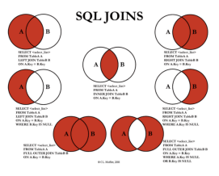

# database 05
## JOIN
- 관계형 데이터베이스의 가장 큰 장점이자 핵심적인 기능
- 일반적으로 데이터베이스에는 하나의 테이블에 많은 데이터를 저장하는 것이 아니라 여러 테이블로 나눠 저장하게 되며, 여러 테이블을 결합(Join)하여 출력하여 활용
- 일반적으로 레코드는 **기본키(PK)**나 **외래키(FK)** 값의 관계에 의해 결합


### INNER JOIN
> 조건에 일치하는 (동일한 값이 있는 행만 반환)

```sql
SELECT *
FROM 테이블1 [INNER] JOIN 테이블2
  ON 테이블1.칼럼 = 테이블2.칼럼;
```


### OUTER JOIN
> 동일한 값이 없는 데이터도 반환할 때 사용
>
> 기준이 되는 테이블에 따라 LEFT/RIGHT/FULL 지정

```sql
SELECT *
FROM 테이블1 [LEFT|RIGHT|FULL] OUTER JOIN 테이블2
  ON 테이블1.칼럼 = 테이블2.칼럼;
```


### CROSS JOIN
> 모든 가능한 경우의 수의 Join

```sql
SELECT *
FROM 테이블1 CROSS JOIN 테이블2;
```

## REFERENCE
[sql_join](https://sql-joins.leopard.in.ua/)