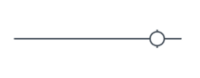
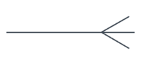
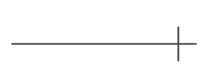
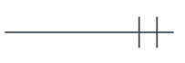
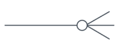
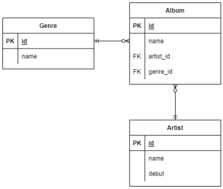

# database 심화
## 모델링
### 데이터 모델링
> 데이터베이스의 구조나 형식으로 모델 구조만 보고 어떤 데이터를 다루는지 알 수 있음
- 개념적 데이터 모델링
  - 데이터의 요구사항을 찾고 분석하는 과정, 핵심 개체(Entity) 사이의 관계를 찾아내고 표현
- 논리적 데이터 모델링
  - 데이터베이스 설계 프로세스의 과정으로 정보의 논리적인 구조와 규칙을 명확하게 표현하는 기법/과정
- 물리적 데이터 모델링
  - 논리적 데이터 모델이 데이터 저장소로서 어떻게 실제로 저장될 것인가

### ERD(Entity Relation Diagram) – 개체 관계 모델
#### 주요 용어
- 엔터티(Entity) : 업무가 관여하는 정보
- 속성(Attribute) : 엔터티가 가지는 성격, 데이터 타입과 크기 및 제약사항 지정
- 관계(Relationship) : Entity 간의 관계, 연관성
#### 관계
- 카디널리티(Cardinality) : 수적 관계, 차수
  - 1:1 관계 : A는 B를 하나 가진다. B는 A를 하나 가진다.
  - 1:N 관계 : A는 B를 여러 개 가진다. B는 A의 하나에 해당한다.
  - M:N 관계 : A는 B를 여러 개 가진다. B는 A를 여러 개 가진다.
- 옵셔널리티
  - (1) : 필수
  - (2) : 선택
#### Crow's feet
- 선택



- 여러개



- 한개



- 필수 한개



- 선택 N개



- 필수 N개


### 정규화
> 데이터베이스 테이블을 설계하는 과정에서 중복성을 제거하여 성능을 향상시키는 행위
#### 정규화 종류
- 제1정규화 : 도메인 원자값
  - 한 속성에 여러 개의 속성이 포함, 같은 유형의 속성이 여러 개로 나눠져 있는 경우 제거
- 제2정규화 : 부분적 함수 종속성 제거
  - PK가 아닌 모든 칼럼은 PK에 종속되도록 구성
- 제3정규화 : 이행적 함수 종속성 제거(X->Y, Y->Z)
  - 일반 속성 간의 함수 종속 관계가 존재하지 않아야 함
  
## ORM (Object-Relational-Mapping)
> 객체 지향 프로그래밍 언어를 사용하여 호환되지 않는 유형의 시스템 간의 데이터를 변환하는 프로그래밍 기술
>
> 파이썬에서는 SQLAlchemy, peewee 등 라이브러리가 있으며 Django 프레임워크에서는 내장 Django ORM을 활용

### 모델 설계 및 반영
1. 클래스를 생성하여 원하는 DB의 구조를 만든다.
```python
class Genre(models.Model):
    name = models.CharField(max_length=30)
```
2. 클래스의 내용으로 데이터베이스에 반영하기 위한 마이그레이션 파일을 생성한다.
```bash
$ python manage.py makemigrations
```
```python
# 자동생성
from django.db import migrations, models
class Migration(migrations.Migration):
    initial = True
    dependencies = [
    ]
    operations = [
        migrations.CreateModel(
            name='Genre',
            fields=[
                ('id', models.AutoField(auto_created=True, primary_key=True, serialize=False, verbose_name='ID')),
                ('name', models.CharField(max_length=30)),
            ],
        ),
    ]
```
3. DB에 migrate한다.
```bash
$ python manage.py migrate
```
#### Migration(마이그레이션)
- Model에 생긴 변화를 DB에 반영하기 위한 방법
- 마이그레이션 파일을 만들어 DB 스키마를 반영한다.
- 명령어
  - makemigrations : 마이그레이션 파일 생성
  - migrate : 마이그레이션을 DB에 반영
```sql
BEGIN;
--
-- Create model Genre
--
CREATE TABLE "db_genre" (
    "id" integer NOT NULL PRIMARY KEY AUTOINCREMENT,
    "name" varchar(30) NOT NULL
);
COMMIT;
```
### 데이터베이스 조작(Database API)
```python
#  Class Name Manager QuerySet API
        Genre.objects.all()
```

### ORM 기본 조작
- Create
```python
# 1. create 메서드 활용
Genre.objects.create(name='발라드')

# 2. 인스턴스 조작
genre = Genre()
genre.name = '인디밴드'
genre.save()
```

- Read
```python
# 1. 전체 데이터 조회
Genre.objects.all()
# <QuerySet [<Genre: Genre object (1)>, <Genre: Genre object (2)>]>

# 2. 일부 데이터 조회(get)
Genre.objects.get(id=1)
# <Genre: Genre object (1)>

# 3. 일부 데이터 조회(filter)
Genre.objects.filter(id=1)
# <QuerySet [<Genre: Genre object (1)>]>
```

- Update
```python
# 1. genre 객체 활용
genre = Genre.objects.get(id=1)

# 2. genre 객체 속성 변경
genre.name = '트로트’

# 3. genre 객체 저장
genre.save()
```

- Delete
```python
# 1. genre 객체 활용
genre = Genre.objects.get(id=1)

# 2. genre 객체 삭제
genre.delete()
```

#### get()과 filter()
- get() 메소드 사용
  - QuerySet이 아닌 Question 모델 객체가 리턴
  - 리턴값이 많을 때는 MultipleObjects, 리턴값이 없을 때는 DoesNotExist exception 에러를 리턴한다.
  - 특정 한개만 검색할 경우(id와 같이 고유한 값으로 검색) 사용
```python
Genre.objects.get(id=1)
```

- filter() 메소드 사용
  - QuerySet 모델 객체가 리턴
  - 새로운 쿼리셋을 생성 후, 필터 조건에 부합하는 객체들을 넣은 후 리턴한다. (즉, 필터조건에 부합하는 객체들이 하나도 없을시, 에러 메시지가 아닌 빈 쿼리셋을 리턴한다.)
  - 여러개를 검색할 경우 사용
```python
Genre.objects.filter(id=1)
```

### QuerySet API
- gt : greater than
```python
Entry.objects.filter(id__gt=4)
```
```sql
SELECT ... WHERE id > 4;
```
- gte : greater than equal
```python
Entry.objects.filter(id__gte=4)
```
```sql
SELECT ... WHERE id >= 4;
```
- lt : less than
```python
Entry.objects.filter(id__lt=4)
```
```sql
SELECT ... WHERE id < 4;
```
- lte : less than equal
```python
Entry.objects.filter(id__lte=4)
```
```sql
SELECT ... WHERE id <= 4;
```
- in : 포함 여부
```python
Entry.objects.filter(id__in=[1, 3, 4])
Entry.objects.filter(headline__in='abc')
```
```sql
SELECT ... WHERE id IN (1, 3, 4);
SELECT ... WHERE headline IN ('a', 'b', 'c');
```
- startswith : 시작 검색
```python
Entry.objects.filter(headline__startswith='Lennon')
```
```sql
SELECT ... WHERE headline LIKE 'Lennon%';
```
- endswith : 끝 검색
```python
Entry.objects.filter(headline__endswith='Lennon’)
Entry.objects.filter(headline__iendswith='Lennon')
```
```sql
SELECT ... WHERE headline LIKE '%Lennon';
SELECT ... WHERE headline ILIKE '%Lennon'
```
- contains : 포함 검색
```python
Entry.objects.get(headline__contains='Lennon’)
Entry.objects.get(headline__icontains='Lennon’)
```
```sql
SELECT ... WHERE headline LIKE '%Lennon%’;
SELECT ... WHERE headline ILIKE '%Lennon%';
```
- range : 범위 지정
```python
import datetime
start_date = datetime.date(2005, 1, 1)
end_date = datetime.date(2005, 3, 31)
Entry.objects.filter(pub_date__range=(start_date, end_date))
```
```sql
SELECT ... WHERE pub_date
BETWEEN '2005-01-01' and '2005-03-31';
```
- 복합 활용
```python
inner_qs = Blog.objects.filter(name__contains='Cheddar')
entries = Entry.objects.filter(blog__in=inner_qs)
```
```sql
SELECT ...
WHERE blog.id IN (SELECT id FROM ... WHERE NAME
LIKE '%Cheddar%’);
```
- limit
```python
Entry.objects.all()[0]
```
```sql
SELECT ...
LIMIT 1;
```
- order by
```python
Entry.objects.order_by('id')
Entry.objects.order_by('-id')
```
```sql
SELECT ...
ORDER BY id;
SELECT ...
ORDER BY id DESC;
```
### ORM 확장 (1:N)
#### 모델링(ORM)

```python
class Genre(models.Model):
  name = models.CharField(max_length=30)

class Artist(models.Model):
  name = models.CharField(max_length=30)
  debut = models.DateField()

class Album(models.Model):
  name = models.CharField(max_length=30)
  genre = models.ForeignKey('Genre', on_delete=models.CASCADE)
  artist = models.ForeignKey('Artist', on_delete=models.CASCADE)
```
#### 외래키
- Foreign Key(외래키)
  - 키를 사용하여 부모 테이블의 유일한 값 참조(참조 무결성)
    - 데이터베이스 관계 모델에서 관련된 2개의 테이블 간의 일관성
  - 외래 키의 값이 반드시 부모 테이블의 기본 키일 필요는 없지만 유일한 값이어야 함
- model.ForeignKey 필드
  - Model class : 참조하는 모델
  - on_delete : 외래 키가 참조하는 객체가 삭제되었을 때 처리 방식
    - CASCADE : 부모 객체(참조된 객체)가 삭제 됐을 때 이를 참조하는 객체도 삭제
    - PROTECT : 삭제되지 않음
    - SET_NULL : NULL 설정
    - SET_DEFAULT : 기본 값 설정

#### Create
```python
artist = Artist.objects.get(id=1)
genre = Genre.objects.get(id=1)

album = Album()
album.name = '앨범1'
album.artist = artist # 객체의 저장
album.genre = genre
album.save()
```

#### 참조와 역참조
```python
# 1. 참조
album = Album.objects.get(id=1)
album.artist
# <Artist: Artist object (1)>
album.genre
# <Genre: Genre object (1)>

# 2. 역참조
genre = Genre.objects.get(id=1)
genre.album_set.all()
# <QuerySet [<Album: Album object (1)>, <Album:Album object (2)>]>
```