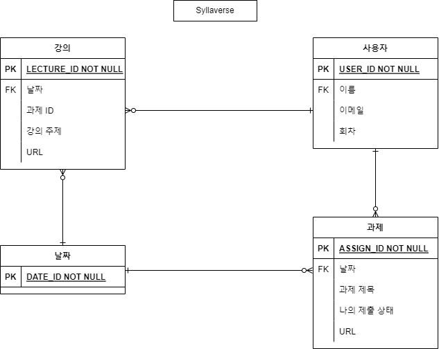
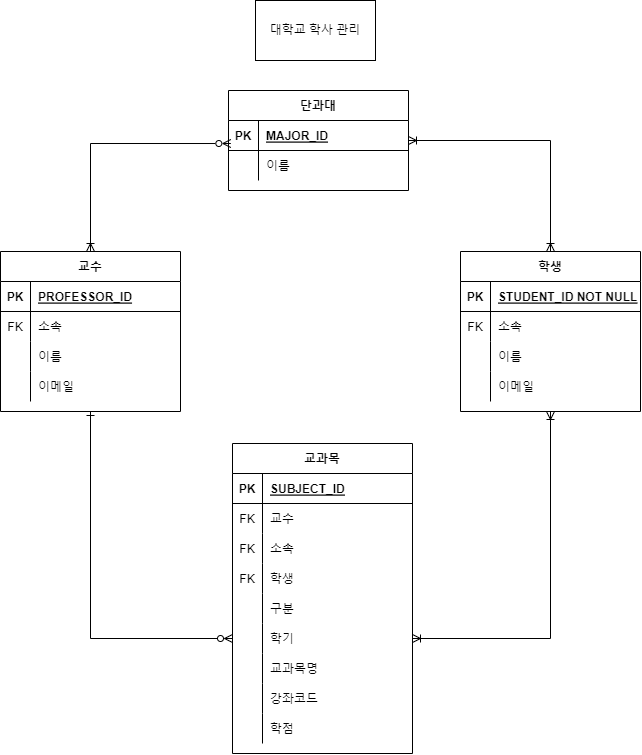
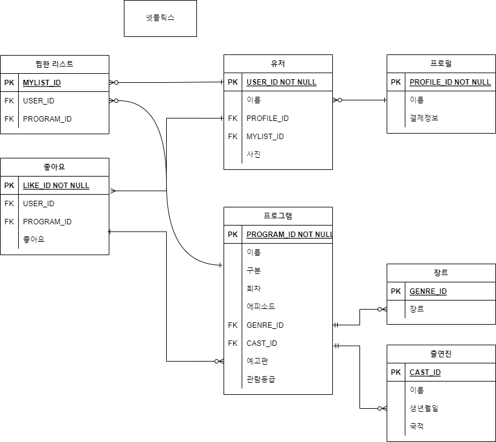

# ERD 작성하기
### 1. syllaverse
Syllaverse의 커리큘럼 탭을 보고 어떤 구조인지 ERD를 자유롭게 그려봅니다.

주요 Entity는 사용자, 강의, 과제 등입니다.

### 2. 대학교 학사 관리 시스템

수업시간에 간단하게 나눈 대학교의 학사관리시스템 기능을 ERD를 자유롭게 그려봅니다.

(**예시)**

- 주요 Entity는 학생, 교수, 교과목이며 추가하여 자유롭게 구성할 수 있습니다.
- 교과목은 교양/전공으로 구분되며, 강좌코드가 있습니다.
- 교과목은 매년, 학기별로 개설됩니다. 여러 강의가 개설될 수 있습니다. 
단, 강의는 한 명의 교수가 담당합니다.
- 예) 마케팅 원론 - 홍길동 교수, 마케팅 원론 - 김철수 교수, …
- 학생은 강의를 수강신청하며, 여러 강의를 동시에 들을 수 있습니다.

### 3. 실제 서비스 분석 (선택

본인이 활용하고 있는 서비스를 보고 주요 기능의 ERD를 자유롭게 그려봅니다.

(예시) **Instagram, Melon, Netflix, 오늘의집 등**

