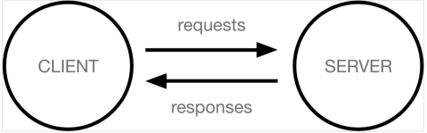

# Django 01
## 프레임워크 (Framwork)
> Frame(뼈대, 틀) + Work(일하다), 특정 프로그램을 개발하기 위한 여러 도구들과 규약을 제공하는 것
>
> 웹 서비스를 개발할 때 자주 사용되는 부분들을 재사용 할 수 있게 좋은 구조의 코드들을 모아놓은 것, 즉 서비스 개발에 필요한 기능들을 미리 구현해서 모아놓은 것
### 프레임워크의 장단점
- 장점
  - 효율적 : 어떤 프로그램을 개발 할때 뼈대부터 개발하는 경우는 거의 없다. 프레임워크는 이미 만들어진 코드를 사용하게 하여 시간과 비용을 아낄 수 있다.
  - 완성도 : 프레임워크에서 제공하는 기능들은 검증된 코드이다. 이를 사용함으로 오류가 적은 품질을 살릴 수 있다.
  - 유지보수 : 프레임워크를 사용하면 다른 시스템이라도 같은 프레임워크로 개발해왔다면 쉽게 적응할 수 있다.
  - 확장성 : 새로운 이슈나 기능이 업데이트 되고 이를 사용할 수 있다. 확장성으로 인해 업데이트된 기능을 통해 프로그램의 품질을 끌어 올릴 수 있다.
- 단점
  - 학습 필요 : 특정 프로그램 언어를 배우고 해당 프레임워크 사용법과 철학을 익혀야 하는 학습이 필요로 한다.
  - 제약사항 : 프레임워크는 사용법이 정해져 있다. 예외적인 소스를 작성할때는 복잡해질 수 있는 문제가 있다.
## 인터넷과 웹
### 인터넷
- 컴퓨터로 연결하여 TCP/IP( Transmission Control Protocol / Internet Protocol)라는 통신 프로토콜을 이용해 정보를 주고받는 컴퓨터 네트워크
### WWW (World Wide Web)
- 인터넷에 연결된 사용자들이 만나 정보를 주고받을 수 있는 전 세계적인 정보 공간
- 인터넷에서 HTTP 프로토콜, 하이퍼텍스트, HTML 형식 등을 사용하여 그림과 문자를 교환하는 전송방식

## 클라이언트와 서버
- 오늘날 우리가 사용하는 대부분의 웹 서비스는 클라이언트-서버 구조를 기반으로 동작한다.
- 클라이언트와 서버 역시 하나의 컴퓨터이며 이들이 어떻게 상호작용하는지에 대한 간소화된 다이어그램은 다음과 같다.

### 클라이언트
- 웹 사용자의 인터넷에 연결된 장치 (예) wi-fi에 연결된 컴퓨터 또는 모바일)
- Chrome 또는 Firefox와 같은 웹 브라우저
- 서비스를 요청하는 주체
### 서버
- 웹 페이지, 사이트 또는 앱을 저장하는 컴퓨터
- 클라이언트가 웹 페이지에 접근하려고 할 때 서버에서 클라이언트 컴퓨터로 웹 페이지 데이터를 응답해 사용자의 웹 브라우저에 표시
- 요청에 대해 서비스를 응답하는 주체
### 서비스
- 서버는 클라이언트로부터 요청을 받아 응답을 내려주고 클라이언트는 서버에 데이터를 요청하고 응답을 받는다.
- 재화와 서비스의 개념에서 가져와 서비스라고 일컫는다.
- 서비스의 종류에 따라 파일 서버/메일 서버/어플리케이션 서버 등으로 나눠진다.
## HTTP
> HyperText(링크) Transfer Protocol
>
> 인터넷에서 데이터를 주고받을 수 있는 프로토콜(규칙)
>
> 웹 상에서 통신을 할 때 어떤 형식으로 통신을 하자고 정해놓은 약속
### HTTP Request 의 구조
|Start Line|
|----|
|Header|
|(white space)|
|Body|
- Start Line (HTTP 메소드, Request target, HTTP version로 구성)
  - Request target : HTTP Request가 전송되는 목표 주소
  - HTTP version : version에 따라 Request 메시지 구조나 데이터가 다를 수 있기때문에 명시
- Headers
  - HTTP Request 그 자체에 대한 정보
  - key : value 형태
- Body
  - HTTP Request가 전송하는 데이터를 담고 있는 부분
  - 전송하는 데이터가 없다면 Body 부분은 비어있다.
  - 보통 POST 요청일 경우, HTML 폼 데이터가 포함되어 있다.
### HTTP Request 의 구조
|Start Line|
|----|
|Header|
|(white space)|
|Body|
- Start Line (HTTP version, Status Code, Status Text)
  - Staus Code : Response 상태를 나타내는 코드
  - Status Text : Response 상태를 간략하게 글로 설명
- Headers
  - Response의 headers와 동일하다.
  - 다만 response에서만 사용되는 header 값들이 있다.
- Body
  - Response의 body와 일반적으로 동일하다.
  - Request와 마찬가지로 전송하는 데이터가 없으면 비어있다.
### HTTP Method
> HTTP request가 의도하는 actions을 정의한 것
- `GET`: URI 에 해당하는 정보의 전송요청을 보냄
- `HEAD`: URI 에 해당하는 정보의 전송을 요청. GET 과는 다르게 Meta 정보만을 요청
- `POST`: 서버가 처리할 수 있는 자료를 보냄
- `PUT`: 자료를 전송하여 해당 URI 에 자료를 저장
- `DELETE`: 해당 URI 의 자원/정보를 삭제
- `CONNECT`: 프록시가 사용하고, 연결을 요청
- `OPTIONS`: 요청한 URI 에 어떤 메소드가 가능한지 질문
- `TRACE`: 이전까지 요청한 정보들의 목록을 요청
- `PATCH`: 자원의 부분 교체
## 웹브라우저와 웹서버
### 웹브라우저
- 웹에서 페이지를 찾아서 보여주고, 사용자가 하이퍼링크를 통해 다른 페이지로 이동할 수 있도록 하는 프로그램
- 웹페이지 파일을 우리가 보는 화면으로 바꿔주는(렌더링) 프로그램
- HTTP 요청을 보내고 HTTP 응답을 받는다.
- 예) Safari, Chrome, FireFox 등
#### 웹브라우저의 동작 과정
1. 브라우저는 DNS 서버로 가서 웹사이트가 있는 서버의 진짜 주소를 찾는다.
2. 그 다음 브라우저는 서버에게 웹사이트의 사본을 클라이언트에게 보내달라는 HTTP 요청 메세지를 서버로 전송한다. 이 메세지, 그리고 클라이언트와 서버 사이에 전송된 모든 데이터는 TCP/IP 연결을 통해서 전송된다.
3. 이 메세지를 받은 서버는 클라이언트의 요청을 승인하고, "200 OK" 메세지를 클라이언트에게 전송한다. 그 다음 서버는 웹사이트의 파일들을 데이터 패킷이라 불리는 작은 일련의 덩어리들로 브라우저에 전송하기 시작한다.
4. 브라우저는 이 작은 덩어리들을 완전한 웹 사이트로 조립하고, 당신에게 보여준다.

- DNS(Domain Name System) 란?
  - 웹사이트에 접속 할 때 우리는 외우기 어려운 IP 주소 대신 도메인 이름을 사용한다. 도메인 이름을 사용했을 때 입력한 도메인을 실제 네트워크상에서 사용하는 IP 주소로 바꾸고 해당 IP 주소로 접속하는 과정이 필요하다. 이러한 과정, 전체 시스템을 DNS(도메인 네임 시스템)라고 한다.
### 웹서버
-  컴퓨터에서 실행되는 소프트웨어로, 필요할 때마다 웹 페이지를 사용자에게 배포하고 웹 사이트의 페이지를 저장하고 구성 할 영역을 제공
- HTTP 요청을 받고 HTTP 응답을 보낸다.
#### 웹페이지
> 우리가 보는 화면 각각 한장 한장이 웹페이지
- 정적 웹페이지(Static Web page)
  - 웹서버에 이미 완성본으로 저장되어 있는 파일(html)을 전달하는 웹페이지
  - 한 요청에 관해 모든 사용자가 같은 결과를 받음
  - 사용자는 서버의 데이터가 변경되지 않는 한 고정된 웹페이지를 보게 됨
  - 변경이 빈번히 발생하지 않는 경우(예) 회사 소개 등)에 정적 웹페이지 사용
  -장점
    - 다른 처리 없이 요청에 대한 파일만 전송하기 때문에 빠르다.
    - 단순한 문서로 웹서버를 구축하므로 호스팅 서버에 연결하는 비용이 적다.
  - 단점
    - 저장된 정보만 보여주기 때문에 서비스가 한정적이다.
    - 추가/수정/삭제 등의 작업이 모두 코드를 직접 건들여야 하므로 관리가 힘들다.
- 동적 웹페이지
  - 서버에 있는 데이터를 스크립트에 의해 가공처리하여 만들어진 html 문서를 전달하는 페이지
  - 요청에 관하여 사용자는 조건에 따라 다른 결과를 받음
  - 사용자는 상황, 시간, 요청 등에 따라 달라지는 웹페이지를 보게 됨
  - 현재 대부분의 웹사이트는 동적 웹페이지 사용
  - 장점
    - 여러 요청에 따라 웹페이지를 동적으로 생성하므로 서비스가 다양함
    - 추가/수정/삭제 등의 작업이 용이함
  - 단점
    - 사용자에게 웹페이지를 전달하기 전에 처리해야 할 작업이 있으므로 상대적으로 느림
    - 웹서버 이외에 추가적인 웹어플리케이션 서버(backend)가 필요하므로 추가 비용 발생
## Django
### Django 프로젝트
- “collection of apps”
- 프로젝트는 앱의 집합
- 프로젝트에는 여러 앱이 포함될 수 있음
- 앱은 여러 프로젝트에 있을 수 있음
#### Django 프로젝트 구조
- `__init__.py`
  - Python에게 이 디렉토리를 하나의 Python 패키지로 다루도록 지시
  - 별도로 추가 코드를 작성하지 않음
- `asgi.py`
  - Asynchronous Server Gateway Interface
  - Django 애플리케이션이 비동기식 웹서버와 연결 및 소통하는 것을 도움
  - 추후 배포 시에 사용하며 지금은 수정하지 않음
- `settings.py`
  - Django 프로젝트 설정을 관리
- `urls.py`
  - 사이트의 url과 적절한 views의 연결을 지정
- `wsgi.py`
  - Web Server Gateway Interface
  - Django 애플리케이션이 웹서버와 연결 및 소통하는 것을 도움
  - 추후 배포 시에 사용하며 지금은 수정하지 않음
- `manage.py`
  - Django 프로젝트와 다양한 방법으로 상호작용 하는 커맨드라인 유틸리티
### Django 애플리케이션
- 앱은 실제 요청을 처리하고 페이지를 보여주는 등의 역할을 담당
- 일반적으로 앱은 하나의 역할 및 기능 단위로 작성하는 것을 권장
#### Django 애플리케이션 구조
- `admin.py`
  - 관리자용 페이지를 설정 하는 곳
- `apps.py`
  - 앱의 정보가 작성된 곳
  - 별도로 추가 코드를 작성하지 않음
- `models.py`
  - 애플리케이션에서 사용하는 Model을 정의하는 곳
  - MTV 패턴의 M에 해당
- `tests.py`
  - 프로젝트의 테스트 코드를 작성하는 곳
- `views.py`
  - view 함수들이 정의 되는 곳
  - MTV 패턴의 V에 해당