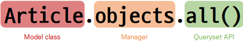

# Django 05

## 장고 ORM
> 장고를 데이터베이스에 연결하고, 데이터를 저장

### 모델
- models.py 작성
  - 모델 클래스를 작성하는 것은 데이터베이스 테이블의 스키마를 정의하는 것
  - 각 모델은 django.models.Model 클래스의 서브 클래스 (각 모델은 django.db.models 모듈의 Model 클래스를 상속받아 구성됨)
  - models 모듈을 통해 어떠한 타입의 DB 필드(컬럼)을 정의할 것인지 정의

```python
# articles/models.py
from django.db import models

class Article(models.Model):
  content = models.TextField()
```


#### 사용할 모델 필드
- `CharField(max_length=None, **options)`
  - 길이의 제한이 있는 문자열을 넣을 때 사용
  - max_length
    - 필드의 최대 길이(문자)
    - CharField의 필수 인자
    - 데이터베이스와 Django의 유효성 검사(값을 검증하는 것)에서 활용
- `TextField(**options)`
  - 글자의 수가 많을 때 사용
  - max_length 옵션 작성 시 사용자 입력 단계에서는 반영 되지만,모델과 데이터베이스 단계에는 적용되지 않음 (CharField를 사용해야 함)
    - 실제로 저장될 때 길이에 대한 유효성을 검증하지 않음

### Migrations
- makemigrations
  - 클래스의 내용으로 데이터베이스에 반영하기 위한 마이그레이션 파일을 생성
  - 모델의 변경사항에 대한 새로운 migration을 만들 때 사용
  - 명령어 실행 후 migrations/0001_initial.py가 생성된 것을 확인
```bash
python manage.py makemigrations
```
- migrate
  - makemigrations로 만든 설계도를 실제 데이터베이스에 반영하는 과정
  - `db.lite3`파일에 반영
  - 결과적으로 모델의 변경사항과 데이터베이스를 동기화
```bash
python manage.py migrate
```

## ORM
### ORM의 장단점
- 장점
  - SQL을 잘 알지 못해도 객체지향 언어로 DB 조작이 가능
  - 객체 지향적 접근으로 인한 높은 생산성
- 단점
  - ORM 만으로 세밀한 데이터베이스 조작을 구현하기 어려운 경우가 있음

## QuerySet API


- Objects manager
  - Django 모델이 데이터베이스 쿼리 작업을 가능하게 하는 인터페이스
  - Django는 기본적으로 모든 Django 모델 클래스에 대해 objects 라는 Manager 객체를 자동으로 추가함
  - 이 Manager를 통해 특정 데이터를 조작할 수 있음
  - DB를 Python class로 조작할 수 있도록 여러 메서드를 제공하는 manager

- Query
  - 데이터베이스에 특정한 데이터를 보여 달라는 요청
  - 파이썬으로 작성한 코드가 ORM의 의해 SQL로 변환되어 데이터베이스에 전달되며, 데이터베이스의 응답 데이터를 ORM이 QuerySet이라는 자료 형태로 변환하여 우리에게 전달

- QuerySet
  - 데이터베이스에게서 전달 받은 객체 목록(데이터 모음)
  - 순회가 가능한 데이터로써 1개 이상의 데이터를 불러와 사용할 수 있음
  - Django ORM을 통해 만들어진 자료형이며, 필터를 걸거나 정렬 등을 수행할 수 있음
  - objects manager를 사용하여 복수의 데이터를 가져오는 queryset method를 사용할 때 반환되는 객체
  - 단, 데이터베이스가 단일한 객체를 반환 할 때는 QuerytSet이 아닌 모델(Class)의 인
스턴스로 반환됨

- QuerySet API
  - QuerySet과 상호작용하기 위해 사용하는 도구 (메서드, 연산자 등)

### CURD
- CREATE
```python
# create 메서드 활용
Todo.objects.create(id=1)
```

- READ
  - `all()` : 전체 데이터 조회
  - `get()` : 단일 데이터 조회
  - `filter()` : 지정된 조회 매게 변수와 일치하는 객체를 포함하는 새 QuerySet을 반환
```python
# 전체 데이터 조회
Todo.objects.all()

# 일부 데이터 조회(get)
Todo.objects.get(id=1)

# 일부 데이터 조회(filter)
Todo.objects.filter(id=1)
```

- UPDATE
```python
# Todo 객체 활용
todo = Todo.objects.get(id=1)

# Todo 객체 속성 변경
todo.priority = 1

# Todo 객체 저장
todo.save()
```

- DELETE
```python
# Todo 객체 활용
todo = Todo.objects.get(id=1)
 
# Todo 객체 삭제
todo.delete()
```