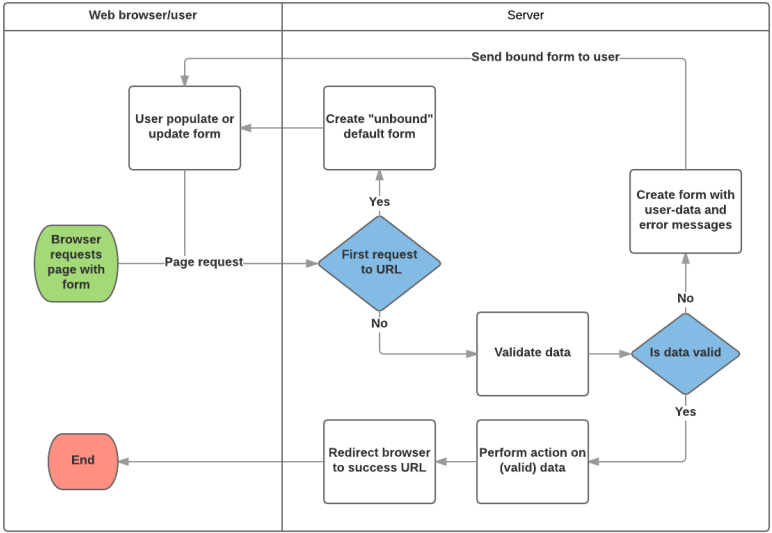

# Django 07 - ModelForm
> 사용자가 입력한 값이 DB의 데이터 형식과 일치하는지를 확인하는 유효성 검증을 서버 사이드에서 처리할 때 필요한 class

## ModelForm 선언
- forms 라이브러리의 ModelForm 클래스를 상속받음
- 정의한 ModelForm 클래스 안에 Meta 클래스를 선언
- 어떤 모델을 기반으로 form을 작성할 것인지에 대한 정보를 Meta 클래스에 지정
```python
# articles/forms.py
from django import forms
from .models import Article

class ArticleForm(forms.ModelForm):
    class Meta:
        model = Article
        fields = '__all__'
```

### Meta Class
- ModelForm의 정보를 작성하는 곳
- ModelForm을 사용할 경우 참조 할 모델이 있어야 하는데, Meta class의 model 속성이 이를 구성함
- fields 속성에 '__all__'를 사용하여 모델의 모든 필드를 포함할 수 있음
- 또는 exclude 속성을 사용하여 모델에서 포함하지 않을 필드를 지정할 수 있음
  - `exclude = ('title',)`

### ModelForm 활용
- 1. ModelForm 객체를 context로 전달
```python
# articles/views.py
from .forms import ArticleForm

def new(request):
    form = ArticleForm()
    context = {
        'form': form,
    }
return render(request, 'articles/new.html', context)
```
- 2. Input Field 활용
```html
<!-- articles/new.html -->



<h1>NEW</h1>
  <form action="" method="POST">
  
  {{ form.as_p }}
  <input type="submit">
</form>
<hr>
<a href="">[back]</a>

```

- `<label>` & `<input>` 쌍에 대한 3가지 출력 옵션
- `as_p()`
  - 각 필드가 단락(`<p>` 태그)으로 감싸져서 렌더링
- `as_ul()`
  - 각 필드가 목록 항목(`<li>` 태그)으로 감싸져서 렌더링
  - `<ul>` 태그는 직접 작성해야 한다.
- `as_table()`
  - 각 필드가 테이블(`<tr>` 태그) 행으로 감싸져서 렌더링

## ModelForm with view functions
### ModelForm 활용 로직

- 요청 방식에 따른 분기
  - HTML Form 전달
  - 사용자 입력 데이터 수신
- 유효성 검사에 따른 분기
  - 유효성 검사 실패시 Form으로 전달
  - 유효성 검사 성공시 DB 저장

### CREATE
- 유효성 검사를 통과하면
  - 데이터 저장 후 상세 페이지로 리다이렉트
- 통과하지 못하면
  - 작성 페이지로 리다이렉트
```python
# articles/views.py

def create(request):
    form = ArticleForm(request.POST)
    if form.is_valid():
        article = form.save()
        return redirect('articles:detail', article.pk)
    return redirect('articles:new')
```

- `is_valid()` method
  - 유효성 검사를 실행하고, 데이터가 유효한지 여부를 boolean으로 반환
  - 데이터 유효성 검사를 보장하기 위한 많은 테스트에 대해 Django는 is_valid()를 제공하여 개발자의 편의를 도움
- `save()` method
  - form 인스턴스에 바인딩 된 데이터를 통해 데이터베이스 객체를 만들고 저장
  - ModelForm의 하위 클래스는 키워드 인자 instance 여부를 통해 생성할 지, 수정할지를 결정함

- `save()` method
form 인스턴스에 바인딩 된 데이터를 통해 데이터베이스 객체를 만들고 저장
- ModelForm의 하위 클래스는 키워드 인자 instance 여부를 통해 생성할 지, 수정할지를 결정함
  - 제공되지 않은 경우 save()는 지정된 모델의 새 인스턴스를 만듦(CREATE)
  - 제공되면 save()는 해당 인스턴스를 수정(UPDATE)
```python
# CREATE
form = ArticleForm(request.POST)
form.save()

# UPDATE
form = ArticleForm(request.POST, instance=article)
form.save()
```

#### form 인스턴스의 errors 속성
- `is_valid()`의 반환 값이 False인 경우 form 인스턴스의 errors 속성에 값이 작성되는데, 유효성 검증을 실패한 원인이 딕셔너리 형태로 저장됨 -> 유효성 검증을 실패
했을 때 사용자에게 실패 결과 메세지를 출력해줄 수 있음
```python
# articles/views.py
def create(request):
    form = ArticleForm(request.POST)
    if form.is_valid():
        article = form.save()
        return redirect('articles:detail', article.pk)
    context = {
        'form': form,
    }
    return render(request, 'articles/new.html', context)
```

### UPDATE
- ModelForm의 인자 instance는 수정 대상이 되는 객체(기존 객체)를 지정
- request.POST
    - 사용자가 form을 통해 전송한 데이터 (새로운 데이터)
- instance
    - 수정이 되는 대상
```python
# articles/views.py
def edit(request, pk):
    article = Article.objects.get(pk=pk)
    form = ArticleForm(instance=article)
    context = {
        'article': article,
        'form': form,
    }
    return render(request, 'articles/edit.html', context)
```
```html
<!– articles/edit.html -->


<h1>EDIT</h1>
  <form action="" method="POST">
    
    {{ form.as_p }}
  <input type="submit">
  </form>
  <hr>
  <a href="">[back]</a>

```
```python
# articles/views.py
def update(request, pk):
    article = Article.objects.get(pk=pk)
    form = ArticleForm(request.POST, instance=article)
    if form.is_valid():
        form.save()
        return redirect('articles:detail', article.pk)
    context = {
        'form': form,
        'article': article,
    }
    return render(request, 'articles/edit.html', context)
```
## REFERENCE
[ModelForm](https://developer.mozilla.org/en-US/docs/Learn/Server-side/Django/Forms)