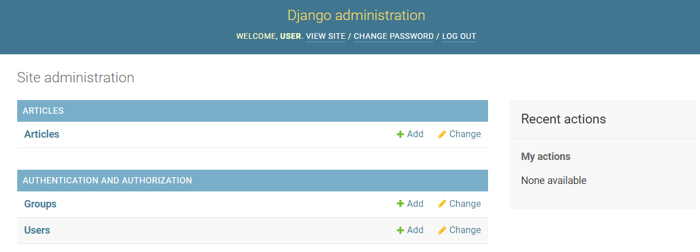
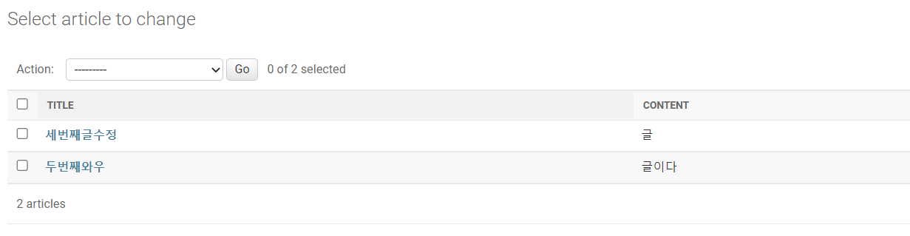

# Django 08
## Admin site
- 관리자 페이지
  - 사용자가 아닌 서버의 관리자가 활용하기 위한 페이지
  - 모델 class를 admin.py에 등록하고 관리
  - 레코드 생성 여부 확인에 매우 유용하며 직접 레코드를 삽입할 수도 있음

### admin 계정 생성
```bash
$ python manage.py createsuperuser
```
- username과 password를 입력해 관리자 계정을 생성하기

### admin site 로그인
- http://127.0.0.1:8000/admin/ 로 접속 후 로그인
- 계정만 만든 경우 Django 관리자 화면에서 모델 클래스는 보이지 않음

### admin에 모델 클래스 등록
- 모델의 record를 보기 위해서는 admin.py에 등록 필요
```python
# articles/admin.py
from django.contrib import admin
from .models import Article

class ArticleAdmin(admin.ModelAdmin):
    list_display = ('title', 'content')

admin.site.register(Article, ArticleAdmin)
```



- admin 페이지에서 데이터를 직접 CRUD 할 수 있다.

## Static files
### 웹서버와 정적 파일
- 웹서버
  - 웹 서버는 특정 위치(URL)에 있는 자원(resource)을 요청(HTTP request) 받아서 제공(serving)하는 응답(HTTP response)을 처리하는 것을 기본 동작으로 함
  - 웹 서버는 요청 받은 URL로 서버에 존재하는 정적 자원(static resource)를 제공
- 정적 파일
  - 응답할 때 별도의 처리 없이 파일 내용을 그대로 보여주면 되는 파일
  - 파일 자체가 고정되어 있고, 서비스 중에도 추가되거나 변경되지 않고 고정되어 있음
  - Django에서는 이러한 파일들을 `Static file`이라 함
### 정적 파일 활용
- settings.py의 INSTALLED_APPS에 django.contrib.staticfiles가 포함되어 있는지 확인
- settings.py에서 STATIC_URL을 정의
- `STATICFILES_DIRS` : `app/static/` 디렉토리 경로(기본 경로) 를 사용하는 것외에 추가적인 정적 파일 경로 목록을 정의하는 리스트
```python
# pjt/settings.py
INSTALLED_APPS = [
    'django.contrib.staticfiles',
]

STATIC_URL = '/static/'

STATICFILES_DIRS = [BASE_DIR / 'static']
```
```html


```
- 이 외에 css, font, js 파일 등등도 활용 가능하다.