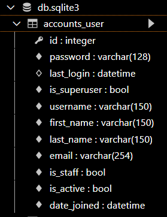
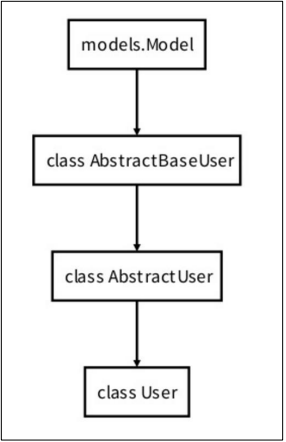
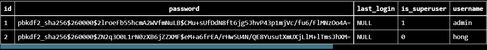

# Django 08
## Django Auth
> Django authentication system(인증 시스템)은 인증(Authentication)과 권한(Authorization) 부여를 함께 제공한다.
- Authentication (인증)
  - 신원 확인
  - 사용자가 자신이 누구인지 확인하는 것
- Authorization (권한, 허가)
  - 권한 부여
  - 인증된 사용자가 수행할 수 있는 작업을 결정
### 사전 설정
- accounts app 생성 및 등록
```bash
$ python manage.py startapp accounts
```
```python
# settings.py
# accounts로 이름 사용 권장
INSTALLED_APPS = [
    'accounts',
    ...
]
```
- url 분리 및 매핑
```python
# accounts/urls.py
from django.urls import path
from . import views

app_name = 'accounts'
urlpatterns = [

]
```

```python
# pjt/urls.py
urlpatterns = [
    ...,
    path('accounts/', include('accounts.urls')),
]
```

## User model 활용하기
- Django는 기본적인 인증 시스템과 여러 가지 필드가 포함된 User Model을 제공하지만 대부분의 개발 환경에서 기본 User Model을 Custom User Model로 대체함(강력 권장)
- Custom User Model은 기본 User 모델과 동일하게 작동하면서도 필요한 경우 나중에 맞춤 설정할 수 있기때문
  - User Model 대체 작업은 프로젝트의 모든 migrations 혹은 첫 migrate를 실행하기 전에 이 작업을 마쳐야 함
- Django는 현재 프로젝트에서 사용할 USer Model을 결정하는 AUTH_USER_MODEL 설정 값으로 Default User Model을 재정의(override)할 수 있도록 함

### AUTH_USER_MODEL
- 프로젝트에서 User를 나타낼 때 사용하는 모델
- 프로젝트가 진행되는 동안 변경할 수 없음
- 프로젝트 시작 시 설정하기 위한 것이며, 참조하는 모델은 첫번째 마이그레이션에서 사용할 수 있어야 함
- 기본 값 : 
```python
# settings.py

AUTH_USER_MODEL = 'auth.User'
```

### 대체하기
- AbstractUser를 상속받는 커스텀 User 클래스 작성
- 기존 User 클래스도 AbstractUser를 상속받기 때문에 커스텀 User 클래스도
완전히 같은 모습을 가지게 됨
```python
# accounts/models.py

from django.contrib.auth.models import AbstractUser

class User(AbstractUser):
    pass
```

- Django 프로젝트에서 User를 나타내는데 사용하는 모델을 방금 생성한
커스텀 User 모델로 지정
```python
# settings.py

AUTH_USER_MODEL = 'accounts.User'
```

- admin.py에 커스텀 User 모델을 등록
- 기본 User 모델이 아니기 때문에 등록하지 않으면 admin site에 출력되지 않음
```python
# accounts/admin.py

from django.contrib import admin
from django.contrib.auth.admin import UserAdmin
from .models import User

admin.site.register(User, UserAdmin)
```

- 데이터베이스 초기화
- migrations 파일, db.sqlite3 삭제 후 migrations 진행


- 이제 auth_user 테이블이 아닌 accounts_user 테이블을 사용

### User 모델 상속 관계

- `class AbstractBaseUser` : 비밀번호 / 인증
- `class AbstractUser` : username, email 등의 정보를 정의 -> Custom 진행


### 암호 관리
- 회원은 가입시 일반적으로 암호 저장이 필수적이며 별도의 처리가 필요하다.
- Django에서는 기본으로 PBKDF2를 (Password-Based Key Derivation Function) 사용하여 저장
  - 단방향 해시함수를 활용하여 비밀번호를 다이제스트로 암호화하며, 이는 복호화가 불가능함
  - 단방향 해시함수는 MD5, SHA-1, SHA-256 등이 존재하며, Django는 SHA256 활용
  - 단방향 해시함수의 경우 레인보우 공격 및 무차별 대입 공격 등의 문제가 발생 가능함
  - 이를 보완하기 위하여 아래의 기법을 추가 활용
    - 솔팅(Salting) : 패스워드에 임의의 문자열인 salt를 추가하여 다이제스트를 생성
    - 키 스트레칭(Key Stretching) : 해시를 여러 번 반복하여 시간을 늘림

### User 객체 활용
- 셸 사용하기
```bash
$ pip install django-extensions
```
```python
# pjt/settings.py

INSTALLED_APPS = [
    'django_extensions',
    ...,
]
```
```bash
$ pip install ipython
$ python manage.py
```
- User 생성
```python
user = User.objects.create_user('hong', 'hong@naver.com', '1q2w3e')
```
- User 비밀번호 변경
```python
user = User.objects.get(pk=2)
user.set_password('new password')
user.save()
```
- User 인증(비밀번호 확인)
```python
from django.contrib.auth import authenticate
authenticate(username='hong', password='1q2w3e!!!')
#
authenticate(username='hong', password='1q2w3e')
# <User: hong>
```


- 알아서 비밀번호를 암호화해서 저장

## 회원 가입
### UserCreationForm
> 주어진 username과 password로 권한이 없는 새 user를 생성하는 ModelForm
>
> username, password1, password2 총 3개의 필드를 가짐

```python
# accounts/urls.py

app_name = 'accounts'
urlpatterns = [
    ...,
    path('signup/', views.signup, name='signup'),
]
```
```python
# accounts/views.py
from django.contrib.auth.forms import AuthenticationForm, UserCreationForm
def signup(request):
    if request.method == 'POST':
        form = UserCreationForm(request.POST)
        if form.is_valid():
            form.save()
            return redirect('articles:index')
    else:
        form = UserCreationForm()
    context = {
        'form': form,
    }
return render(request, 'accounts/signup.html', context)
```
```html
<!-- accounts/signup.html -->


<h1>회원가입</h1>
<form action="" method="POST">
  
  {{ form.as_p }}
  <input type="submit">
</form>

```

- UserCreationForm이 우리가 대체한 커스텀 유저 모델이 아닌 기존 유저 모델로 인해 작성된 클래스이기 때문에 회원가입 진행 후 에러 페이지가 나타난다.

### UserCreationForm() 커스텀 하기
- 기존 UserCreationForm을 상속받아 User 모델 재정의
```python
# accounts/forms.py

from django.contrib.auth import get_user_model
from django.contrib.auth.forms import UserCreationForm
from django.contrib.auth import get_user_model

class CustomUserCreationForm(UserCreationForm):
    class Meta(UserCreationForm.Meta):
        model = get_user_model()
        fields = ('username',)
```
- `get_user_model()`
  - 현재 프로젝트에서 활성화된 사용자 모델(active user model)을 반환
  - Django에서 User 클래스는 커스텀을 통해 변경이 가능하며, 직접 참조하는 대신 get_user_model() 사용을 권장
    - 직접 User를 참조하면 나중에 모델이 바뀌는 등 변경 사항이 생기면 코드의 많은 부분을 고쳐야하기 때문에 권장하는 것

- CustomUserCreationForm() 으로 대체하기
```python
# accounts/views.py
from django.contrib.auth.forms import AuthenticationForm, UserCreationForm
from .forms import CustomUserCreationForm, CustomUserChangeForm

def signup(request):
    if request.method == 'POST':
        form = CustomUserCreationForm(request.POST)
        if form.is_valid():
            form.save()
            return redirect('articles:index')
    else:
        form = CustomUserCreationForm()
    context = {
        'form': form,
    }
    return render(request, 'accounts/signup.html', context)
```

## 참조 - Django에 bootstrap5 패키지 적용하기
```bash
$ pip install django-bootstrap5
```
```python
# pjt/setting.py
INSTALLED_APPS = [
    'django_bootstrap5',
    ...,
]
```
```html
<!-- accounts/signup.html -->




<h1>signUp</h1>
<form action="" method="POST">
    
    
    <input type="submit" value="submit">
</form>

```