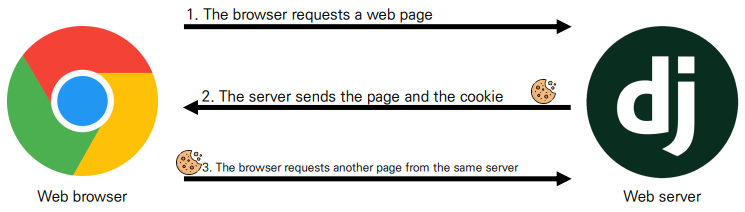
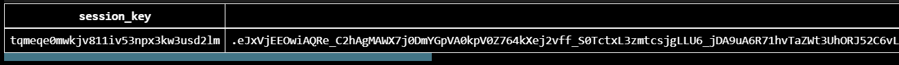
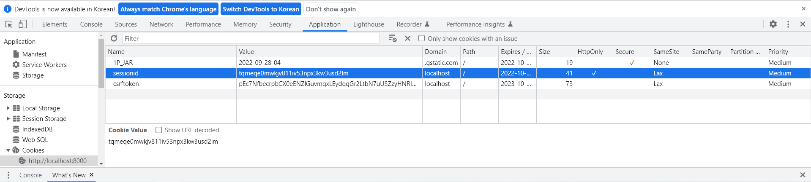

# Django 10
## 로그인 과정
### HTTP
- Hyper Text Transfer Protocol
- HTML 문서와 같은 리소스들을 가져올 수 있도록 해주는 프로토콜(클라이언트 - 서버 프로토콜이라고도 부름)
- 웹(WWW)에서 이루어지는 모든 데이터 교환의 기초

#### 요청과 응답
- 요청 (requests) : 클라이언트(브라우저)에 의해 전송되는 메시지
- 응답 (response) : 서버에서 응답으로 전송되는 메시지

#### HTTP 특징
- 비연결지향(connectionless)
  - 서버는 요청에 대한 응답을 보낸 후 연결을 끊음
- 무상태(stateless)
  - 연결을 끊는 순간 클라이언트와 서버 간의 통신이 끝나며 상태 정보가 유지되지 않음
  - 클라이언트와 서버가 주고받는 메시지들은 서로 완전히 독립적

### 쿠키와 세션
> 서버와 클라이언트 간 지속적인 상태 유지를 위해 존재

#### 쿠키
- 서버가 사용자의 웹 브라우저(클라이언트)에 전송하는 작은 데이터 조각
  - 브라우저(클라이언트)는 쿠키를 로컬에 KEY-VALUE의 데이터 형식으로 저장
  - 동일한 서버에 재요청 시 저장된 쿠키를 함께 전송
- 쿠키는 서로 다른 요청이 동일한 브라우저로부터 발생한 것인지 판단할 때 주로 사용됨
  - 상태가 없는(stateless) HTTP에서 상태 정보를 관리, 사용자는 로그인 상태를 유지할 수 있음



##### 쿠키 사용 목적
- 세션 관리 (Session management)
  - 로그인, 아이디 자동완성, 공지 하루 안 보기, 팝업 체크, 장바구니 등의 정보 관리
- 개인화 (Personalization)
  - 사용자 선호, 테마 등의 설정
- 트래킹 (Tracking)
  - 사용자 행동을 기록 및 분석

##### 쿠키 수명(Lifetime)
- Session cookie
  - 현재 세션(current session)이 종료되면 삭제됨
  - 브라우저 종료와 함께 세션이 삭제됨
- Persistent cookies 
  - Expires 속성에 지정된 날짜 혹은 Max-Age 속성에 지정된 기간이 지나면 삭제됨

#### 세션
- 사이트와 특정 브라우저 사이의 state(상태) 를 유지시키는 것
- 클라이언트가 서버에 접속하면 서버가 특정 session id를 발급하고, 클라이언트는 session id를 쿠키에 저장
  - 클라이언트가 다시 동일한 서버에 접속하면 요청과 함께 쿠키(session id가 저장된)를 서버에 전달
  - 쿠키는 요청 때마다 서버에 함께 전송 되므로 서버에서 session id를 확인해 알맞은 로직을 처리
- session id 는 세션을 구별하기 위해 필요하며, 쿠키에는 session id 만 저장

##### 장고에서의 세션
- Django는 database-backend sessions 저장 방식을 기본 값으로 사용
  - session 정보는 Django DB의 django_session 테이블에 저장
  - 설정을 통해 다른 저장방식으로 변경 가능
- Django는 특정 session id를 포함하는 쿠키를 사용해서 각각의 브라우저와 사이트가 연결된 session을 확인함

## login
### AuthenticationForm
> 로그인을 위한 built-in-form

```python
# accounts/urls.py

from django.urls import path
from . import views

app_name = 'accounts'
urlpatterns = [
    path('accounts/login/', views.login, name='login'),
]
```

```html
<!-- accounts/login.html -->


  <h1>로그인</h1>
  <form action="" method="POST">
  
  {{ form.as_p }}
  <input type="submit">
  </form>

```

```python
# accounts/views.py

from django.contrib.auth.forms import AuthenticationForm
from django.contrib.auth import login as auth_login

def login(request):
    if request.method == 'POST':
        form = AuthenticationForm(request, data=request.POST)
        if form.is_valid():
            auth_login(request, form.get_user())
            return redirect('accounts:index')
    else:
        form = AuthenticationForm()
    context = {
        'form': form
    }
return render(request, 'accounts/login.html', context)
```

#### `login()`
- `login(request, user, backend=None)`
- 인증된 사용자를 로그인
  - 유저의 ID를 세션에 저장하여 세션을 기록
- HttpRequet 객체와 User 객체가 필요
  - 유저 정보는 반드시 인증된 유저 정보여야 함
    - `authenticate()` 함수를 활용한 인증
    - AuthenticationForm을 활용한 is_valid

#### `get_user()`
- AuthenticationForm의 인스턴스 메서드
- 유효성 검사를 통과했을 경우 로그인 한 사용자 객체 반환

#### 로그인 후 세션 데이터 확인
- django에서 확인
  -  django_session 테이블에서 확인



- 브라우저에서 확인
  - 개발자도구 - Application - Cookies



## Authentication with User
### 현재 로그인되어 있는 유저 정보 출력하기
- setting.py의 context processors 설정의 'django.contrib.auth.context_processors.auth' 때문에 템플릿에서 context 데이터 없이 user 변수를 사용할 수 있다.
```html
<!-- base.html -->
...
<body>
  <a href="">회원가입</a>
  <a href="">로그인</a>
  <h3>안녕하세요 {{ user }} 님</h3>
   
...
```
- context processors
  - 템플릿이 렌더링 될 때 호출 가능한 컨텍스트 데이터 목록
  -  django에서 자주 사용하는 데이터 목록을 미리 템플릿에 로드 해 둔 것
- 템플릿 변수 `{{ user }}`
  - 클라이언트가 로그인한 경우 User 클래스의 인스턴스 -> `username`
  - 클라이언트가 로그인하지 않은 경우 AnonymousUser 클래스의 인스턴스 -> `AnonymousUser`
```python
# settings.py
TEMPLATES = [
    {
        ...
        'OPTIONS': {
            'context_processors': [
            'django.template.context_processors.debug',
            'django.template.context_processors.request',
            'django.contrib.auth.context_processors.auth',
            'django.contrib.messages.context_processors.messages',
            ],
        },
    },
]
```

## Limiting access to logged-in users
- 로그인 사용자에 대한 접근 제한하기
- 로그인 사용자에 대해 접근을 제한하는 2가지 방법
  - is_authenticated attribute를 활용한 조건문
  - The login_required decorator를 활용한 view 제한

### `is_authenticated`
- User model의 속성(attributes) 중 하나
- 사용자가 인증 되었는지 여부를 알 수 있는 방법
- 모든 User 인스턴스에 대해 항상 True인 읽기 전용 속성
- 일반적으로 request.user에서 이 속성을 사용 (request.user.is_authenticated)
- 권한(permission)과는 관련이 없으며, 사용자가 활성화 상태(active)이거나 유효한 세션(valid session)을 가지고 있는지도 확인하지 않음

#### 적용하기
- 로그인과 비로그인 상태에서 출력되는 링크 다르게 설정하기
```html
<!-- base.html -->
...
<body>
  <div class="d-flex">
    
    <h3>안녕하세요 {{ user }} 님</h3>
    <a href="">회원정보 수정</a>
    
    <a href="">회원가입</a>
    <a href="">로그인</a>
    
  </div>
   
  ...
```
- 인증된 사용자만 게시글 작성 링크를 볼 수 있도록 처리하기
  - 이 방법은 URL을 직접 입력하면 로그인을 안해도 게시글 작성 페이지로 갈 수 있다.
```html
<!-- accounts/index.html -->

  <a href="">글 작성</a>

  <a href="">새 글을 작성하려면 로그인하세요</a>

```
```python
# accounts/views.py
def login(request):
    if request.user.is_authenticated:
    return redirect('articles:index')
...
```

### `login_required```
- login_required decorator
- 사용자가 로그인 되어 있으면 정상적으로 view 함수 실행
- 로그인 하지 않은 사용자의 경우 setting.py의 LOGIN_URL 문자열 주소로 redirect (`/accounts/login/`)

#### 적용하기
- 로그인 상태에서만 글을 작성/수정/삭제 할 수 있도록 변경
  - `/accounts/create/`로 브라우저에 직접 요청하면 `/accounts/login/?next=/articles/create/` 페이지로 리다이렉트 됨

```python
# accounts/views.py
from django.contrib.auth.decorators import login_required

@login_required
def create(request):
    pass
@login_required
def delete(request, pk):
    pass
@login_required
def update(request, pk):
    pass
```

- `/accounts/create/`로 로그인을 하지 않고 브라우저에 직접 요청
- 로그인 페이지로 리다이렉트 및 URL 확인
  - 인증 성공 시 사용자가 redirect 되어야하는 경로는 "next"라는 쿼리 문자열 매개 변수에 저장됨

```python
# accounts/views.py
def login(request):
    if request.user.is_authenticated:
        return redirect('accounts:index')
    if request.method == "POST":
        form = AuthenticationForm(request, data=request.POST)
        if form.is_valid():
            auth_login(request, form.get_user())
            # https://127.0.0.1:8000/accounts/login/?next=/accounts/create/
            # request.GET.get('next') : /accounts/create/
            return redirect(request.GET.get('next') or 'accounts:index')
            # return문을 if문으로 풀어서 쓰면
            # if request.GET.get('next'):
            #   return redirect(request.GET.get('next'))
            # else:
            #   return redirect('accounts:index')
    else:
        form = AuthenticationForm()
    context = {
        "form": form,
    }
    return render(request, 'accounts/login.html', context)
```

## logout
### `logout(request)`
- 요청 유저에 대한 세션 정보를 삭제
  - DB에서 session data 삭제
  - 클라이언트의 쿠키에서 sessionid 삭제
- HttpRequest 객체를 인자로 받고 반환 값이 없음
- 사용자가 로그인하지 않은 경우 오류를 발생시키지 않음

```python
# accounts/urls.py

from django.urls import path
from . import views

app_name = 'accounts'
urlpatterns = [
    ...
    path('accounts/logout/', views.logout, name='logout'),
    ...
]
```

```python

# accounts/views.py
from django.contrib.auth import logout as auth_logout

def logout(request):
    auth_logout(request)
return redirect('articles:index')
```

```html
<!-- base.html -->
...
<body>
  <div class="d-flex">
    
    <h3>안녕하세요 {{ user }} 님</h3>
    <a href="">회원정보 수정</a>
    <form action="" method="POST">
      
      <input type="submit" value="로그아웃">
    </form>
    
    <a href="">회원가입</a>
    <a href="">로그인</a>
    
  </div>
   
  ...
```