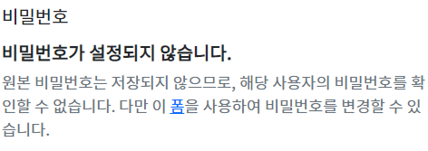

# Django 11
## 회원정보 수정
### UserChangeForm
- 사용자의 정보 및 권한을 변경하기 위해 admin 인터페이스에서 사용되는 ModelForm
- ModelForm이기 때문에 instace 인자로 기존 user 데이터 정보를 받는 구조
- 이미 이전에 CustomUserChangeForm으로 확장했기 때문에 CustomUserChangeForm을 사용하기

```python
# accounts/forms.py
from django.contrib.auth import get_user_model
from django.contrib.auth.forms import UserChangeForm

class CustomUserChangeForm(UserChangeForm):
    class Meta(UserChangeForm.Meta):
        model = get_user_model()
        fields = ('email', 'first_name', 'last_name',)
```
```python
# accounts/urls.py
app_name = 'accounts'
urlpatterns = [
    ...,
    path('update/', views.update, name='update'),
]
```
```html
<!-- accounts/update.html -->


<h1>회원정보수정</h1>
<form action="" method="POST">
  
  {{ form.as_p }}
  <input type="submit">
</form>

```
```python
# accounts/views.py
def update(request):
    if request.method == 'POST':
        form = CustomUserChangeForm(request.POST, instance=request.user)
        if form.is_valid():
            form.save()
            return redirect('articles:index')
    else:
        form = CustomUserChangeForm(instance=request.user)
    context = {
    'form': form,
    }
return render(request, 'accounts/update.html', context)
```
```html
<!-- base.html -->
<div class="container">
  <a href="">Signup</a>
  <a href="">회원정보 수정</a>
  <hr>
  
  
</div>
```

## 비밀번호 변경
### PasswordChangeForm
- 사용자가 비밀번호를 변경할 수 있도록 하는 Form
- 이전 비밀번호를 입력하여 비밀번호를 변경할 수 있도록 함
- 이전 비밀번호를 입력하지 않고 비밀번호를 설정할 수 있는 SetPasswordForm을 상속받는 서브 클래스


- UserChangeForm에 기본적으로 나오는 정보
- 비밀번호 변경 form 주소 : `http://localhost:8000/password/`

```python
# accounts/urls.py
app_name = 'accounts'
urlpatterns = [
    ...,
    path('password/', views.change_password, name='change_password'),
]
```
```html
<!-- accounts/change_password.html -->


<h1>비밀번호 변경</h1>
<form action="" method="POST">
  
  {{ form.as_p }}
  <input type="submit">
</form>

```
```python
# accounts/views.py
from django.contrib.auth.forms import AuthenticationForm, PasswordChangeForm

def change_password(request):
    if request.method == 'POST':
        pass
    else:
        form = PasswordChangeForm(request.user)
    context = {
        'form': form,
    }
return render(request, 'accounts/change_password.html', context)
```

### 회원가입 이후 로그인
- 바로 로그인 진행
  - `user = form.save()
auth_login(request, user) `
```python
# accounts/views.py
def signup(request):
    if request.method == 'POST':
        form = CustomUserCreationForm(request.POST)
        if form.is_valid():
            user = form.save()
            auth_login(request, user)
            return redirect('articles:index')
    else:
        form = CustomUserCreationForm()
    context = {'form': form,}
    return render(request, 'accounts/signup.html', context)
```

-  암호 변경 시 세션 무효화 방지하기
  - `update_session_auth_hash(request, user)`
```python
from django.contrib.auth import update_session_auth_hash

def change_password(request):
    if request.method == 'POST':
        form = PasswordChangeForm(request.user, request.POST)
    if form.is_valid():
        form.save()
        update_session_auth_hash(request, form.user)
        return redirect('articles:index')
    else:
        form = PasswordChangeForm(request.user)
    context = {
        'form': form,
    }
    return render(request, 'accounts/change_password.html', context)
```

### 회원 탈퇴하기
- 탈퇴하면서 해당 유저의 세션 정보도 함께 지우기
- **탈퇴 후 로그아웃** 순서 지키기
```python
# accounts/views.py

def delete(request):
    request.user.delete()
    auth_logout(request)
```