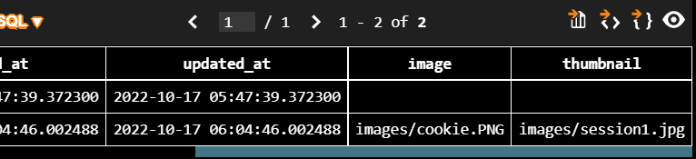
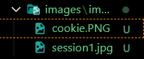

# Django 11
## 이미지 업로드
### 미디어 파일
- 사용자가 웹에서 업로드하는 정적 파일
- 유저가 업로드 한 모든 정적 파일
### 미디어 관련 필드
- `ImageField`
  - 이미지 업로드에 사용하는 모델 필드
  - FileField를 상속받는 서브 클래스이기 때문에 FileField의 모든 속성 및 메서드를 사용 가능하며 더해서 사용자에 의해 업로드 된 객체가 유효한 이미지인지 검사함
  - ImageField 인스턴스는 최대 길이가 100자인 문자열로 DB에 생성되며, max_length 인자를 사용하여 최대 길이를 변경 할 수 있음
  - 사용하기 위해서 반드시 Pillow 라이브러리가 필요
  ```bash
  $ pip install Pillow
  ```
- `FileField`
  - 파일 업로드에 사용하는 모델 필드
  - 2개의 선택 인자를 가지고 있음
    - `upload_to`
    - `storage`
#### 모델 설정 - `upload_to` argument
- 문자열 경로 지정 방식
```python
# models.py

class Article(models.Model):
    image = models.ImageField(upload_to='images/')
```
- 함수 호출
```python
# models.py

def articles_image_path(instance, filename):
    return f'user_{instance.user.pk}/{filename}'

class Article(models.Model):
    image = models.ImageField(upload_to=articles_image_path)
```

#### URL 설정
- setting.py에 MEDIA_ROOT, MEDIA_URL 설정
  - `MEDIA_ROOT`
    - 사용자가 업로드 한 파일(미디어 파일)들을 보관할 디렉토리의 절대 경로
    - django는 성능을 위해 업로드 파일은 데이터베이스에 저장하지 않음 (실제 DB에 저장되는 것은 파일의 경로)
  - `MEDIA_URL`
    - MEDIA_ROOT에서 제공되는 미디어를 처리하는 URL
    - 업로드 된 파일의 주소(URL)를 만들어 주는 역할
    - 비어 있지 않은 값으로 설정 한다면 반드시 slash(/)로 끝나야 함
```python
# setting.py

MEDIA_ROOT = BASE_DIR / 'images'
MEDIA_URL = '/media/'
```

- upload_to 속성을 정의하여 업로드 된 파일에 사용 할 MEDIA_ROOT의 하위 경로를 지정
- 업로드 된 파일의 경로는 django가 제공하는 ‘url’ 속성을 통해 얻을 수 있음
```html

```

- 개발 단계에서 사용자가 업로드한 파일 제공하기
  - 사용자가 업로드 한 파일이 우리 프로젝트에 업로드 되지만, 실제로 사용자에게 제공하기 위해서는 업로드 된 파일의 URL이 필요
```python
# pjt/urls.py
from django.contrib import admin
from django.urls import path, include
from django.conf import settings
from django.conf.urls.static import static

urlpatterns = [
    path('admin/', admin.site.urls),
    path('articles/', include('articles.urls'))
] + static(settings.MEDIA_URL, document_root=settings.MEDIA_ROOT)
```

## 이미지 업로드 (CREATE)
### 모델 설정
- `ImageField`
  - `upload_to='images/'` : 실제 이미지가 저장되는 경로를 지정
  - `blank=True` : 이미지 필드에 빈 값(빈 문자열)이 허용되도록 설정
```python
# articles/models.py

from django.db import models

class Article(models.Model):
    title = models.CharField(max_length=20)
    content = models.TextField()
    created_at = models.DateTimeField(auto_now_add=True)
    updated_at = models.DateTimeField(auto_now=True)
    image = models.ImageField(blank=True, upload_to='images/')
```

#### 모델 필드 옵션
- `blank` - Validation-related
    - 기본 값 : False
    - True인 경우 필드를 비워 둘 수 있음 (DB에 '' 저장)
    - 유효성 검사에서 사용됨 (form 유효성 검사에서 빈 값을 입력할 수 있음)

- `null` - Database-relate
    - 기본 값 : False
    - True면 빈 값을 DB에 NULL로 저장
    - 문자열 기반 필드에는 사용하는 것을 피해야 함
    - 문자열 기반 필드에 True로 설정 시 `데이터 없음(no data)`에 `빈 문자열(1)`과 `NULL(2)`의 2가지 가능한 값이 있음을 의미하게 됨
    - 대부분의 경우 `데이터 없음`에 대해 두 개의 가능한 값을 갖는 것은 중복되며, Django는 NULL이 아닌 빈 문자열을 사용하는 것이 규칙

### HTML 설정
```html
<!-- articles/forms.html -->



<form action="" method="POST" enctype='multipart/form-data'>
  

  
  <input type="submit" value="저장" class="btn btn-dark">
</form>

```
- form 요소 - enctype(인코딩) 속성
  - `multipart/form-data`
    - 파일/이미지 업로드 시에 반드시 사용해야 함 (전송되는 데이터의 형식을 지정)
    - `<input type="file">`을 사용할 경우에 사용
  - `application/x-www-form-urlencoded`
    - (기본값) 모든 문자 인코딩
  - `text/plain`
    - 인코딩을 하지 않은 문자 상태로 전송
    - 공백은 '+' 기호로 변환하지만, 특수 문자는 인코딩 하지 않음

### View 설정
```python
def create(request):
    if request.method == 'POST':
        form = ArticleForm(request.POST, request.FILES)
        if form.is_valid():
            form.save()
            return redirect('articles:index')
    else:
        form=ArticleForm()
    context = {
        'form': form,
    }
    return render(request, 'articles/forms.html', context)
```

### DB 및 파일 확인
- DB 확인



- 실제 파일 위치
  - MEDIA_ROOT/images/



## 이미지 업로드 (READ)
- `article.image.url` : 업로드 파일의 경로
- `article.image` : 업로드 파일의 파일 이름
```html
<!-- articles/detail.html -->


  
  {{ article.title }}
  {{ article.content }}

```

## 이미지 업로드 (UPDATE)
- 이미지는 바이너리 데이터(하나의 덩어리)이기 때문에 텍스트처럼 일부만 수정 하는 것은 불가능하고, 새로운 사진으로 덮어 씌우는 방식을 사용
  - `instance` 사용

```python
def update(request, pk):
    article = Article.objects.get(pk=pk)
    if request.method == 'POST':
        form = ArticleForm(request.POST, request.FILES, instance=article)
        if form.is_valid():
            form.save()
            return redirect('articles:index')
    else:
        form=ArticleForm(instance=article)
    context = {
        'article': article,
        'form': form,
    }
    return render(request, 'articles/forms.html', context)
```

## 이미지 Resizing
### Django-imagekit
- 실제 원본 이미지를 서버에 그대로 업로드 하는 것은 서버의 부담이 큰 작업
- `` 태그에서 직접 사이즈를 조정할 수도 있지만 (width 와 height),
업로드 될 때 이미지 자체를 resizing 하는 것을 사용해 볼 것
- django-imagekit 라이브러리 활용

1. django-imagekit 설치
2. INSTALLED_APPS에 추가
```bash
$ pip install django-imagekit
```
```python
# settings.py
INSTALLED_APPS = [
    ...
    'imagekit',
    ...
]
```

- 이미지 크기 변경하기

```python
from imagekit.models import ProcessedImageField
from imagekit.processors import ResizeToFill

class Article(models.Model):
    thumbnail = ProcessedImageField(upload_to='images/',blank=True,
                                    processors=[ResizeToFill(1200, 960)],
                                    format='JPEG',
                                    options={'quality': 80})
```