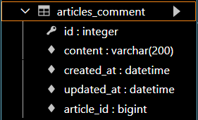

# Django 11
## 댓글 기능
### RDB
- 데이터를 테이블, 행, 열 등으로 나누어 구조화하는 방식
- RDB의 모든 테이블에는 행에서 고유하게 식별 가능한 기본 키라는 속성이 있으며, 외래 키를 사용하여 각 행에서 서로 다른 테이블 간의 관계를 만드는 데 사용할 수 있음
### RDB에서의 관계
- 1:1
  - 한 테이블의 레코드 하나가 다른 테이블의 레코드 단 한개와 관련된 경우
- 1:N
  - 한 테이블의 0개 이상의 레코드가 다른 테이블의 레코드 한 개와 관련된 경우
- M:N
  - 한 테이블의 0개 이상의 레코드가 다른 테이블의 0개 이상의 레코드와 관련된 경우
  - 양쪽 모두에서 1:N 관계를 가짐
### Foreign Key
- 외래 키(외부 키)
- 관계형 데이터베이스에서 다른 테이블의 행을 식별할 수 있는 키
- 참조되는 테이블의 기본 키(Primary Key)를 가리킴
- 참조하는 테이블의 행 1개의 값은, 참조되는 측 테이블의 행 값에 대응됨
- 참조하는 테이블 행 여러 개가, 참조되는 테이블의 동일한 행을 참조할 수 있음
#### 특징
- 키를 사용하여 부모 테이블의 유일한 값을 참조 (참조 무결성)
  - 참조 무결성 : 데이터베이스 관계 모델에서 관련된 2개의 테이블 간의 일관성
- 외래 키의 값이 반드시 부모 테이블의 기본 키 일 필요는 없지만 유일한 값이어야 함
### 1:N
#### 모델 관계 설정
- 게시판의 게시글와 1:N 관계를 나타낼 수 있는 댓글 구현
- 1:N 관계에서 댓글을 담당할 Article 모델은 1, Comment 모델은 N이 될 것
  - 게시글은 댓글을 0개 이상 가진다.
  - 댓글은 반드시 하나의 게시글에 속한다.

- Comment

|id|
|----|
|content|
|created_at|
|updated_at|
|**Article의 id**|

- Comment 데이터 예시

|id|content|created_at|updated_at|Article의 id|
|----|----|----|----|----|
|1|댓글 내용 1|..|..|1|
|2|댓글 내용 2|..|..|3|
|3|댓글 내용 3|..|..|3|

- Article

|**id**|
|----|
|title|
|content|
|created_at|
|updated_at|

#### Django Relationship Fields 종류
- `OneToOneField()` - 1:1
- `ForeignKey()` - 1:N
- `ManyToManyField()` - N:M

#### `ForeignKey(to, on_delete, **options)`
- A one-to-many relationship을 담당하는 Django의 모델 필드 클래스
- Django 모델에서 관계형 데이터베이스의 외래 키 속성을 담당
- 2개의 필수 인자
  - 참조하는 model class
  - on_delete 옵션
    - 외래 키가 참조하는 객체가 사라졌을 때, 외래 키를 가진 객체를 어떻게 처리할 지를 정의
    - 데이터 무결성을 위해서 매우 중요한 설정
    - on_delete 옵션 값
      - CASCADE : 부모 객체(참조 된 객체)가 삭제 됐을 때 이를 참조하는 객체도 삭제
      - PROTECT, SET_NULL, SET_DEFAULT...

#### Comment 모델 정의
- 외래 키 필드는 ForeignKey 클래스를 작성하는 위치와 관계없이 필드의 마지막에 작
성됨
- ForeignKey() 클래스의 인스턴스 이름은 참조하는 모델 클래스 이름의 단수형(소문자)
으로 작성하는 것을 권장
```python
# articles/models.py
class Comment(models.Model):
    article = models.ForeignKey(Article, on_delete=models.CASCADE)
    content = models.CharField(max_length=200)
    created_at = models.DateTimeField(auto_now_add=True)
    updated_at = models.DateTimeField(auto_now=True)
def __str__(self):
    return self.content
```
- migrate 후 Comment 모델 클래스로 인해 생성된 테이블
  - ForeignKey 모델 필드로 인해 작성된 컬럼의 이름은 **article_id**



### Comment 구현
#### CREATE
- 사용자로부터 댓글 데이터를 입력 받기 위한 CommentForm 작성
```python
# articles/forms.py
from .models import Article, Comment
class CommentForm(forms.ModelForm):

    class Meta:
        model = Comment
        fields = ('content',)
```

- detail 페이지에서 CommentForm 출력 (view 함수)
```python
# articles/views.py
from .forms import ArticleForm, CommentForm
def detail(request, pk):
    article = Article.objects.get(pk=pk)
    comment_form = CommentForm()
    context = {
        'article': article,
        'comment_form': comment_form,
    }

return render(request, 'articles/detail.html', context)
```

- 댓글의 외래 키 데이터에 필요한 정보가 게시글의 pk 값이기 때문에 url에서 pk 변수를 넘기기
```python
# articles/urls.py
urlpatterns = [
    ...,
    path('<int:pk>/comments/', views.comments_create, name='comments_create'),
```
```html
<!-- articles/detail.html -->
<form action="" method="POST">
  
  {{ comment_form }}
  <input type="submit">
</form>
```
```python
# articles/views.py

def comments_create(request, pk):
    article = Article.objects.get(pk=pk)
    comment_form = CommentForm(request.POST)
    if comment_form.is_valid():
        comment = comment_form.save(commit=False)
        comment.article = article
        comment.save()
return redirect('articles:detail', article.pk)
```

- `save(commit=False)`
  - 아직 데이터베이스에 저장되지 않은 인스턴스를 반환
  - 저장하기 전에 객체에 대한 사용자 지정 처리를 수행할 때 유용하게 사용

#### READ
- 작성한 댓글 목록 출력하기
```python
# articles/views.py

from .models import Article, Comment
def detail(request, pk):
    article = Article.objects.get(pk=pk)
    comment_form = CommentForm()
    comments = article.comment_set.all()
    context = {
        'article': article,
        'comment_form': comment_form,
        'comments': comments,
    }
    return render(request, 'articles/detail.html', context)
```
- detail 템플릿에서 댓글 목록 출력하기
```html
<!-- articles/detail.html -->



  ...
  <a href="">back</a>
  <hr>
  <h4>댓글 목록</h4>
  <ul>
    
      <li>{{ comment.content }}</li>
    
  </ul>
  <hr>
  ...

```

#### DELETE
- 댓글 삭제 구현하기
```python
# articles/urls.py
urlpatterns = [
    ...,
    path('<int:article_pk>/comments/<int:comment_pk>/delete/', views.comments_delete, name='comments_delete'),
]
```

```python
# articles/views.py

def comments_delete(request, article_pk, comment_pk):
    comment = Comment.objects.get(pk=comment_pk)
    comment.delete()
    return redirect('articles:detail', article_pk)
```

```html
<!-- articles/detail.html -->


  ...
  <h4>댓글 목록</h4>
  <ul>
    
      <li>
        {{ comment.content }}
        <form action="" method="POST">
          
          <input type="submit" value="DELETE">
        </form>
      </li>
    
  </ul>
  <hr>
  ...

```

#### Comment 추가 사항
- 댓글 개수 출력하기
  - DTL filter - length 사용
```html
{{ comments|length }}
{{ article.comment_set.all|length }}
```
  - Queryset API - count() 사용
```html
{{ comments.count }}
{{ article.comment_set.count }}
```
- 댓글이 없는 경우 대체 컨텐츠 출력하기
```html
<!-- articles/detail.html -->


  <li>
    {{ comment.content }}
    <form action="" method="POST">
    
    <input type="submit" value="DELETE">
  </form>
</li>

  <p>댓글이 없어요..</p>

```