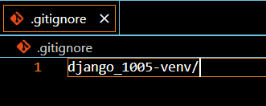
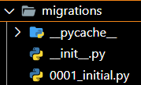
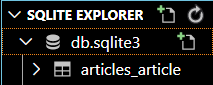

# Django CRUD
> Django : 파이썬 기반 웹 프레임 워크

## 1. 가상환경 및 Django 설치
> 가상환경 : 프로젝트별 별도 패키지 관리

### 1. 가상환경 생성 및 실행
- 가상환경 폴더를 `.gitignore`로 설정하기



```bash
$ python -m venv django_1005-venv
$ source venv/Scripts/activate
(django_1005-venv) $
```
### 2. Django 설치 및 기록
```bash
$ pip install django==3.2.13
$ pip freeze > requirements.txt
```
### 3. Django 프로젝트 생성
```bash
$ django-admin startproject pjt .
```

## 2. articles app 생성
> 주요 기능 단위의 App 구조로, App 별로 MTV 구조 + `urls.py`를 가지는 모습
### 1. app 생성
```bash
$ python manage.py startapp articles
```
### 2. app 등록
```python
# pjt/settings.py
INSTALLED_APPS = [
    'articles',
    ...
]
```
### 3. urls.py 설정
- 프로젝트 단위의 urls.py에 app.urls 등록
```python
# pjt/urls.py
from django.urls import path, include

urlpatterns = [
    path('articles/', include('articles.urls')),
]
```
- 앱 단위의 urls.py에 views 함수와 url을 연결(name 지정)
```python
# articles/urls.py
from django.urls import path
from . import views

app_name = "articles"
urlpatterns = [
    path('', views.index, name="index"),
]
```
- 활용 : articles:index => /articles/
  - Template에서 활용 예시
  ```html
  
  ```
  - View에서 활용 예시
  ```python
  redirect('articles:index')
  ```

### 4. base.html로 templates 설정
- django_1005 폴더의 가장 하위에 `templates` 폴더 생성후 `base.html` 파일 생성
- 부트스트랩과 글꼴도 함께 적용
```html
<!DOCTYPE html>
<html lang="en">

<head>
  <meta charset="UTF-8">
  <meta http-equiv="X-UA-Compatible" content="IE=edge">
  <meta name="viewport" content="width=device-width, initial-scale=1.0">
  <link rel="preconnect" href="https://fonts.googleapis.com" />
  <link rel="preconnect" href="https://fonts.gstatic.com" crossorigin />
  <link href="https://fonts.googleapis.com/css2?family=Noto+Sans+KR&display=swap" rel="stylesheet" />
  <link href="https://cdn.jsdelivr.net/npm/bootstrap@5.2.1/dist/css/bootstrap.min.css" rel="stylesheet"
    integrity="sha384-iYQeCzEYFbKjA/T2uDLTpkwGzCiq6soy8tYaI1GyVh/UjpbCx/TYkiZhlZB6+fzT" crossorigin="anonymous" />
  <link rel="stylesheet" href="https://cdn.jsdelivr.net/npm/bootstrap-icons@1.8.0/font/bootstrap-icons.css">
  <script src="https://cdn.jsdelivr.net/npm/@popperjs/core@2.9.2/dist/umd/popper.min.js"></script>
  <script src="https://cdn.jsdelivr.net/npm/bootstrap@5.0.1/dist/js/bootstrap.min.js"
    integrity="sha384-Atwg2Pkwv9vp0ygtn1JAojH0nYbwNJLPhwyoVbhoPwBhjQPR5VtM2+xf0Uwh9KtT"
    crossorigin="anonymous"></script>
  <style>
    * {
      font-family: "Noto Sans KR", sans-serif;
    }
  </style>
  <title>Document</title>
</head>

<body>
   
  <script src="https://cdn.jsdelivr.net/npm/bootstrap@5.2.1/dist/js/bootstrap.bundle.min.js"
    integrity="sha384-u1OknCvxWvY5kfmNBILK2hRnQC3Pr17a+RTT6rIHI7NnikvbZlHgTPOOmMi466C8"
    crossorigin="anonymous"></script>
  <script src="https://cdn.jsdelivr.net/npm/@popperjs/core@2.11.6/dist/umd/popper.min.js"
    integrity="sha384-oBqDVmMz9ATKxIep9tiCxS/Z9fNfEXiDAYTujMAeBAsjFuCZSmKbSSUnQlmh/jp3"
    crossorigin="anonymous"></script>
  <script src="https://cdn.jsdelivr.net/npm/bootstrap@5.2.1/dist/js/bootstrap.min.js"
    integrity="sha384-7VPbUDkoPSGFnVtYi0QogXtr74QeVeeIs99Qfg5YCF+TidwNdjvaKZX19NZ/e6oz"
    crossorigin="anonymous"></script>
</body>

</html>
```
- 프로젝트 단위의 settings.py에 템플릿 적용
```python
# pjt/settings.py
TEMPLATES = [
    {
        'DIRS': [BASE_DIR / "templates"],
        ...
    }
]
```

## Model 정의 (DB 설계)
### 1. 클래스 정의
```python
class Article(models.Model):
    title = models.CharField(max_length=20)
    content = models.TextField()
    created_at = models.DateTimeField(auto_now_add=True)
    updated_at = models.DateTimeField(auto_now=True)
```
### 2. 마이그레이션 파일 생성
- app 폴더 내의 `migrations` 폴더에 생성된 파일 확인
```bash
$ python manage.py makemigrations
```


### 3. DB 반영(migrate)
```bash
$ python manage.py migrate
```



## 4. CURD 기능 구현
### 0. ModelForm 선언
> 선언된 모델에 따른 필드 구성
>
> (1) Form 생성 (2) 유효성 검사

```python
from django import forms
from .models import Article

class ArticleForm(forms.ModelForm):

    class Meta:
        model = Article
        fields = ['title', 'content']
```

### 1. 게시글 생성
> 사용자에게 입력받은 데이터를 처리 (ModelForm 로직)

#### 1. HTML Form 제공
> GET http://127.0.0.1:8000/articles/create/
```python
# articles/urls.py
urlpatterns = [
    path('', views.index, name="index"),
    path('create/', views.create, name="create"),
]
```
```html
<!-- articles/templates/articles/index.html -->



<h1>게시판 목록</h1>
<a href="">글쓰기</a>

```
```python
# articles/views.py
def create(request):
    article_form = ArticleForm()
    context = {
        'article_form': article_form
    }
    return render(request, 'articles/create.html', context)
```

- `` : CSRF 공격을 방어하기 위해 POST 요청에 대해서만 csrf token을 발급하고 체크
```html
<!-- articles/templates/articles/create.html -->



<h1>글쓰기</h1>
<form action="" method="POST">
  
  {{ article_form.as_p }}
  <input type="submit" value="글쓰기">
</form>

```
- HTML Form 태그 활용시 핵심
  - 어떤 필드를 구성할 것인지(`name`, `value`)
  - 어디로 보낼 것인지(`action`, `method`)

#### 2. 입력받은 데이터 처리
> POST http://127.0.0.1:8000/articles/create/
>
> 게시글 DB에 생성하고 index 페이지로 redirect

- GET 요청 처리 흐름과 POST 요청 처리 흐름(주의! invalid)을 분기하여 처리
- `GET`
  - 요청을 전송할 때, 쿼리스트링을 통해 전송
  - /articles/create/?title=123&content=123
    - 쿼리스트링 : URL의 끝에 ?와 함께 이름과 값으로 쌍을 이루는 요청 파라미터
    - 요청 파라미터명 : title, content
    - 서버에 요청 보내는 값 : 123, 123
- `POST`
  - 서버의 리소스를 새로 생성하거나 업데이트할 때 사용
  - GET과 달리 전송해야될 데이터를 HTTP 메세지의 Body에 담아서 전송
  - 따라서 내용이 눈에 보이지 않기때문에 GET보다 보안적인 면에서 안전
  - /articles/create/
  
```python
# articles/views.py
def create(request):
    if request.method == 'POST':
        article_form = ArticleForm(request.POST)
        if article_form.is_valid():
            article_form.save()
            return redirect('articles:index')
    else: 
        article_form = ArticleForm()
    context = {
        'article_form': article_form
    }
    return render(request, 'articles/new.html', context)
```

### 2. 게시글 목록
> DB에서 게시글을 가져와서 index에 전달
>
> http://127.0.0.1:8000/articles/

```python
# articles/views.py
def index(request):
    articles = Article.objects.all()
    context = {
        'articles': articles,
    }
    return render(request, 'articles/index.html', context)
```
```html
<!-- articles/templates/articles/detail.html -->



<h1>게시판 목록</h1>

<p>{{ article.title }}</p>


```

### 3. 상세보기
> 게시글 목록에서 특정한 글을 클릭하면 해당 pk에 해당하는 상세 페이지로 이동하기
>
> http://127.0.0.1:8000/articles/detail/int:pk/

```python
# articles/urls.py
urlpatterns = [
    path('', views.index, name="index"),
    path('create/', views.create, name="create"),
    path('detail/<int:pk>', views.detail, name="detail"),
]
```
- 글 제목을 누르면 detail 페이지로 넘어가는데, 해당 글의 pk도 넘겨준다.
```html
<!-- articles/templates/articles/index.html -->



<h1>게시판 목록</h1>

<a href="">{{ article.title }}</a>

<a href="">글쓰기</a>

```
```python
# articles/views.py
def detail(request, pk):
    # 글의 pk에 해당하는 db 값을 보내주기
    articles = Article.objects.get(pk=pk)
    context = {
        'articles': articles,
    }
    return render(request, 'articles/detail.html', context)
```
```html
<!-- articles/templates/articles/detail.html -->



<h1>상세보기</h1>
<h2>제목 : {{ articles.title }}</h2>
<p>내용 : {{ articles.content }}</p>

```

### 4. 삭제하기
> 게시글 목록에서 특정한 글의 삭제 버튼을 클릭하면 해당 pk에 해당하는 글을 삭제
>
> http://127.0.0.1:8000/articles/delete/int:pk/

```python
# articles/urls.py
urlpatterns = [
    path('', views.index, name="index"),
    path('create/', views.create, name="create"),
    path('detail/<int:pk>', views.detail, name="detail"),
    path('delete/<int:pk>', views.delete, name="delete"),
]
```
- 삭제 버튼 추가 후 pk를 가지고 delete url로 연결
```html
<!-- articles/templates/articles/index.html -->



<h1>게시판 목록</h1>

<p>
  <a href="">{{ article.title }}</a>
  <a href="">삭제</a>
</p>

<a href="">글쓰기</a>

```
```python
# articles/views.py
def delete(request, pk):
    articles = Article.objects.get(pk=pk)
    articles.delete()
    return redirect('articles:index')
```

## 5. 수정하기
> 특정한 글을 수정 -> 사용자에게 수정할 수 양식을 제공하고(GET) 특정한 글을 수정(POST)
>
> http://127.0.0.1:8000/articles/update/int:pk/

```python
# articles/urls.py
urlpatterns = [
    path('', views.index, name="index"),
    path('create/', views.create, name="create"),
    path('detail/<int:pk>', views.detail, name="detail"),
    path('delete/<int:pk>', views.delete, name="delete"),
    path('update/<int:pk>', views.update, name="update"),
]
```
```html
<!-- articles/templates/articles/index.html -->



<h1>게시판 목록</h1>

<p>
  <a href="">{{ article.title }}</a>
  <a href="">수정</a>
  <a href="">삭제</a>
</p>

<a href="">글쓰기</a>

```

- ModelForm의 하위 클래스는 키워드 인자 instance가 있어야 수정하는 것으로 결정
```python
# articles/views.py
def update(request, pk):
    articles = Article.objects.get(pk=pk)
    if request.method == 'POST':
        article_form = ArticleForm(request.POST, instance=articles)
        if article_form.is_valid():
            article_form.save()
            return redirect('articles:detail', articles.pk)
    else: 
        article_form = ArticleForm(instance=articles)
    context = {
        'article_form': article_form
    }
    return render(request, 'articles/update.html', context)
```
```html
<!-- articles/templates/articles/update.html -->



<h1>글 수정</h1>
<form action="" method="POST">
  
  {{ article_form.as_p }}
  <input type="submit" value="수정">
</form>

```