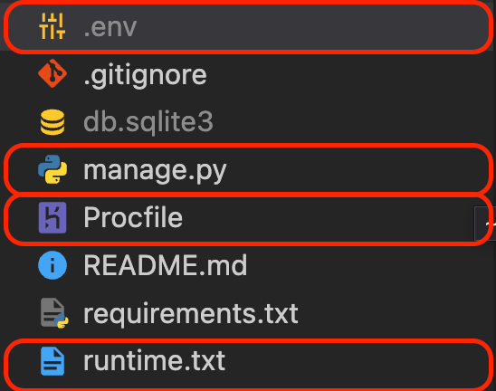
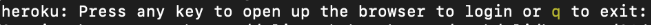

# 헤로쿠 배포 가이드
## 헤로쿠(Heroku)
- 웹 서비스 호스팅 기능을 지원해주는 클라우드 플랫폼 서비스
- 배포를 위한 OS 설정 / 파이썬 설치 / 데이터베이스 설정 / 네트워크 등등 개발자가 구축해야 할 개발환경을 제공해주기 때문에 개발자는 개발한 서비스를 간편하게 배포할 수 있다.
- 깃을 활용해서 배포 과정을 진행한다.
- 어플리케이션 관점에서 필요한 배포를 학습할 수 있다.

### Heroku 설치 & 로그인
1. Heroku CLI 설치
[devcenter.heroku.com](https://devcenter.heroku.com/articles/heroku-cli)

2. [터미널] Heroku 설치 확인
```bash
heroku --version

# 아래 메세지가 출력되면 정상
# heroku/7.65.0 darwin-x64 node-v14.19.0
```
### 배포 준비
1. [터미널] 패키지 설치
- 가상환경이 실행된 상태인지 확인합니다.
```bash
pip install gunicorn 
pip install dj-database-url # PostgreSQL 설정용 패키지
pip install psycopg2-binary # PostgreSQL 설정용 패키지
pip install whitenoise # 정적 파일 처리용 패키지
pip install python-dotenv # 환경 변수 관리 패키지

pip freeze > requirements.txt # 패키지 목록 저장
```
2. [Procfile] Procfile
> Procfile : 헤로쿠가 배포 과정에 실행할 명령어 모음 파일
- manage.py 가 있는 폴더에 Procfile(대소문자 구분) 생성하고 아래 명령어 작성
```
web: gunicorn [프로젝트명].wsgi --log-file -
```
3. [runtime.txt] runtime.txt 생성
- runtime.txt : 헤로쿠가 사용해야할 파이썬 버전 명시
- manage.py 가 있는 폴더에 runtime.txt 생성 후 버전 작성
```
python-3.9.15
```

4. [settings.py] 데이터베이스 PostgreSQL 설정
> PostgreSQL : 관계형 데이터베이스 중 하나로 헤로쿠에서 기본적으로 지원하는 데이터베이스

- 헤로쿠에서는 SQLite를 사용할 수 없기 때문에 추가 설정이 필요합니다.
- DATABASES 아래에 코드를 추가합니다.
```python
DATABASES = {
    "default": {
        "ENGINE": "django.db.backends.sqlite3",
        "NAME": BASE_DIR / "db.sqlite3",
    }
}

"""
기존 DATABASES 코드 아래에 아래 세 줄을 추가합니다.
"""
import dj_database_url

db_from_env = dj_database_url.config(conn_max_age=500)
DATABASES["default"].update(db_from_env)
```

5. [.env / settings.py] SECRET_KEY 분리
> SECRET_KEY : Django 인증(회원가입, 로그인 등등) 과정에 필요한 외부로 노출되면 안되는 비밀키입니다.

- [Djecrety.ir](https://djecrety.ir/) 에서 새로운 SECRET_KEY를 생성해서 사용합니다.
- manage.py가 있는 폴더에.env 파일을 생성합니다.
- `.env` 파일을 `.gitignore`에 추가합니다.
- [.env]에 생성한 SECRET_KEY를 작성합니다
```
# .env
SECRET_KEY="생성한 SECRET_KEY"

# 예시
# SECRET_KEY="$o5(+um4@+4g#3pp_zj-+b3vx99qbecllpsr%wh-d&hk(d=he@"
```
- [settings.py] SECRET_KEY 코드를 수정합니다.
```python
"""
기존
SECRET_KEY = "..."
"""

# 수정
"""
아래 3줄은 파일 최상단에 작성합니다.
"""
from dotenv import load_dotenv
import os
load_dotenv() # .env 파일에서 환경 변수를 불러옵니다.

# 기존 SECRET_KEY 대신 사용합니다.
SECRET_KEY = os.getenv("SECRET_KEY")
```

6. [settings.py] ALLOWED_HOSTS 설정
> ALLOWED_HOSTS : 서비스 접속을 허용할 도메인(주소) 목록입니다.

- [settings.py] ALLOWED_HOSTS을 수정합니다.
```python
"""
# 기존
ALLOWED_HOSTS = []
또는
ALLOWED_HOSTS = ['*']
"""

# 수정
ALLOWED_HOSTS = ["127.0.0.1", "localhost", ".herokuapp.com"]
```
7. [settings.py / .env] DEBUG 설정
> DEBUG : 오류가 발생했을 때 오류 원인 출력(노란 화면) 여부에 대해 결정하는 옵션입니다. 사용자에게 노출되면 안 되는 정보들이 많이 포함된 화면입니다. 그러므로 배포 환경에서는 DEBUG 옵션을 비활성화(False) 시킵니다.

- 환경 변수를 통해 개발 환경(True)과 배포 환경(False)에서 다른 값이 할당되도록 합니다.
- [settings.py] DEBUG 값을 수정합니다.
```python
"""
# 기존 
DEBUG = True
"""

# 수정
# 환경 변수에서 가져온 DEBUG 값이
# (개발 환경) "True" 라면 DEBUG에 True 가 할당됩니다.
# (배포 환경) "False" 라면 DEBUG에 False 가 할당됩니다.
DEBUG = os.getenv("DEBUG") == "True"
```
- [.env] DEBUG 값을 추가합니다.
```
SECRET_KEY="..."

DEBUG="True"
```
8. [settings.py] STATIC_ROOT 설정
> STATIC_ROOT : 배포 이전에는 Django가 각 앱의 static 폴더에서 정적 파일을 처리합니다. 하지만, 배포 이후에는 정적 파일에 대한 처리가 필요합니다.
정적 파일 처리를 위해 파일을 모아야 하는데(python manage.py collectstatic), STATIC_ROOT에 할당된 경로에 파일이 모입니다.

- [settings.py] STATIC_ROOT를 생성하고, 경로를 할당합니다.
```python
"""
STATIC_URL = '/static/'
STATIC_URL 아래에 작성합니다.
"""

STATIC_ROOT = BASE_DIR / "staticfiles"
```

9. [settings.py] whitenoise 설정
> whitenoise : 정적(static) 파일을 사용자에게 제공해주는 패키지입니다. DEBUG = False 일 때 장고는 정적 파일을 사용자에게 제공하지 않습니다. 정적 파일 제공을 whitenoise가 대신 담당 합니다.
- [settings.py] MIDDLEWARE 리스트의 SecurityMiddleware 아래에 코드를 추가합니다.
- SecurityMiddleware는 기존에 작성 되어 있는 Middleware 입니다. SecurityMiddleware를 추가하지 않도록 합시다.
```python
MIDDLEWARE = [
		"""
		SecurityMiddleware는 추가하지 않습니다.
		SecurityMiddleware는 기존에 있는 코드입니다.
		"""
    "django.middleware.security.SecurityMiddleware",

		# SecurityMiddleware 아래에 다음 코드를 추가합니다.
    "whitenoise.middleware.WhiteNoiseMiddleware",

		# ... 이하 생략
]
```
#### 확인사항
- 생성한 파일들(Procfile, runtime.txt, .env)이 올바른 위치에 있는지 파일 이름이 정확한지 확인해주세요.

- .gitignore 에 .env / db.sqlite3 가 등록된 상태인지 확인해주세요.
- 패키지 목록을 저장 했는지 확인해주세요.

### 배포
1. Heroku 로그인
  1. [터미널] 명령어 입력
  ```bash
  heroku login
  ```
  2. [터미널] 웹 로그인
  - 아래 상태에서 아무 키나 입력하면 로그인 페이지가 열립니다.

  
  3. [브라우저] Log In 버튼 클릭
  4. [브라우저] 로그인 완료 확인, 창 닫기
  5. [터미널] 로그인 성공 메세지 확인
2. [터미널] Heroku 앱 생성
```bash
# 앱 이름을 정해서 랜덤으로 정해서 생성해줍니다.
heroku create
```
3. [터미널] 헤로쿠 환경(배포 환경)에서의 환경 변수(env) 등록
  1. [브라우저] 헤로쿠 대쉬보드 접속
  [dashboard.heroku.com](https://dashboard.heroku.com/apps/)
  2. [브라우저] 생성한 앱 대쉬보드 접속
  3. [브라우저] Settings - Reveal Config Vars 클릭
  4. DEBUG = False 입력 → Add 클릭 / SECRET_KEY = 생성한 SECRET_KEY 입력 → Add 클릭
4. [터미널] 배포
```bash
git add .

git commit -m "Commit Message"

# 로컬 master 브랜치 -> 헤로쿠 저장소 master 브랜치
git push heroku master
```
5. [터미널] 데이터베이스 설정
```bash
# 데이터베이스 마이그레이트
heroku run python manage.py migrate

# 관리자 계정 생성
heroku run python manage.py createsuperuser
```
6. [터미널] 웹사이트 열기
```bash
heroku open
```
### 재배포
- git add - commit - push heroku master를 합니다.
- makemigrations를 했다면 migrate를 합니다.

### 에러 해결
- python manage.py collectstatic --noinput' 에러
```bash
# 터미널에 아래 명령어를 입력합니다.
heroku config:set DISABLE_COLLECTSTATIC=1
```
- Reqeusted runtime (python-3.9.15) is not available for this stack
  - python 버전이 3.9.13이여서 생긴 문제
  - runtime.txt에 python-3.9.13 로 수정
- 업로드한 이미지(Media)는 Heroku에서 저장해주지 않기 때문에 AWS와 S3를 사용해서 처리해야 합니다.
- Your account has reached its concurrent builds limit.
```bash
# 터미널에 아래 명령어를 입력해서 헤로쿠를 재시작합니다.
heroku restart
```
- You're using the staticfiles app without having set the STATIC_ROOT setting to a filesystem path
  - `STATIC_ROOT`를 확인해주세요.
- raise KeyError(key) from None KeyError: '…'
  - 헤로쿠 환경 변수 `SECRET_KEY` 를 확인해주세요. 