# 장고 설치 가이드
> 장고를 설치하는 방법과 기본 프로젝트 시작방법에 대해 알아보겠습니다.
>
> django 3.2 버전을 바탕으로 가상환경에서 장고 수업이 진행됩니다.

## Django 설치하기
### 1. 터미널에서 `home(~)`에서 새로운 폴더를 만듭니다.
```cmd
mkdir [폴더이름]
```
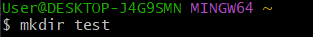

C드라이브의 사용자 폴더에 생성됩니다.
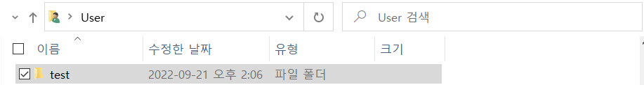

### 2. 설치 전 3.x 버전 이상의 pyhton이 준비되어야합니다.
test 폴더에 들어간 후 아래와 같이 명령어를 입력합니다.
```cmd
python --version
```
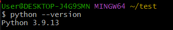

만약 해당 명령여에 대한 결과로 python 2 버전이 나오면
```cmd
pyhton3 --version
```
을 입력해서 python3로 업데이트해주세요.

### 3. 가상환경을 만든 후 그 안에서 장고를 설치할 것이기때문에 가상환경을 만들어줍니다.
```cmd
python -m venv [가상환경이름]
```
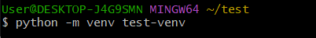

만든 폴더와 가상환경 폴더의 리스트를 확인했을 때 아와 같이 뜨면 정상적으로 완료된 것입니다.

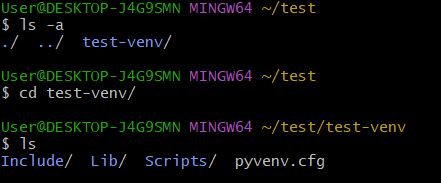

### 4. 가상환경을 실행합니다.
```cmd
source [가상환경이름]/Scripts/activate
```
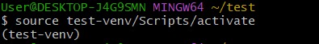

(test-venv) 라는 표시가 뜨면 정상적으로 가상환경에 진입한 것입니다.

- 해당 명령어를 입력하면 가상환경에서 나올 수 있습니다.
```cmd
deactivate
```

### 5. `3.2.13` 버전의 django를 설치합니다.
```cmd
pip install django==3.2.13
```
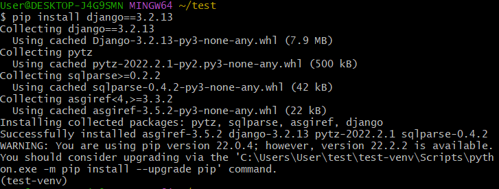

제일 최신 버전의 장고를 설치하려면
```cmd
pip install django
```
위 명령어를 입력해주시면 됩니다.

## 장고 프로젝트 시작하기
### 1. 장고 설치가 완료되었으면 장고 프로젝트를 시작합니다.
```cmd
django-admin startproject [프로젝트이름] [설치경로]
```
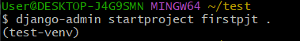

해당 명령어를 입력해도 아무런 결과가 뜨지 않지만 ls 명령어로 확인하면 저희가 만든 프로젝트 firstpjt라는 폴더가 생긴 것을 확인할 수 있습니다.

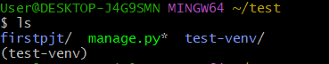

- 해당 폴더를 vscode로 실행시킬 수도 있습니다.
```cmd
code .
```

### 2. 서버를 돌려 정상적으로 프로젝트가 실행되는지 확인합니다.
```cmd
python manage.py runserver
```
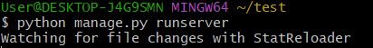

정상적으로 명령어를 입력하시면 위와 같이 결과가 나오고 더 이상 명령을 입력할 수 없게 됩니다.
해당 결과는 현재 `127.0.0.1:8000`(`localhost:8000`) 에서 서버가 돌아가고 있다는 것을 의미합니다.

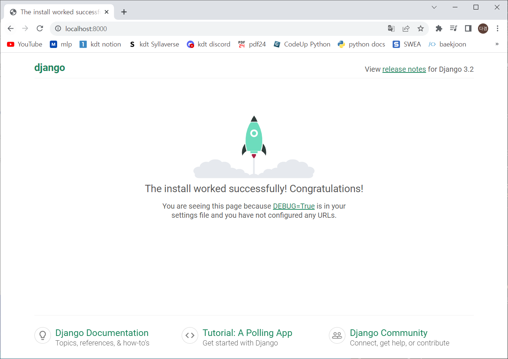

웹 브라우저의 주소창에 `127.0.0.1:8000` 또는 `localhost:8000` 을 입력해서 위와 같은 화면이 떴다면 정상적으로 프로젝트가 생성된 것입니다.

**성공! 장고 수업과 프로젝트가 기대됩니다(●'◡'●)**