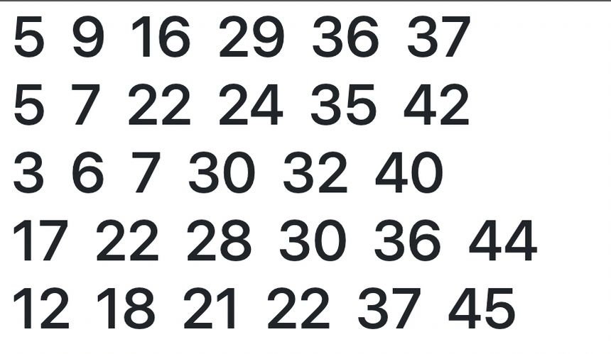

## 오늘의 저녁

today-dinner 주소를 요청하면 랜덤으로 저녁 메뉴와 메뉴 이미지를 추천해주는 화면을 응답하는 프로그램을 개발합니다.

### 예시

## 로또 번호 추첨

lotto 주소를 요청하면 랜덤으로 로또 다섯 줄을 뽑아주는 화면을 응답하는 프로그램을 개발합니다.

### 예시

### 추가 기능

저번주 1033회차 로또 당첨 번호는 3 11 15 29 35 44 보너스 번호 10 입니다. 

랜덤으로 뽑은 각 줄의 번호가 몇 등 인지 화면을 응답하는 프로그램을 개발합니다.