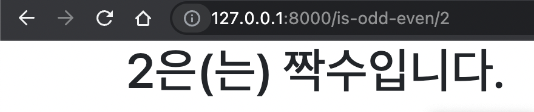
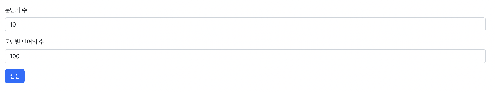
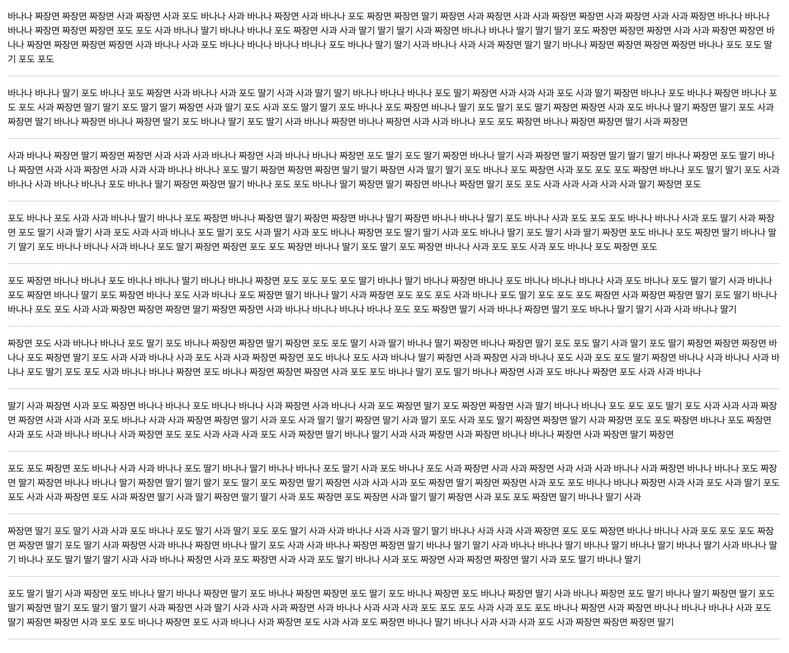

## [url] 입력한 숫자가 홀수인지 짝수인지 확인하기

숫자를 입력하면 숫자가 홀수인지 짝수인지 0인지 판단하고 화면에 표시하는 프로그램을 개발하세요.

해당 프로그램은 Path parameter를 활용해야 합니다.

- 주소창에 직접 값을 넣는 형태로 실습을 진행합니다.(form 사용 x)
    - EX) is-odd-even/1 , is-odd-even/2 , is-odd-even/0

### 화면 예시

## [url] 사칙연산 수행하기

숫자 2개를 입력하면 사칙연산 수행 결과를 화면에 표시하는 프로그램을 개발하세요.

해당 프로그램은 Path parameter를 활용해야 합니다.

- 주소창에 직접 값을 넣는 형태로 실습을 진행합니다.(form 사용 x)
- 사칙연산은 view에서 수행합니다. view에서 연산한 결과를 템플릿에 출력합니다.

### 화면 예시

## [form] 랜덤 전생

이름을 입력하면 랜덤으로 대상의 전생을 화면에 표시하는 프로그램을 개발하세요. 

또는 아래 사이트를 참고해서 랜덤 게임을 개발하세요.

[봉봉 - 심심할 땐 봉봉!](https://kr.vonvon.me/)

해당 프로그램은 form 태그를 활용하여 사용자에게 텍스트 1개를 입력 받아야 합니다.

- 페이지 2개를 만듭니다.
    - 이름을 입력하는 폼이 있는 페이지
    - 랜덤으로 전생을 출력하는 페이지

### 화면 예시

- 이름 입력 페이지
    
    
    
- 전생 확인 페이지
    
    
    

## [form] 로렘 입숨 한글 버전

[https://www.lipsum.com/](https://www.lipsum.com/) 의 한글 버전 프로그램을 개발하세요.

해당 프로그램은 form 태그를 활용하여 사용자에게 숫자 2개를 입력 받아야 합니다.

- 문단의 수
- 문단 별 단어의 수
    - 사용할 단어 꾸러미는 자유롭게 만들어주세요.

생성 버튼을 누르면 랜덤 한글 텍스트를 생성하고 텍스트를 화면에 표시합니다.

### 화면 예시

- 문단 수, 단어 수 입력 페이지
    
    
    
- 텍스트 확인 페이지

    