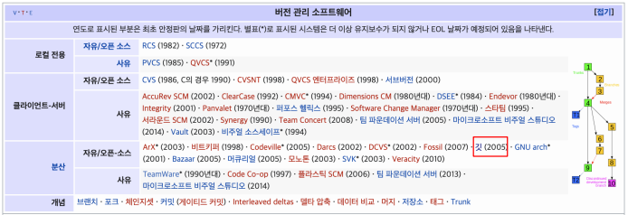

# Git/GitHub

깃을 사용하려면 먼저 CLI에 대해 알아야한다.

## CLI란

> CLI는 명령 기반의 인터페이스이다.
>
> 참고 - GUI : 그래픽 기반의 인터페이스

### 디렉토리 관리

- pwd(print working directory) : 현재 디렉토리 출력
- cd 디렉토리이름(change directory) : 디렉토리 이동
  - . : 현재 디렉토리, .. : 상위 디렉토리
- ls(list) : 목록
- mkdir(make directory) : 디렉토리 생성
- touch : 파일 생성
- rm 파일명 : 파일 삭제하기
  - rm -r 폴더명 : 폴더 삭제하기

## 버전관리

> git은 분산 버전 관리 시스템이다.

## 분산버전관리-git

> 분산버전관리시스템(DVCS)
>
> :  중앙집중식버전관리시스템은 중앙에서 버전을 관리하고 파일을 받아서 사용
>
> : 분산버전관리시스템은 원격 저장소를 통하여 협업하고, 모든 히스토리를 클라이언트들이 공유

## 기본 명령어

- 저장소 처음 만들때
  - $ git init : 로컬 저장소 생성
- 버전을 기록할 때
  - $ git add <파일명> : 특정 파일/폴더의 변경사항 추가
  - $ git commit -m '커밋메시지' : 커밋(버전 기록)
    - . : 모든 디렉토리
- 상태 확인할 때
  - $ git status : 1통, 2통 상태 확인
  - $ git log : 커밋 확인

빈 폴더는 status에 나타나지 않는다.

빈 폴더 들어가서 touch .gitkeep

그러면 add, commit 가능

명령어 치다가 > 줄로 내려가면 ctrl+c로 실행취소
