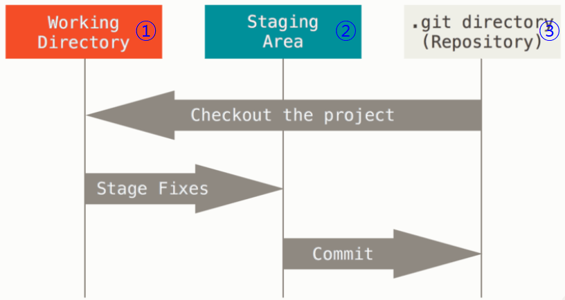
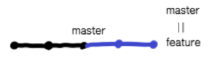
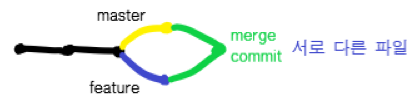
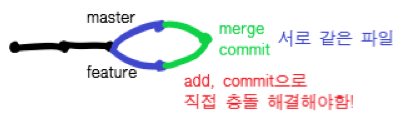
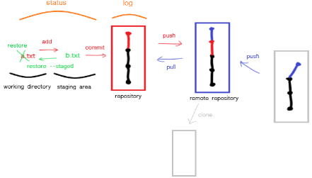

# Git/GitHub

깃을 사용하려면 먼저 CLI에 대해 알아야한다.

## CLI란

> CLI는 명령 기반의 인터페이스이다.
>
> 참고 - GUI : 그래픽 기반의 인터페이스

### 디렉토리 관리

- pwd(print working directory) : 현재 디렉토리 출력
- cd 디렉토리이름(change directory) : 디렉토리 이동
  - . : 현재 디렉토리, .. : 상위 디렉토리
- ls(list) : 목록
- mkdir(make directory) : 디렉토리 생성
- touch : 파일 생성
- rm 파일명 : 파일 삭제하기
  - rm -r 폴더명 : 폴더 삭제하기

## 분산버전관리 - git

> 분산버전관리시스템(DVCS)이란?
>
> 중앙집중식버전관리시스템은 중앙에서 버전을 관리하고 파일을 받아서 사용
>
> <->
>
> 분산버전관리시스템은 원격 저장소를 통하여 협업하고, 모든 히스토리를 클라이언트들이 공유


## 기본 명령어

- 저장소 처음 만들때

 ```bash
  $ git init // 로컬 저장소 생성
 ```

- 버전을 기록할 때

```bash
$ git add <파일명> // 특정 파일/폴더의 변경사항 추가
$ git commit -m '커밋메시지' // 커밋(버전 기록)
// . : 모든 디렉토리
```

- 상태 확인할 때

```bash
$ git status // 상태 확인
$ git log // 커밋 확인
$ git log -1 // 최근 1개의 커밋 상태 확인
$ git log --oneline // 커밋 상태 한줄로 확인
```

## 기본 흐름

- Git은 파일을 modified, staged, committed로 관리한다.
  - modified : 파일이 수정된 상태
  - staged : 수정한 파일을 곧 커밋할 것이라고 표시한 상태
  - committed : 커밋이 된 상태



- ① -> ② : add 명령어

- ② -> ③ : commit 명령어

## 라이프 사이클


- Untracked : 아무것도 건드리지 않은 상태
- Unmodified : 수정 안 된 상태
- Modified : 수정 된 상태
- Staged : add 후 staging 상태

## git 설정 파일(config)

```bash
// 사용자 정보
$ git config —global user.name “username” // github에서 설정한 username으로 설정
$ git config —global user.email “my@email.com” // github에서 설정한 email로 설정
// 설정 확인
$ git config -l
$ git config —global -l
$ git config user.name
```

- —system
  - /etc/gitconfig
  - 시스템의 모든 사용자와 모든 저장소에 적용(관리자 권한)
- —global 
  - ~/.gitconfig
  - 현재 사용자에게 적용되는 설정
- —local
  - .git/config
  - 특정 저장소에만 적용되는 설정

## 원격저장소 - github

> github - 버전을 관리한다.
>
- 로컬 저장소의 버전을 원격저장소로 보낸다.


```bash
$ git push '파일명'
```

- 원격저장소의 버전을 로컬 저장소로 가져온다.


```bash
$ git pull '파일명'
```

## github에서 원격 저장소 만들기

- New Repository -> 저장소에서 이름/설명/공개 여부 설정 -> github 주소 확인 후

```bash
$ git remote add origin https://github.com/kimdakyeom/0706.git
```

## 원격저장소 git 활용 명령어

```bash
$ git clone <url> // 원격저장소 복제
$ git remote -v // 원격저장소 정보 확인
$ git remote add <원격저장소> <url> // 원격저장소 추가(default:origin)
$ git remote rm <원격저장소> // 원격저장소 삭제
$ git push <원격저장소> <브랜치> // 원격저장소에 push
$ git pull <원격저장소> <브랜치> // 원격저장소로부터 pull
```

## git branch

### 1. branch 관련 명령어

```bash
// git branch를 위해 root-commit을 발생시키고 진행해야 한다.
$ touch README.md
$ git add .
$ git commit -m 'init'
// branch 생성
$ git branch {브랜치명}
// branch 이동
$ git checkout {브랜치명}
// branch 생성 및 이동 한번에
$ git checkout -b {브랜치명}
// branch 삭제
$ git branch -d {브랜치명}
// branch 목록
$ git branch
// branch 병합(master 브랜치에서 {브랜치명}을 병합)
$ git merge {브랜치명}
```

### 2. branch 병합 시나리오

> **branch의 다양한 시나리오는 3가지로 나뉜다.**

#### 상황 1. fast-foward

> feature 브랜치가 생성된 이후 master 브랜치에 변경 사항이 없는 상황(**master만 변경**)



1. feature/home branch 생성 및 이동

```bash
(master) $ git branch feature/home
(master) $ git checkout feature/home
```

2. 작업 완료 후 commit

```bash
(feature/home) $ touch home.txt
(feature/home) $ git add .
(feature/home) $ git commit -m 'Add home.txt'
(feature/home) $ git log --oneline
b534a34 (HEAD -> feature/home) Complete Home!!!!
e89616a (master) Init
```

3. master 이동

```bash
(feature/home) $ git checkout master
(master) $ git log --oneline
```

4. master에 병합

```ba
(master) $ git merge feature/home 
Updating e89616a..b534a34
Fast-forward
 home.txt | 0
 1 file changed, 0 insertions(+), 0 deletions(-)
 create mode 100644 home.txt
```

5. 결과

```bash
(master) $ git log --oneline
b534a34 (HEAD -> master, feature/home) Complete Home!!!!
e89616a Init
```

6. branch 삭제

```bash
(master) $ git branch -d feature/home 
Deleted branch feature/home (was b534a34).
```


***


#### 상황 2. merge commit

> 서로 다른 commit을 merge하는 과정에서 서로 다른 파일이 수정되어 있는 상황
>
> git이 auto merging을 진행하고, commit 발생



1. feature/about branch 생성 및 이동

```bash
(master) $ git checkout -b feature/about
(feature/about) $
```

2. 작업 완료 후 commit

```bash
(feature/about) $ touch about.txt
(feature/about) $ git add .
(feature/about) $ git commit -m 'Add about.txt'
(feature/about) $ git log --oneline
5e1f6de (HEAD -> feature/about) 자기소개 페이지 완료!
b534a34 (master) Complete Home!!!!
e89616a Init
```

3. master 이동

```bash
(feature/about) $ git checkout master
(master) $
```

4. master에 추가 commit 이 발생시키기!!
   - 다른 파일을 수정 혹은 생성하세요!

```bash
(master) $ touch master.txt
(master) $ git add .
(master) $ git commit -m 'Add master.txt'
(master) $ git log --oneline
98c5528 (HEAD -> master) 마스터 작업....
b534a34 Complete Home!!!!
e89616a Init
```

5. master에 병합

```bash
(master) $ git merge feature/about
```

6. 결과 -> 자동으로 merge commit 발생
7. 커밋 및 그래프 확인하기

```bash
$ git log --oneline --graph
*   582902d (HEAD -> master) Merge branch 'feature/about'
|\
| * 5e1f6de (feature/about) 자기소개 페이지 완료!
* | 98c5528 마스터 작업....
|/
* b534a34 Complete Home!!!!
* e89616a Init
```

8. branch 삭제

```bash
$ git branch -d feature/about 
Deleted branch feature/about (was 5e1f6de).
```


***


#### 상황3. merge commit 충돌

> 서로 다른 commit을 merge하는 과정에서 **같은 파일의 동일한 부분**이 수정되어 있는 상황
>
> git이 auto merging을 하지 못하고, 충돌 메시지가 뜬다.
>
> 해당 파일의 위치에 표준형식에 따라 표시 해준다.
>
> 원하는 형태의 코드로 직접 수정을 하고 직접 commit을 발생시켜야한다.



1. feature/test branch 생성 및 이동

```bash
(master) $ git checkout -b feature/test
```

2. 작업 완료 후 commit

```bash
# README.md 파일 열어서 수정
(feature/test) $ touch test.txt
(feature/test) $ git add .
(feature/test) $ git commit -m 'Add test.txt'
(feature/test) $ git log --oneline
95fad1c (HEAD -> feature/test) README 수정하고 test 작성하고
582902d (master) Merge branch 'feature/about'
98c5528 마스터 작업....
5e1f6de 자기소개 페이지 완료!
b534a34 Complete Home!!!!
e89616a Init
```

3. master 이동

```bash
$ git checkout master
```

4. master에 추가 commit 발생시키기

```bash
# README.md 파일 열어서 수정
(master) $ git add README.md
(master) $ git commit -m 'Update README.md'
```

5. master에 병합

```bash
(master) $ git merge feature/test 
Auto-merging README.md
CONFLICT (content): Merge conflict in README.md
Automatic merge failed; fix conflicts and then commit the result.
```

6. 결과 -> merge conflict 발생
   - git status 명령어로 충돌 파일 확인

```bash
(master|MERGING) $ git status
On branch master
You have unmerged paths.
  (fix conflicts and run "git commit")        
  (use "git merge --abort" to abort the merge)

Changes to be committed:
        new file:   test-1.txt
        new file:   test-2.txt
        new file:   test.txt

Unmerged paths:
  (use "git add <file>..." to mark resolution)
        both modified:   README.md
```

7. 충돌 확인 및 해결

```bash
<<<<<<< HEAD
# 마스터에서 작업함...
=======
# 테스트에서 작성
>>>>>>> feature/test
```

8. merge commit 진행

```bash
(master|MERGING) $ git add .
(master|MERGING) $ git commit
```

* vim 편집기 화면이 나타납니다.

     * 자동으로 작성된 커밋 메시지를 확인하고, `esc`를 누른 후 `:wq`를 입력하여 저장 및 종료를 합니다.
     * `w` : write
     * `q` : quit
* vs code 편집기에서 메시지보고 닫아주세요~!

9. 커밋 및 확인하기

```bash
(master) $ git log --oneline --graph
*   bc1c0cd (HEAD -> master) Merge branch 'feature/test'
|\  
| * 95fad1c (feature/test) README 수정하고 test 작성하고
* | 2ecad28 리드미 수정
|/  
*   582902d Merge branch 'feature/about'
|\  
| * 5e1f6de 자기소개 페이지 완료!
* | 98c5528 마스터 작업....
|/  
* b534a34 Complete Home!!!!
* e89616a Init
```

10. branch 삭제

```bash
(master) $ git branch -d feature/test
```

## 전체 동작 과정



## REFERENCE

- [위키백과 - git](https://ko.wikipedia.org/wiki/%EA%B9%83_(%EC%86%8C%ED%94%84%ED%8A%B8%EC%9B%A8%EC%96%B4))

- [git 기본 흐름](https://git-scm.com/book/ko/v2/%EC%8B%9C%EC%9E%91%ED%95%98%EA%B8%B0-Git-%EA%B8%B0%EC%B4%88)

- [git 생명 주기](https://git-scm.com/book/ko/v2/Git%EC%9D%98-%EA%B8%B0%EC%B4%88-%EC%88%98%EC%A0%95%ED%95%98%EA%B3%A0-%EC%A0%80%EC%9E%A5%EC%86%8C%EC%97%90-%EC%A0%80%EC%9E%A5%ED%95%98%EA%B8%B0)
