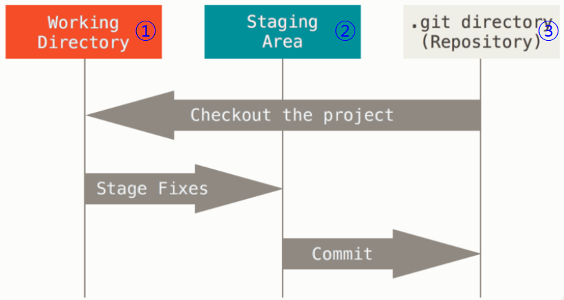

# Git/GitHub

깃을 사용하려면 먼저 CLI에 대해 알아야한다.

## CLI란

> CLI는 명령 기반의 인터페이스이다.
>
> 참고 - GUI : 그래픽 기반의 인터페이스

### 디렉토리 관리

- pwd(print working directory) : 현재 디렉토리 출력
- cd 디렉토리이름(change directory) : 디렉토리 이동
  - . : 현재 디렉토리, .. : 상위 디렉토리
- ls(list) : 목록
- mkdir(make directory) : 디렉토리 생성
- touch : 파일 생성
- rm 파일명 : 파일 삭제하기
  - rm -r 폴더명 : 폴더 삭제하기

## 분산버전관리 - git

> 분산버전관리시스템(DVCS)이란?
>
> 중앙집중식버전관리시스템은 중앙에서 버전을 관리하고 파일을 받아서 사용
>
> <->
>
> 분산버전관리시스템은 원격 저장소를 통하여 협업하고, 모든 히스토리를 클라이언트들이 공유


## 기본 명령어

- 저장소 처음 만들때

 ```bash
  $ git init // 로컬 저장소 생성
 ```

- 버전을 기록할 때

```bash
$ git add <파일명> // 특정 파일/폴더의 변경사항 추가
$ git commit -m '커밋메시지' // 커밋(버전 기록)
// . : 모든 디렉토리
```

- 상태 확인할 때

```bash
$ git status // 상태 확인
$ git log // 커밋 확인
$ git log -1 // 최근 1개의 커밋 상태 확인
$ git log --oneline // 커밋 상태 한줄로 확인
```

## 기본 흐름

- Git은 파일을 modified, staged, committed로 관리한다.
  - modified : 파일이 수정된 상태
  - staged : 수정한 파일을 곧 커밋할 것이라고 표시한 상태
  - committed : 커밋이 된 상태



- ① -> ② : add 명령어

- ② -> ③ : commit 명령어

## 라이프 사이클


- Untracked : 아무것도 건드리지 않은 상태
- Unmodified : 수정 안 된 상태
- Modified : 수정 된 상태
- Staged : add 후 staging 상태

## git 설정 파일(config)

```bash
// 사용자 정보
$ git config —global user.name “username” // github에서 설정한 username으로 설정
$ git config —global user.email “my@email.com” // github에서 설정한 email로 설정
// 설정 확인
$ git config -l
$ git config —global -l
$ git config user.name
```

- —system
  - /etc/gitconfig
  - 시스템의 모든 사용자와 모든 저장소에 적용(관리자 권한)
- —global 
  - ~/.gitconfig
  - 현재 사용자에게 적용되는 설정
- —local
  - .git/config
  - 특정 저장소에만 적용되는 설정

## 원격저장소 - github

> github - 버전을 관리한다.
>
> - 로컬 저장소의 버전을 원격저장소로 보낸다.


```bash
$ git push '파일명'
```

- 원격저장소의 버전을 로컬 저장소로 가져온다.


```bash
$ git pull '파일명'
```

## github에서 원격 저장소 만들기

- New Repository -> 저장소에서 이름/설명/공개 여부 설정 -> github 주소 확인 후

```bash
$ git remote add origin https://github.com/kimdakyeom/0706.git
```

## 원격저장소 활용 명령어

```bash
$ git clone <url> // 원격저장소 복제
$ git remote -v // 원격저장소 정보 확인
$ git remote add <원격저장소> <url> // 원격저장소 추가(default:origin)
$ git remote rm <원격저장소> // 원격저장소 삭제
$ git push <원격저장소> <브랜치> // 원격저장소에 push
$ git pull <원격저장소> <브랜치> // 원격저장소로부터 pull
```

## REFERENCE

- [위키백과 - git](https://ko.wikipedia.org/wiki/%EA%B9%83_(%EC%86%8C%ED%94%84%ED%8A%B8%EC%9B%A8%EC%96%B4))

- [git 기본 흐름](https://git-scm.com/book/ko/v2/%EC%8B%9C%EC%9E%91%ED%95%98%EA%B8%B0-Git-%EA%B8%B0%EC%B4%88)

- [git 생명 주기](https://git-scm.com/book/ko/v2/Git%EC%9D%98-%EA%B8%B0%EC%B4%88-%EC%88%98%EC%A0%95%ED%95%98%EA%B3%A0-%EC%A0%80%EC%9E%A5%EC%86%8C%EC%97%90-%EC%A0%80%EC%9E%A5%ED%95%98%EA%B8%B0)
