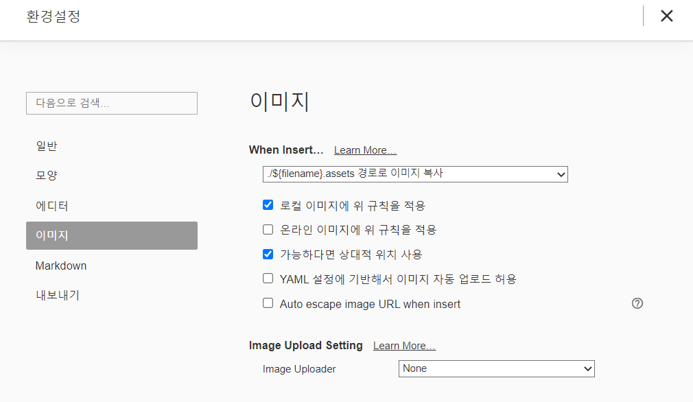

# 마크다운

> plain text 기반의 마크업 언어

## 제목/소제목(Heading)

- #의 개수에 따라 h1~h6까지 표현 가능하다.
  - `# h1`
  - `# h2`
  - `# h3`

## 목록(list)

### 1. 순서가 없는 리스트

목록 활용시 단계를 tab, shift+tab으로 조절

- `-(hyphen), *(asterisk)` 이용
  - `tab` 이용
- `shift+tab` 이용(다시 돌아와서 채워진 검정)

### 2. 순서가 있는 리스트

1. 1번 내용
2. 2번 내용
   1. `tab` 2-1번 내용


## 코드블록

### 1. Fanced Code Block

- `(backtick) 기호 3개 활용해 작성 ``` + 작성언어

- 특정 언어를 명시하면 Syntax highlighting 기능이 적용

  - 예)
  
  ``` python
  print('hello')
  # 주석
  ```
  
  ```html
  <h1>
      제목
  </h1>
  <!-- 주석 -->
  ```

### 2. Inline Code Block

- `(backtick) 기호안에 내용쓰고 감싸주기
  - 예) ` print` 는 파이썬에서 출력하는 함수이다.

## 링크

- [] 안에 보여주고 싶은 문자 () 안에 연결하고 싶은 url 링크
  - 예) [실라버스 링크](https://syllabus.com)
    - ctrl+click하면 해당 url에 들어갈 수 있다.
  - 현재 디렉토리의 파일에 접근하려면 ./(현재 디렉토리 접근) + 파일명

## 이미지

- 디렉토리에서 드래그 앤 드롭
  - Typora의 환경설정을 이용하면 이미지 드래그 앤 드롭으로 바로 이미지를 사용할 수 있다.

> Typora란?
>
> 기존 텍스트 에디터, IDE 뿐만 아니라 마크다운 전용 에디터를 활용하여 문서를 작성하는 프로그램이다. 문법을 작성하면 바로 일반적으로 보이는 모습으로 변하여 처음 작성할 때 많은 도움을 주며, 복잡한 문법이나 이미지를 드래그 앤 드랍으로 적용이 가능하다.



스누피 사진을 한장 가져왔다.

Typora에 끌어다놓으면


짠! 사진과 동시에 assets 폴더가 생성되어서 상대경로가 생겨서 간단하게 처리 가능하다.

## 인용문

- '>' + 인용구
  - 예)  
  
    > Life is short, you need python.
    >
   - 보통 용어 정의할 때 사용한다.

## Table

- 타이포라 기능에 표 기능 적극 사용하자!
  - 본문 > 표 > 표 삽입 (ctrl + t)
  - 예)

|      |      |      |
| ---- | ---- | ---- |
|      |      |      |
|      |      |      |
|      |      |      |

## 텍스트

- **굵게(볼드체)** : `**텍스트**` (ctrl+b)

- *기울임(이탤릭체)* : `*텍스트*` (ctrl+i)

- ***둘 다***(볼드체+이탤릭체_) : `***텍스트***`

- ~~취소선~~ : `~~텍스트~~`

### 수평선

- `***`
  - 예)

***

## 기타 정리

- 띄어 쓰기 있는 것

  - 제목(#)

  - 목록(-, 1.)


- 띄어 쓰기 없는 것
  - `inline code bock` *기울임*  **굵게**

