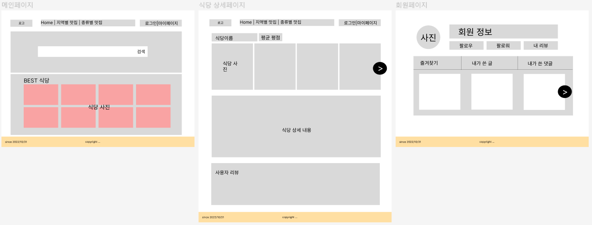
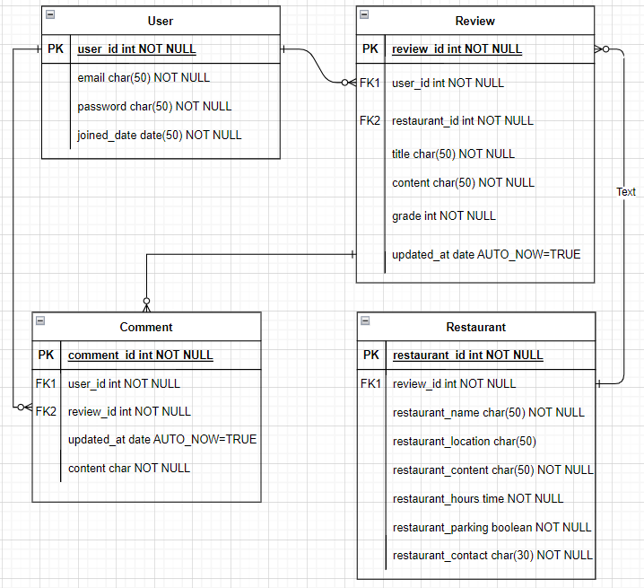

# alcohol trip 프로젝트 기획

## 프로젝트 개요

| 프로젝트 목적 | 웹 프레임워크 Django와 HTML / CSS / JavaScript를 활용한 콘텐츠 기반 커뮤니티 웹 플랫폼 개발 |
| --- | --- |
| 프로젝트 기간 | 10.31 (월) ~ 11.07 (월) |
| 발표 날짜 | 11.08 (화) |
| 팀명 | 티미름 |
| 주제 | 맛집 정보 및 후기 공유 커뮤니티 서비스 |
| 팀장 | 김다겸 |
| 발표자 | 김문경 |
| PPT 제작자 | 황여원 |
| PPT 제작자 | 이정섭 |
| 서비스명 | 알콜트립 |

## 개발 역할 분담

| 이름 | 역할 |
| --- | --- |
| 김다겸 | 베이스 코드 작성, 회원 관리 앱 개발 |
| 김문경 | 콘텐츠 데이터 수집, 콘텐츠 앱 개발 |
| 황여원 | 콘텐츠 데이터 수집, 콘텐츠 앱 개발 |
| 이정섭 | 프론트엔드 전체 관리 & 개발 |

## 주제 사전 조사 & 분석
[Instagram](https://www.instagram.com/)

[망고플레이트: 나만의 맛집 검색](https://www.mangoplate.com/)

[테이블링 | 맛집 도착 전 앱으로 미리 줄서기](https://www.tabling.co.kr/)

[즐거운 미식 생활의 시작, 캐치테이블](https://app.catchtable.co.kr/)

[식신 : 대한민국 No.1 맛집검색,맛집추천](https://www.siksinhot.com/)

## 서비스 주요 기능
- 회원관리
    - 회원가입
    - 소셜로그인
    - 로그인
    - 로그아웃
    - 회원 프로필
    - 팔로우/팔로잉
- 콘텐츠(식당; 식당 등록은 점주만 가능, 일반 회원 X)
    - 찜(좋아요 기능)
    - 입력 내용(제목, 내용, 사진, 지역, 카테고리)
- 리뷰
    - 해당 술집에 대한 리뷰 작성(제목, 내용, 사진)
    - 수정/삭제
- 댓글
    - 생성/수정/삭제(로그인 회원만 가능)
    - 좋아요
- 예약 기능(추후 개발 예정)

## 화면 설계

## DB 모델링(ERD)
