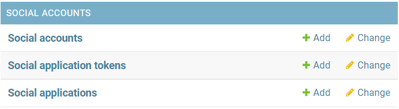
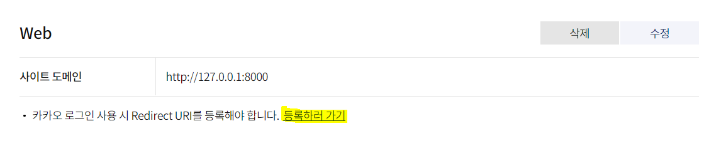

# Django 소셜 로그인
> allauth, naver, google, kakao
## 1. 설치하기
```bash
$ pip install django-allauth
```
## 2. setting.py
```python
INSTALLED_APPS = [
    'django.contrib.sites',
    'allauth',
    'allauth.account', # 가입한 계정 관리
    'allauth.socialaccount', # 소셜 계정으로 가입한 계정 관리
    'allauth.socialaccount.providers.naver', # 어떤 소셜 서비스 사용하는지 추가
]


AUTHENTICATION_BACKENDS = (
    'django.contrib.auth.backends.ModelBackend',
    'allauth.account.auth_backends.AuthenticationBackend',
)
SITE_ID = 1
LOGIN_REDIRECT_URL = '/'
```
## 3. urls.py
```python
pjt/urls.py

path('accounts/', include('allauth.urls')),
```
## 4. python manage.py migrate
## 5. 로그인, 로그아웃 기능을 구현하고 싶은 템플릿에서 작성
```html
<li class="nav-item">
   {# 유저가 로그인 중이면 #}
    <a href="" class="nav-link">Logout</a>
  
    <a href="" class="nav-link">Login</a>
  
</li>
```
- `account_login`, `account_logout`은 urls.py에 지정해주지 않았지만 allauth 앱에서 설정해둔 이름이다.
- 구현해준 적 없는 내용과 form이 있다. allauth에서 자동으로 생성해 준 것이다.


## 6. API
해당 소셜 사이트에서 API 키 발급 받기

- [NAVER Developers](https://developers.naver.com/main/)

- [Google Developers](https://console.cloud.google.com/apis/dashboard?pli=1&project=kyoemdi)

- [Kakao Developers](https://developers.kakao.com/)
### Naver
- 애플리케이션 등록
  - 메인 페이지의 역할을 하는 링크 : `http://127.0.0.1:8000`
  - 리다이렉트 링크 : `http://127.0.0.1:8000/accounts/login/naver/callback`
  - client id와 secret key를 발급 받기


- 서버의 admin 페이지
  - add social application
  - Available sites에 있던 example.com을 추가해도 된다.



- 끝!


### Google
- 애플리케이션 등록
  - 메인 페이지의 역할을 하는 링크 : `http://127.0.0.1:8000`
  - 리다이렉트 링크 : `http://127.0.0.1:8000/accounts/login/google/callback`
  - client id와 secret key를 발급 받기


- 서버의 admin 페이지
  - add social application
  - Available sites에 있던 example.com을 추가해도 된다.


- 끝!


### Kakao
- 애플리케이션 등록
  - 메인 페이지의 역할을 하는 링크 : `http://127.0.0.1:8000`
  - 리다이렉트 링크 : `http://127.0.0.1:8000/accounts/login/kakao/callback`
  - client id와 secret key를 발급 받기





- 서버의 admin 페이지
  - add social application
  - example.com은 안되고 무조건 아래의 링크들 추가
  - kakao는 secret key를 발급 안해주기때문에 none(다른 내용 써도 됨) 써넣는다.


- 끝!


## 해결 못한 문제..
처음에 네이버와 구글 로그인을 구현했는데 example.com으로 하나의 사이트만 선택했기 때문에 DB에 site_id가 1로 들어간다.

하지만 카카오 로그인은 example.com으로 선택하면 안되기 때문에 메인 페이지 로컬 사이트와 리다이렉트 로컬 사이트 두개의 사이트를 선택해서 2로 들어간다.

settings.py에서 `SITE_ID = 1`로 주었기때문에 네이버, 구글 로그인만 작동되고 카카오 로그인은 오류가 떴다.

반대로 `SITE_ID = 2`로 주면 카카오 로그인만 작동이 된다.

어찌저찌 DB에 같은 site_id를 넣어서 작동은 되지만 이 문제를 해결해야 할 것 같다.

## 해결 완료
네이버와 구글은 콜백 사이트로 example.com 하나의 사이트만 넣었고, 카카오는 로컬과 로컬콜백 사이트를 지정했기 때문에 DB에 각각 하나와 두개의 내용이 들어간다. 따라서 아이디도 다르다. 

네이버와 구글도 로컬과 로컬콜백 사이트를 지정하면 세개의 소셜이 모두 같은 개수의 DB를 갖는다.