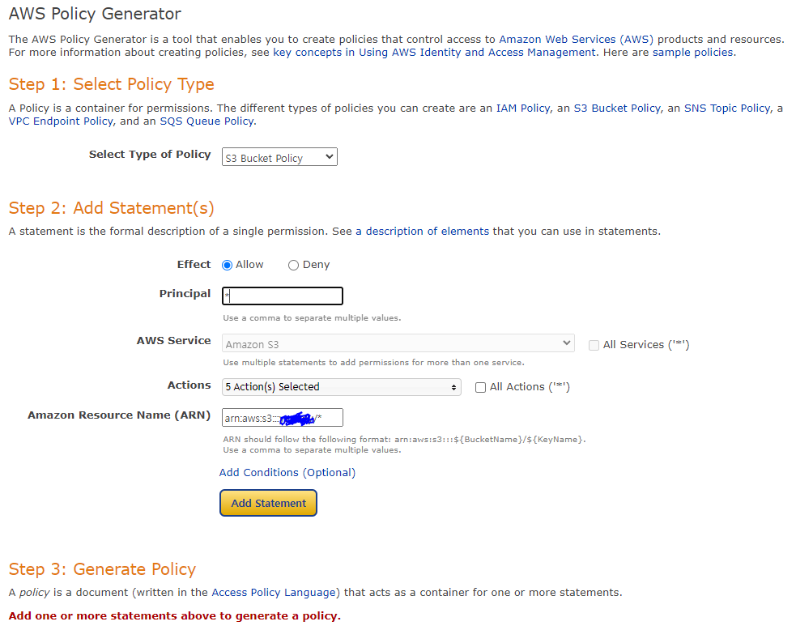
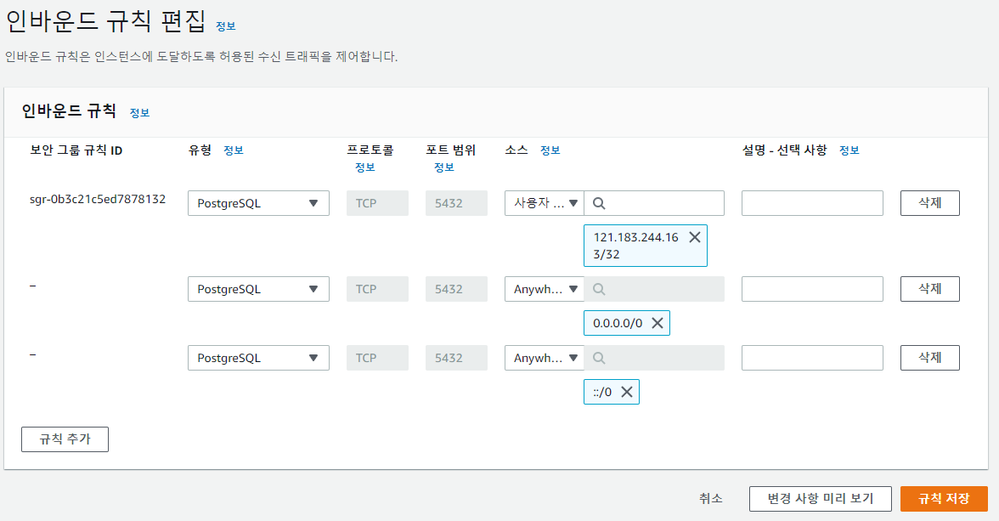
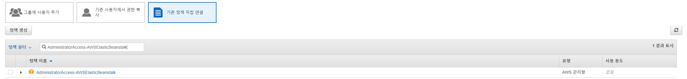
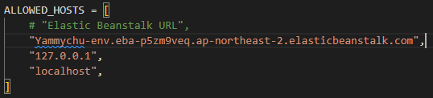

# 프로젝트 AWS 개발 환경 구축

## IAM 생성

  1. AWS 검색창에 IAM 검색 후 들어간다.

   

  2. 사용자 추가버튼을 클릭한 후 사용자 이름과 자격 증명 유형을 선택해준다.

   

  3. 기존 정책 직접 연결 선택 후 'AmazonS3FullAccess' 검색 (S3를 사용할 것이기 때문에)

   
  
  4. 다음 항목은 패스

   

  5. 계정을 사용해야하기 때문에 CSV 파일을 다운받으면 된다.

   

## S3

  1. AWS에 S3 검색 후 버킷 항목 들어간 후 버킷 만들기 클릭

   

  2. 버킷 설정에서는 아래 그림들과 같은 항목들은 선택한 후 생성한다.

   

   

  3. 버킷이 생성 완료되었으면 생성된 버킷누르고 권한 탭으로 들어가서 정책의 편집 => 정책 생성기 클릭.

   

  4. 아래 항목과 같이 체크를 진행한다.

   

   

  5. 모든 입력이 끝나면 아래와 같은 json 파일이 생성되고 생성된 파일을 편집에 붙여넣고 저장한다.

   

   

## Django S3

  1. 패키지 설치

```
pip install django-storages
pip install boto3
pip install python-dotenv
pip freeze > requirements.txt
```

  2. settings.py 설정

```
AWS_ACCESS_KEY_ID = [IAM 사용자 Access key ID]
AWS_SECRET_ACCESS_KEY = [IAM 사용자 Secret access key]
아까 다운받은 csv파일에 있음
AWS_STORAGE_BUCKET_NAME = [S3 버킷 이름]
```

```
# 최상단에 아래 3줄 추가
import os
from dotenv import load_dotenv
load_dotenv()


INSTALLED_APPS = [
	"storages", # storages 추가
	# ... 이하 생략
]

"""
기존 MEDIA 설정 주석
MEDIA_ROOT = ...
MEDIA_URL = ...
"""

# 아래 코드 추가
DEFAULT_FILE_STORAGE = "storages.backends.s3boto3.S3Boto3Storage"

AWS_ACCESS_KEY_ID = os.getenv("AWS_ACCESS_KEY_ID")
AWS_SECRET_ACCESS_KEY = os.getenv("AWS_SECRET_ACCESS_KEY")
AWS_STORAGE_BUCKET_NAME = os.getenv("AWS_STORAGE_BUCKET_NAME")

AWS_REGION = "ap-northeast-2"
AWS_S3_CUSTOM_DOMAIN = "%s.s3.%s.amazonaws.com" % (
    AWS_STORAGE_BUCKET_NAME,
    AWS_REGION,
)
```

## S3 기존 이미지 처리

  1. 기존의 데이터를 AWS S3에 직접 업로드 해주는 방식 사용

   

  2. 업로드 완료될 경우 아래 사진과 같이 나온다.

   

   


## AWS RDS

  1. RDS - PostgreSQL (2개 이상의 RDS 인스턴스를 생성시 과금이 발생할 수 있다.)
    - 지역 설정 - 서울
    - 다른지역에서 생성한 RDS는 모두 삭제해야한다.

   

  2. 엔진 옵션 - PostgreSQL / 템플릿 - 프리 티어 (다른 템플릿 선택시 과금 발생)

   

  3. DB 인스턴스 식별자 - 자유 입력
    - 마스터 암호 / 암호 확인 - 자유 입력 (패스워드 기록해둬야 안까먹음)

   

  4. 스토리지
    - 스토리지 자동 조정 활성화 - 해제

   

  5. 연결
    - 퍼블릭 액세스 - 예 선택
    - VPC 보안 그룹 새로 생성 => 새 VPC 보안 그룹 입력 - 자유 입력

   

  6. 모니터링
    - 성능 인사이트 켜기 - 해제

   

  7. 추가 구성 
    - 데이터베이스 옵션 => 초기 데이터 베이스 이름 - 데이터베이스 이름 자유 입력
    - 백업 => 자동 백업을 활성화합니다. - 해제

   

  8. 데이터 베이스 생성완료 (생성시 시간이 소요됨)

   

  9. VPC보안 그룹 클릭 => 인바운드 규칙 편집

   

   

## Django 설정

  1. RDS 연결 테스트

```
# postgresql 관리 패키지 설치
pip install psycopg2-binary
pip freeze > requirements.txt
```

  2. settings.py 작성

```
"""
기존 DATABASES 주석 처리
"""
# DATABASES = {
#     'default': {
#         'ENGINE': 'django.db.backends.sqlite3',
#         'NAME': BASE_DIR / 'db.sqlite3',
#     }
# }


DATABASES = {
    "default": {
        "ENGINE": "django.db.backends.postgresql",
        "NAME": "[데이터베이스 이름]", # 코드 블럭 아래 이미지 참고하여 입력
        "USER": "postgres",
        "PASSWORD": "[패스워드]", # 데이터베이스 생성 시 작성한 패스워드
        "HOST": "[엔드포인트]", # 코드 블럭 아래 이미지 참고하여 입력
        "PORT": "5432",
    }
}
```
   - 데이터베이스 이름

   

   - 엔드포인트

   

**개발환경 분리할 경우**

  1. 개발 환경(sqlite) / 배포 환경(postgresql) 설정 분리

```
pip install python-dotenv
```
```
# settings.py

"""
최상단에 아래 세 줄 추가
"""
from dotenv import load_dotenv
import os
load_dotenv()

# ------------------------------

DEBUG = os.getenv("DEBUG") == "True"

if DEBUG:
    DATABASES = {
        'default': {
            'ENGINE': 'django.db.backends.sqlite3',
            'NAME': BASE_DIR / 'db.sqlite3',
        }
    }
		"""
		# 기타 개발 환경 설정 작성
		# ...
		"""

else:
    DATABASES = {
        "default": {
            "ENGINE": "django.db.backends.postgresql",
            "NAME": os.getenv("DATABASE_NAME"), # 코드 블럭 아래 이미지 참고하여 입력
            "USER": "postgres",
            "PASSWORD": os.getenv("DATABASE_PASSWORD"), # 데이터베이스 생성 시 작성한 패스워드
            "HOST": os.getenv("DATABASE_HOST"), # 코드 블럭 아래 이미지 참고하여 입력
            "PORT": "5432",
        }
    }
		"""
		# 기타 배포 환경 설정 작성
		# ...
		"""
```

  2. manage.py 파일과 동일한 위치에 .env 파일 생성 및 내용 작성

```
# .env
DATABASE_HOST = [엔드포인트]
DATABASE_PASSWORD = [패스워드]
DATABASE_NAME = [데이터베이스 이름]
DEBUG = True
```

**분리or그대로 유지한 이후 진행 방법**

  3. Vscode PostgreSQL 데이터베이스 연결

   

   

    - 엔드포인트 입력
    - postgres
    - 패스워드 입력
    - 변경 없이 엔터 입력
    - Standard Connection
    - Show All Databases
    - 데이터베이스 표시 이름 자유 입력

   

    - 위와 같이 데이터 베이스의 형태가 불러와 지지않는 경우가 발생
    - 환경으로 넘어와서 migrate를 실행하니 데이터가저장되었다.

   

    - 의심되는 정황은 settings 쪽에서 DEBUG 값이 TRUE면 기존데이터를 다루고 False 면 post 쪽에 저장되기 때문에 .env에서 DEBUG를 False로 바꿔줘서 다시 실행해 보았더니 잘 됐을 수도?

   

# AWS Elastic Beanstalk + Github

  - S3 와 RDS 설정 후 진행할 수 있다.
  - 2개 이상의 Beanstalk 애플리케이션 생성시 과금이 발생할 수 있다.


## IAM

  1. 기존 IAM 사용자에 AdministratorAccess-AWSElasticBeanstalk 추가

   
   

  2. 검색창에 Elastic Beanstalk 검색 후 Create Application 클릭 아래와 같이 만든 후 생성

   
   

  3. 환경 이름 => 구성 => 소프트웨어 수정 들어가서 아래 항목들 추가
    
```
AWS_ACCESS_KEY_ID : AWS IAM 액세스 키
AWS_SECRET_ACCESS_KEY : AWS IAM 시크릿 키
AWS_STORAGE_BUCKET_NAME : AWS S3 버킷 이름
DATABASE_HOST : AWS RDS 데이터베이스 엔드포인트
DATABASE_NAME : AWS RDS 접속 데이터베이스 이름
DATABASE_PASSWORD : AWS RDS 접속 데이터베이스 패스워드

DEBUG : False
PYTHONPATH : 기존에 작성되어 있는 값 수정하지 말것.
```

   

## Django 설정

  1. settings.py ALLOWED_HOSTS 수정
    
    - 젤위 경로는 본인이 만든 applications 의 URL 설정

   

   

  2. .ebextensions

    - manage.py 위치한 폴더에 '.ebextensions' 폴더 생성
    - .ebextensions 안에 django.config 파일 생성
    - django.config 파일 내용 작성

   

  3. django.config 파일에 내부 내용 작성

```
option_settings:
  aws:elasticbeanstalk:container:python:
    WSGIPath: [프로젝트명].wsgi:application
  
  aws:elasticbeanstalk:environment:proxy:staticfiles:
    /[STATIC_URL]: [STATIC_ROOT]

container_commands:
  01_migrate:
    command: "source /var/app/venv/*/bin/activate && python3 manage.py migrate"
    leader_only: true
  02_collectstatic:
    command: "source /var/app/venv/*/bin/activate && python3 manage.py collectstatic --noinput"
```

   - 예시
```python
# settings.py
STATIC_URL = '/static/'
STATIC_ROOT = 'staticfiles'
```
```
option_settings:
  aws:elasticbeanstalk:container:python:
    WSGIPath: config.wsgi:application
  
  aws:elasticbeanstalk:environment:proxy:staticfiles:
    /static: staticfiles


container_commands:
  01_migrate:
    command: "source /var/app/venv/*/bin/activate && python3 manage.py migrate"
    leader_only: true
  02_collectstatic:
    command: "source /var/app/venv/*/bin/activate && python3 manage.py collectstatic --noinput"
```
   - 적용 한 것
```
option_settings:
  aws:elasticbeanstalk:container:python:
    WSGIPath: yammychu.wsgi:application
  
  aws:elasticbeanstalk:environment:proxy:staticfiles:
    /static: staticfiles

container_commands:
  01_migrate:
    command: "source /var/app/venv/*/bin/activate && python3 manage.py migrate"
    leader_only: true
  02_collectstatic:
    command: "source /var/app/venv/*/bin/activate && python3 manage.py collectstatic --noinput"
```

## Github Actions

  - Github에서 제공하는 CI(Continuous Integration, 지속 통합)/ CD(Continuous Deployment, 지속 배포)
서비스
  - 특정 이벤트(Push, Pull Request)에 반응하여 자동으로 특정 작업을 실행시킬 수 있는 서비스

  1. Github Actions workflow 작성
    - manage.py가 위치한 폴더에 .github 폴더 생성
    - .github 폴더 안에 workflows 폴더 생성
    - workflows 폴더 안에 deploy.yml 파일 생성
    - deploy.yml 파일 내용 작성(주석은 삭제할 것 총 8줄)

   

```
name: EB_Deploy

on:
  push:
    branches: [팀 내 default 브랜치이름]
		# 예시
		# branches: [main]
  pull_request:
    branches: [팀 내 default 브랜치이름]
		# 예시
		# branches: [main]

jobs: 
  deploy: 
      runs-on: ubuntu-latest

      steps:
      - name: Checkout source code
        uses: actions/checkout@v2

      - name: Generate deployment package
        run: zip -r deploy.zip . -x '*.git*'
      
      - name: Get timestamp
        uses: gerred/actions/current-time@master
        id: current-time

      - name: Run string replace
        uses: frabert/replace-string-action@master
        id: format-time
        with:
          pattern: '[:\.]+'
          string: "${{ steps.current-time.outputs.time }}"
          replace-with: '-'
          flags: 'g'
      - name: Deploy to EB
        uses: einaregilsson/beanstalk-deploy@v20
        with:
          aws_access_key: ${{ secrets.AWS_ACCESS_KEY_ID }}
          aws_secret_key: ${{ secrets.AWS_SECRET_ACCESS_KEY }}
          application_name: [Beanstalk 애플리케이션 이름]
					# 예시
					# application_name: "kdt-django-bean"
          environment_name: [Beanstalk 환경 이름]
					# 예시
					# environment_name: "Kdtdjangobean-env"
          version_label: "python-${{ steps.format-time.outputs.replaced }}"
          region: "ap-northeast-2"
          deployment_package: deploy.zip
```
   

```
name: EB_Deploy


on:
  push:
    branches: [master]

  pull_request:
    branches: [master]
jobs: 
  deploy: 
      runs-on: ubuntu-latest

      steps:
      - name: Checkout source code
        uses: actions/checkout@v2

      - name: Generate deployment package
        run: zip -r deploy.zip . -x '*.git*'

      - name: Get timestamp
        uses: gerred/actions/current-time@master
        id: current-time

      - name: Run string replace
        uses: frabert/replace-string-action@master
        id: format-time
        with:
          pattern: '[:\.]+'
          string: "${{ steps.current-time.outputs.time }}"
          replace-with: '-'
          flags: 'g'
      - name: Deploy to EB
        uses: einaregilsson/beanstalk-deploy@v20
        with:
          aws_access_key: ${{ secrets.AWS_ACCESS_KEY_ID }}
          aws_secret_key: ${{ secrets.AWS_SECRET_ACCESS_KEY }}
          application_name: "yammy_chu"
          environment_name: "Yammychu-env"
          version_label: "python-${{ steps.format-time.outputs.replaced }}"
          region: "ap-northeast-2"
          deployment_package: deploy.zip
```

  2. GitHub Repo 아래 AWS_ACCESS_KEY_ID 와 AWS_SECRET_ACCESS_KEY 생성

   

   

  3. Push 이후 Action이 정상적으로 작동하는지 확인

    - 개발 중 환경 변수가 추가되면 Elastic Beanstalk 환경 구성에 환경 변수를 추가해야 한다.
  
### Action 이 비정상적으로 작동됐던 경우
- requirements.txt 내부에 twisted 파일이 존재
- .gitignore 에서 migrations 파일이 존재

## 후기
팀원들과 함께 AWS EB로 서비스를 배포하면서 여러 이슈가 있었지만 그러한 이슈로 AWS의 로그를 볼 수 있는 능력을 키웠다. AWS를 다루면서 리눅스 환경에서 설정할 수 있는 내용도 많다는 것을 알았고, 앞으로 다양한 OS 환경을 배우고 다뤄봐야겠다.