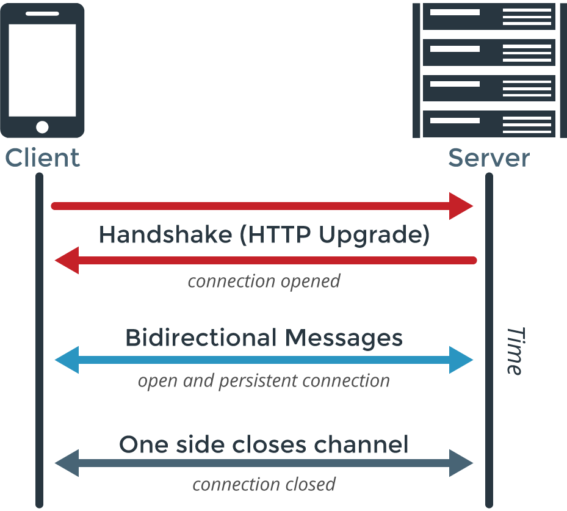
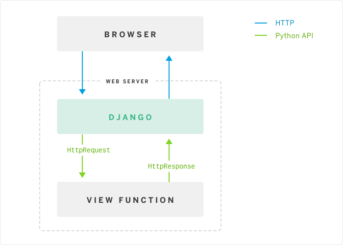
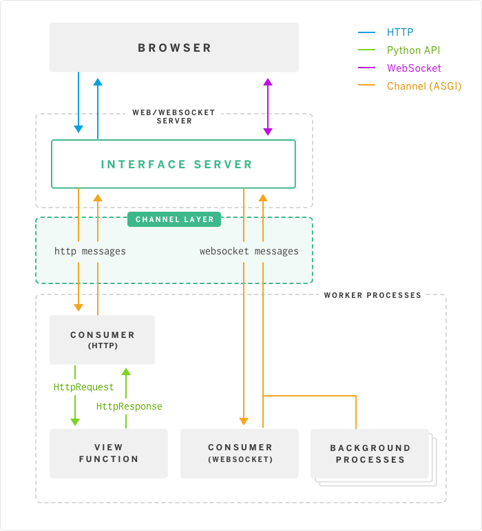

# 비동기적 채팅 기능 01
> 실시간 채팅(비동기적 채팅)을 구현하기 위해 `WebSocket`을 사용할 수 있는 Channels 라이브러리 사용하기

## Websocket
> 프로토콜로서, 실시간으로 데이터를 양방향 통신 할 수 있게 해주는 기술
### django에서 HTTP 통신
1. 클라이언트가 서버에 HTTP request를 보낸다.
2. django는 request를 쪼개고, url을 view에 매칭한다.
3. view가 요청을 수행해 서버가 클라이언트에 response를 보낸다.
- HTTP에서는 트릭을 사용해 실시간처럼 보이도록 통신할 수 있긴 하다. 클라이언트에서 서버로 계속 요청을 보내 이벤트를 받거나(polling), 클라이언트에서 계속 요청을 보내고 필요한 이벤트가 있을 때에만 response를 보내는(streaming) 방식이다.

### 웹소켓 프로토콜 통신
- Socket : 통신을 위한 통로
- HTTP와 다르게, 웹소켓 프로토콜은 양방향 커뮤니케이션(bi-directional communication)을 허용한다. 서버와 클라이언트 사이에 소켓연결(클라이언트 — 서버연결이 계속 유지되어 있는상태)을 지원하는 것이다.이를 push 방식이라고 하는데, 서버는 유저의 요청 없이 클라이언트에 데이터를 줄 수 있다는 뜻이다. HTTP로는 request을 보낸 클라이언트만 response를 받을 수 있는 반면, 웹소켓으로는 다중 클라이언트와 동시에 소통할 수 있다. html5 버전이 나올 때 웹소켓도 함께 등장했다.

## Handshake
- 웹 소켓이 client와 server 간의 접속을 유지하는 방법은 HandShake 이다. 이 과정을 통해 연결을 유지함으로서 방화벽과 같은 환경에서도 연결을 유지할 수 있다. HandShake 과정을 살펴보면 client는 랜덤한 키 값을 전송하고 server는 키 값으로 생성된 토큰을 client에게 response 보낸다.

## Channels
> django에서 HTTP 프로토콜이 아닌 다른 프로토콜을 사용할 수 있게 해주는 라이브러리

- django가 비동기적asynchronous으로 코드를 짤 수 있도록 바꿔주고, django의 동기적인 핵심을 synchronous core 통해 프로젝트가 HTTP뿐 아니라, 장기간 연결을 필요로 하는 프로토콜 Websockets, MQTT, chatbots, amateur radio 등을 핸들링할 수 있도록 해준다.
- django의 동기적이고 쉽게 사용할 수 있는 속성을 유지하면서 코드 스타일을 고를 수 있도록 해주어 유용하다. 완전히 동기적이거나 완전히 비동기적이거나, 섞는 것을 선택할 수 있다.

- django가 `request/response` 을 다루는 방식

- django가 `Channels` 을 사용했을 때
  - Channel layer가 생겨 HTTP message 외에도 Websocket message를 처리할 수 있게 된다.

## ASGI (Asynchronous Server Gateway Interface)
> WSGI(Web Server Gateway Interface)를 계승한 것으로 비동기 방식으로 실행되며, 웹 서버와 python 응용프로그램 간의 표준 인터페이스를 제공하기 위해 Django Channels와 배포에 사용되는 Daphne 서버에서 정의한 사양으로서 HTTP, HTTP/2 및 WebSocket와 같은 프로토콜을 지원

- 웹 소켓을 처리하는 이벤트 : connect, send, receive, disconnect

### Daphne
> django channels를 지원하기 위해 개발된 ASGI 및 ASGI-HTTP 용 HTTP, HTTP2 및 WebSocket 프로토콜 서버이다. 자동화된 프로토콜 중재를 지원한다. HTTP endpoint와 웹소켓 endpoint를 결정할 때 URL을 prefixing 하지 않아도 된다.

### Channel layer
> 의사소통 시스템으로써 많은 소비자들이 django의 다른 부분과 의사소통 할 수 있게 해준다. 소비자들은 채널 이름을 하나씩 가지고 있으며 Channel layer 를 통해 메세지를 주고 받을 수 있다.

- channel
  - channel 은 메세지를 보낼 수 있는 우편함이다. 각 채널은 고유한 이름이 있으며 누구든지 채널에 메세지를 보낼 수 있다.
- group
  - group 은 채널과 관련된 그룹이다. 그룹도 마찬가지로 이름을 가지며 그룹 이름을 가진 사용자는 누구나 그룹에 채널을 추가 / 삭제 가능하고 그룹의 모든 채널에게 메세지를 보낼 수 있다. 그러나 그룹에 속한 채널을 나열할 수 없다.
## REFERENCE
- [장고 공식 문서](https://channels.readthedocs.io/en/latest/introduction.html)
- [장고 채널 튜토리얼](https://channels.readthedocs.io/en/latest/tutorial/part_1.html)