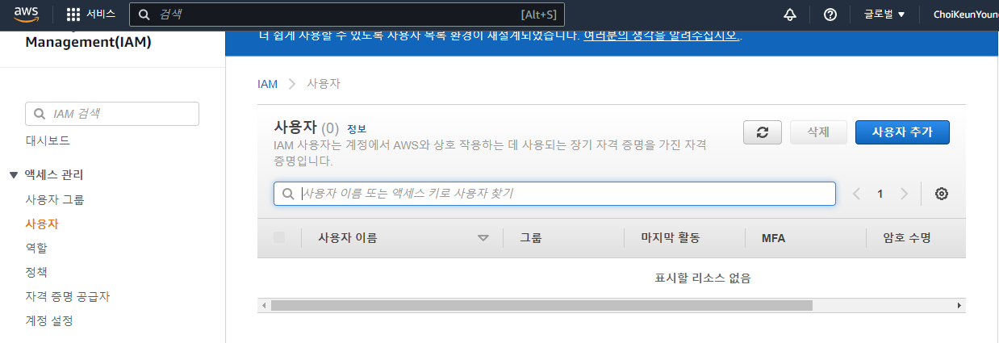

# 비동기적 채팅 기능 02
> 실시간 채팅(비동기적 채팅)을 구현하기 위해 `WebSocket`을 사용할 수 있는 Channels 라이브러리 사용하기

## 준비단계
- 앱 생성 및 추가
```bash
$ python manage.py startapp chat
```
```python
# setting.py
INSTALLED_APPS = (
    ...,
    'chat',
)
```
- 참여할 대화방 이름을 입력하는 `index.html`
```html
<!-- chat/templates/chat/index.html -->
<!DOCTYPE html>
<html>
<head>
    <meta charset="utf-8"/>
    <title>Chat Rooms</title>
</head>

<body>
    What chat room would you like to enter?<br/>
    <input id="room-name-input" type="text" size="100"/><br/>
    <input id="room-name-submit" type="button" value="Enter"/>
    
    <script>
        document.querySelector('#room-name-input').focus();
        document.querySelector('#room-name-input').onkeyup = function(e) {
            if (e.keyCode === 13) {  // enter, return
                document.querySelector('#room-name-submit').click();
            }
        };

        document.querySelector('#room-name-submit').onclick = function(e) {
            var roomName = document.querySelector('#room-name-input').value;
            window.location.pathname = '/chat/' + roomName + '/';
        };
    </script>
</body>
</html>
```
```python
# chat/view.py
from django.shortcuts import render

def index(request):
    return render(request, 'chat/index.html', {})
```
```python
# chat/urls.py
from django.urls import path

from . import views

urlpatterns = [
    path("", views.index, name="index"),
]
```
```python
# urls.py
from django.contrib import admin
from django.urls import include, path

urlpatterns = [
    path("chat/", include("chat.urls")),
    path("admin/", admin.site.urls),
]
```
## Channels 라이브러리
- `channels` 라이브러리를 설치
```bash
$ pip install -U channels
```
- Daphne의 ASGI 버전의 runserver관리 명령어 설치 및 등록
```bash
$ python -m pip install -U channels["daphne"]
```
```python
# settings.py
INSTALLED_APPS = (
    "channels",
    "chat",
    "daphne",
    "django.contrib.auth",
    "django.contrib.contenttypes",
    "django.contrib.sessions",
    "django.contrib.sites",
    ...
)
# Daphne
ASGI_APPLICATION = "yammychu.asgi.application"
```
- 라우팅 config 작성
```python
# routing.py
from channels.routing import ProtocolTypeRouter

application = ProtocolTypeRouter({
    # (http->django views is added by default)
})
```
- Django ASGI 애플리케이션을 래핑하도록 프로젝트 asgi.py파일을 조정
```python
# asgi.py
import os

from channels.routing import ProtocolTypeRouter
from django.core.asgi import get_asgi_application

os.environ.setdefault('DJANGO_SETTINGS_MODULE', 'yammychu.settings')
# Initialize Django ASGI application early to ensure the AppRegistry
# is populated before importing code that may import ORM models.
django_asgi_app = get_asgi_application()

application = ProtocolTypeRouter({
    "http": django_asgi_app,
    # Just HTTP for now. (We can add other protocols later.)
})
```
- `runserver`
  - `channels` 은 runserver 명령을 제어하고 django 개발 서버를 Channel 개발 서버로 대체, 서버를 돌리게 되면 기존과 다른 방식으로 서버가 돌아감
```
Django version 2.2.3, using settings 'yammychu.settings'
Starting ASGI/Channels version 2.2.0 development server at http://127.0.0.1:8000/
```
> 현재는 채팅방에 접속을 해도 채팅방이 존재하지 않으므로 에러 발생
## 채팅방 추가
```html
<!-- chat/templates/chat/room.html -->
<!DOCTYPE html>
<html>
<head>
    <meta charset="utf-8"/>
    <title>Chat Room</title>
</head>

<body>
    <textarea id="chat-log" cols="100" rows="20"></textarea><br/>
    <input id="chat-message-input" type="text" size="100"/><br/>
    <input id="chat-message-submit" type="button" value="Send"/>
</body>

<script>
    var roomName = {{ room_name_json }};

    var chatSocket = new WebSocket(
        'ws://' + window.location.host +
        '/ws/chat/' + roomName + '/');

    chatSocket.onmessage = function(e) {
        var data = JSON.parse(e.data);
        var message = data['message'];
        document.querySelector('#chat-log').value += (message + '\n');
    };

    chatSocket.onclose = function(e) {
        console.error('Chat socket closed unexpectedly');
    };

    document.querySelector('#chat-message-input').focus();
    document.querySelector('#chat-message-input').onkeyup = function(e) {
        if (e.keyCode === 13) {  // enter, return
            document.querySelector('#chat-message-submit').click();
        }
    };

    document.querySelector('#chat-message-submit').onclick = function(e) {
        var messageInputDom = document.querySelector('#chat-message-input');
        var message = messageInputDom.value;
        chatSocket.send(JSON.stringify({
            'message': message
        }));

        messageInputDom.value = '';
    };
</script>

</html>
```
```python
# chat/views.py
from django.shortcuts import render


def index(request):
    return render(request, "chat/index.html")


def room(request, room_name):
    return render(request, "chat/room.html", {"room_name": room_name})
```
```python
# chat/urls.py
from django.urls import path

from . import views

urlpatterns = [
    path("", views.index, name="index"),
    path("<str:room_name>/", views.room, name="room"),
]
```

> 원하는 채팅방으로 접속이 가능하고, 채팅방에서 메세지를 작성함으로 대화를 할 수 있다. 하지만 글을 입력하고 전송하면 에러가 발생한다. 아직 웹소켓 소비자가 만들어지지 않았기때문이다.

## 소비자 만들기
- WebSocket 연결을 받아들이면, root routing configuration에서 소비자를 찾은 후에, 이벤트를 처리하기 위한 함수들을 호출
```python
# chat/consumers.py

from channels.generic.websocket import WebsocketConsumer
import json

class ChatConsumer(WebsocketConsumer):
  	# websocket 연결 시 실행
    def connect(self):
        self.accept()
		# websocket 연결 종료 시 실행 
        
    def disconnect(self, close_code):
        pass
		# 클라이언트로부터 메세지를 받을 시 실행
    def receive(self, text_data):
        text_data_json = json.loads(text_data)
        message = text_data_json['message']
				# 클라이언트로부터 받은 메세지를 다시 클라이언트로 보내준다.
        self.send(text_data=json.dumps({
            'message': message
        }))
```
## routing
- 소비자 라우팅을 처리하기 위해서 앱 안에 routing 을 추가
```python
# chat/routing.py

from django.conf.urls import url
from . import consumers

websocket_urlpatterns = [
    url(r'^ws/chat/(?P<room_name>[^/]+)/$', consumers.ChatConsumer),
]
```
- chat.routing 모듈에서 기본 ASGI 구성을 지정
```python
# asgi.py
import os

from channels.auth import AuthMiddlewareStack
from channels.routing import ProtocolTypeRouter, URLRouter
from channels.security.websocket import AllowedHostsOriginValidator
from django.core.asgi import get_asgi_application

os.environ.setdefault("DJANGO_SETTINGS_MODULE", "mysite.settings")
# Initialize Django ASGI application early to ensure the AppRegistry
# is populated before importing code that may import ORM models.
django_asgi_app = get_asgi_application()

import chat.routing

application = ProtocolTypeRouter(
    {
        "http": django_asgi_app,
        "websocket": AllowedHostsOriginValidator(
            AuthMiddlewareStack(URLRouter(chat.routing.websocket_urlpatterns))
        ),
    }
)
```
- django가 routing 파일을 인식할 수 있도록 추가
```python
# routing.py

from channels.auth import AuthMiddlewareStack
from channels.routing import ProtocolTypeRouter, URLRouter
import chat.routing

# 클라이언트와 Channels 개발 서버가 연결 될 때, 어느 protocol 타입의 연결인지
application = ProtocolTypeRouter({
    # (http->django views is added by default)
  	# 만약에 websocket protocol 이라면, AuthMiddlewareStack
    'websocket': AuthMiddlewareStack(
        # URLRouter 로 연결, 소비자의 라우트 연결 HTTP path를 조사
        URLRouter(
            chat.routing.websocket_urlpatterns
        )
    ),
})
```

> 아직 같은 채팅방에 있더라도 다른 사용자는 메세지를 볼 수 없다

## channel layer 구현
- channe layer를 구현하기위해 백업장소인 Redis DB 이용
  - 꼭 제일 최근 버전으로 설치해야한다. 아니면 오류난다. 현재는 5 버전대가 제일 최근 버전

[Microsoft redis Github](https://github.com/microsoftarchive/redis) 여기서 다운받기

설치가 완료되면 작업관리자에서 확인


- redis server 실행
```bash
$ redis-server
```


- channels 가 redis 인터페이스를 얻을 수 있도록 channels_redis 패키지를 설치
```bash
$ pip install channels_redis
```
- settings 에 channel layer의 설정
```python
# settings.py
ASGI_APPLICATION = 'mysite.routing.application'
CHANNEL_LAYERS = {
    'default': {
        'BACKEND': 'channels_redis.core.RedisChannelLayer',
        'CONFIG': {
            "hosts": [('127.0.0.1', 6379)],
        },
    },
}
```
- 채널 레이어가 Redis와 통신할 수 있는지 확인
- 장고 셸을 열고 다음 명령 실행
```bash
$ python manage.py shell
>>> import channels.layers
>>> channel_layer = channels.layers.get_channel_layer()
>>> from asgiref.sync import async_to_sync
>>> async_to_sync(channel_layer.send)('test_channel', {'type': 'hello'})
>>> async_to_sync(channel_layer.receive)('test_channel')
{'type': 'hello'}
```
- 터미널에서 
```python
# chat/consumers.py
from asgiref.sync import async_to_sync
from channels.generic.websocket import WebsocketConsumer
import json

class ChatConsumer(WebsocketConsumer):
    def connect(self):
      	# chat/routing.py 에 있는
        # url(r'^ws/chat/(?P<room_name>[^/]+)/$', consumers.ChatConsumer),
        # 에서 room_name 을 가져옵니다.
        self.room_name = self.scope['url_route']['kwargs']['room_name']
        self.room_group_name = 'chat_%s' % self.room_name

        # 그룹에 join
        # send 등 과 같은 동기적인 함수를 비동기적으로 사용하기 위해서는 async_to_sync 로 감싸줘야한다.
        async_to_sync(self.channel_layer.group_add)(
            self.room_group_name,
            self.channel_name
        )
        # WebSocket 연결
        self.accept()

    def disconnect(self, close_code):
        # 그룹에서 Leave
        async_to_sync(self.channel_layer.group_discard)(
            self.room_group_name,
            self.channel_name
        )

    # WebSocket 에게 메세지 receive
    def receive(self, text_data):
        text_data_json = json.loads(text_data)
        message = text_data_json['message']

        # room group 에게 메세지 send
        async_to_sync(self.channel_layer.group_send)(
            self.room_group_name,
            {
                'type': 'chat_message',
                'message': message
            }
        )

    # room group 에서 메세지 receive
    def chat_message(self, event):
        message = event['message']

        # WebSocket 에게 메세지 전송
        self.send(text_data=json.dumps({
            'message': message
        }))
```

> channels layer 를 사용하여 메세지를 다른 사용자에게도 보일 수 있게 하였다. 브라우저를 두 개 띄워놓고 같은 채팅방에 메세지를 전송해보면 양 쪽에서 메세지가 뜬다. 채팅방 구현 완료

## 구현하면서 어려웠던 점
### redis 서버 실행시 에러
- 환경변수 설정
  - 고급 시스템 설정 보기 - 환경 변수 - 시스템 변수 - 편집 - `변수:Path, 값 새로 만들기:C:\Program Files\Redis`
- redis 동작 중지 후 다시 실행

1. 작업관리자의 서비스탭의 redis 실행 중지
2. c드라이브 - Program Files - Redis - redis-cli.exe 실행 후 아래 명령어 입력
```bash
$ redis-cli
127.0.0.1:6379> shutdown
not connected> exit
```
이후에 터미널에서 redis server 다시 실행하면 잘 동작한다.
### 후기
- 웹 소켓이라는 개념을 학교에서 이론적으로만 배운 후 까먹고 있었는데 채팅기능을 구현하면서 웹소켓이 실제 작동하는 원리를 알아볼 수 있었다.
- nosql로서 key-value 타입의 저장소인 redis를 사용하면서 rdbms와 nosql DB의 차이를 확실히 알았다.
  - 이전 채팅 내용을 저장하고 싶으면 rdbms를 사용해야하고, 휘발되도록 하려면 nosql을 사용해야한다.
  - 우리는 이전 내용이 휘발되도 상관 없으므로 rdbms를 따로 사용하지 않았다.
- 원래 쓰던 sqlite3 DB 뿐만 아니라 다른 DB도 쓰는 것이기 때문에 추후에 AWS 배포를 진행할 때 많은 고민을 할 것으로 예상된다.

### 해결하지 못한 문제
- 채팅 방에 들어가면 갑자기 로그인이 풀린다거나 그 채팅방에 있던 다른 사용자의 아이디로 로그인이 되는 문제가 아주 가끔씩 발생한다. 원인도 모르고 어느 상황에서 그런 에러가 나는지도 모르겠다. 추후에 더 지켜보고 지속적으로 그런 문제가 나타나면 수정해야겠다..