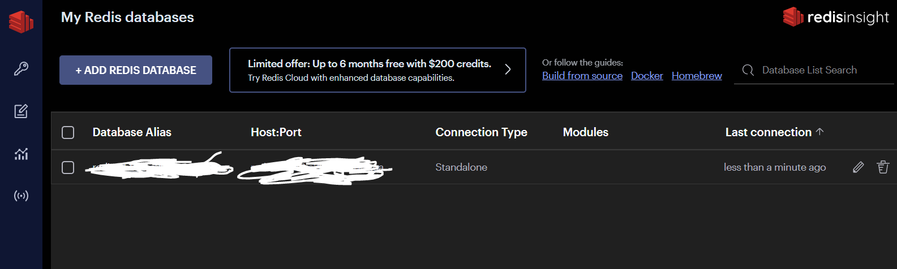

# 프로젝트 REDIS 연결
> 채팅 기능에 redis DB를 사용했고, 개인마다 DB가 다 달랐기때문에 로컬에서만 채팅기능이 가능했다. 다른 사람들과 함께 DB를 사용하기 위해 Redis DB Cloud를 사용했다.

## RedisInsight 다운받기
[redis cloud](https://redis.com/redis-enterprise-software/download-center/software/)
## 데이터베이스 생성 후 키 값 발급받기

## `.env`에 채널 Layer host 지정하기
```
CHANNEL_LAYERS_HOST = ["발급받은 DB key 값"]
``` 
## `setting.py`에 hots 바꿔주기
```python
CHANNEL_LAYERS = {
    "default": {
        "BACKEND": "channels_redis.core.RedisChannelLayer",
        "CONFIG": {
            # "hosts": [("127.0.0.1", 6379)],
            "hosts": [os.getenv("CHANNEL_LAYERS_HOST")]
        },
    },
} 
```
## AWS 환경 속성에 추가
CHANNEL_LAYERS_HOST = ["발급받은 DB key 값"]

## 어려웠던 부분
로컬에서 팀원들과 웹소켓 통신은 성공했지만 AWS 배포는 실패했다.... 처음엔 AWS의 NGINX에서 웹 소켓을 막아둔줄 알고 리눅스 환경에서 확인을 해봤지만 그 문제는 아니었다. 장고 채널 배포 부분을 찾아보니 NGINX에서 supervisor를 생성해 다프네 관련 설정을 따로 해줘야하는 것 같다. 시도해 볼 수 있었지만 프로젝트 기간이 얼마 남지 않아서 시도해보지 못했다. 추후에 프로젝트를 보완할때 꼭 시도해서 channels도 배포할 수 있도록 할것이다.