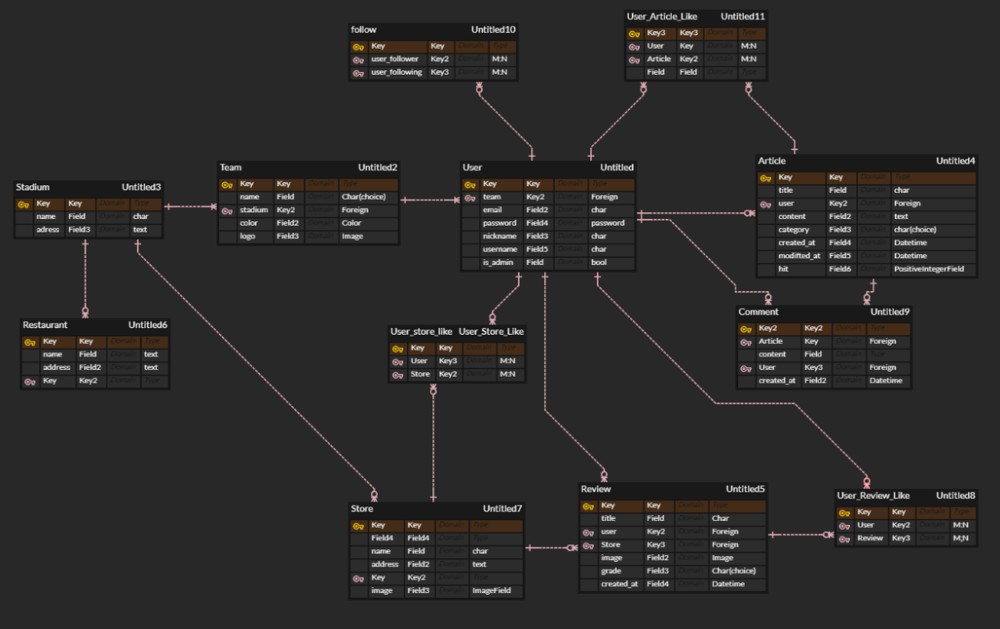
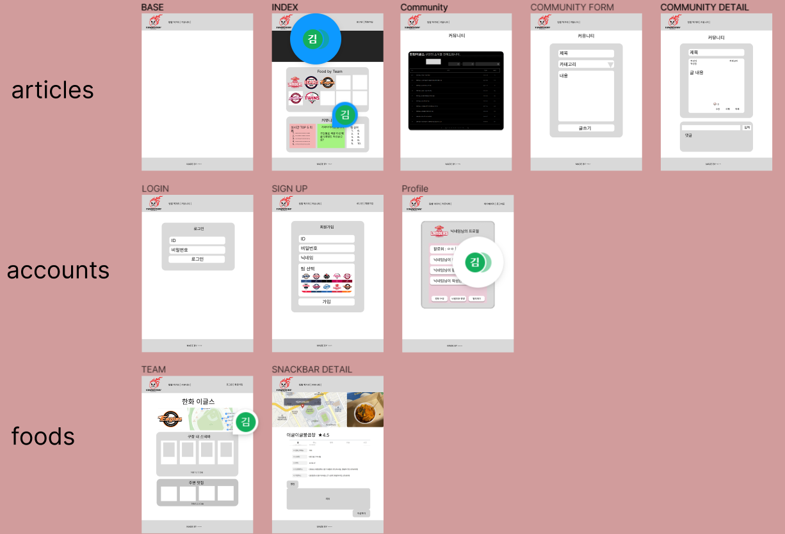

# yammychu 프로젝트 기획

## 프로젝트 개요

| 프로젝트 목적 | 웹 프레임워크 Django와 HTML / CSS / JavaScript를 활용한 콘텐츠 기반 커뮤니티 웹 플랫폼 개발 |
| --- | --- |
| 프로젝트 기간 | 11.09 (수) ~ 11.21 (월) |
| 발표 날짜 | 11.22 (화) |
| 팀명 | YammyChu |
| 주제 | 구장별 야구장 매점 추천, 커뮤니티 |
| 팀장 | 김문경 |
| 발표자 | 김광표 |
| PPT 제작자 | 최근영, 이주용, 김다겸 |

## 개발 역할 분담

| 이름 | 나이 | 거주지 | MBTI | 희망 분야 | 역할 | 과거 | 특이사항 | Git |
| --- | --- | --- | --- | --- | --- | --- | --- | --- |
| 김문경 | 25 | 울산 남구 | ISTJ | BE  | 팀장 | 전자공학 → 졸업 → 방황하면서 취준 → 개발 시작 | 야구 진짜 좋아함(얘기 환영) 음악도 좋아함 | https://github.com/kmk4162 |
| 김광표 | 28 | 부산 부산진구 | INTP | BE / fe | 발표 | 항공우주공학 졸업 → 잠깐 취업 → 겜창인생 → 개발 시작 | 롤 다이아(휴면강등) 개발 첫 과정 | https://github.com/Pangpyo |
| 김준환 | 25 | 대구 동구 | ISFJ | FE | 노션 정리 | 전기공학과 재학 → KDT 시작 | 개발 첫 과정 | https://github.com/hvvany |
| 최근영 | 27  | 부산 동래구 | ESFP | BE / FE | PPT | 전자공학 졸업 → KDT 시작 | 운동 좋아함 열심히 하겠습니다 | https://github.com/choikeunyoung |
| 이주용 | 29 | 수원시 팔달구 | ISFP | BE | PPT | 경제금융학 → 취준 대실패 → 우만동 낭만고양이 | 고양이 소리 잘냄 개발 처음함 롤 끊고 열심히 할게요 | https://github.com/yaonggod|
| 김다겸 | 24 | 서울 노원구 | ISTP | BE | PPT | 정보통신공학과 졸업 → 방황하면서 취준 | 개발 첫과정 | https://github.com/kimdakyeom |

## 주제 사전 조사 & 분석

- 여러 맛집 사이트들이 많지만, 야구장 내의 먹거리를 추천해주는 사이트는 없다
- 야구 관련 서비스
    
    [직관만큼 실감 나게 야구를 즐길 수 있는 앱 5](https://news.appstory.co.kr/appchoice13199)
    
    [↗ 파크에 오면 즐겁다 MLBPARK](https://mlbpark.donga.com/mp)
    
- 구단별 색상코드
    
    [틀:야구 주요 색 - 위키백과, 우리 모두의 백과사전](https://ko.wikipedia.org/wiki/%ED%8B%80:%EC%95%BC%EA%B5%AC_%EC%A3%BC%EC%9A%94_%EC%83%89)

- 각 구단별 사이트
    - **한화**
        
        [한화이글스](https://www.hanwhaeagles.co.kr/index.do)
        
    - KT
        
        [Show Magic! Team KT](https://www.ktwiz.co.kr/)
        
    - SSG
        
        [SSG LANDERS](http://www.ssglanders.com/main)
        
    - NC
        
        [NC Dinos](https://www.ncdinos.com/)
        
    - 롯데
        
        
        
    - LG
        
        [서울 LG TWINS](https://www.lgtwins.com/service/html.ncd?view=/pc_twins/twins_main/twins_main)
        
    - KIA
        
        [KIA타이거즈](https://tigers.co.kr/)
        
    - 두산
        
        [두산베어스](https://www.doosanbears.com/)
        
    - 삼성
        
        [삼성라이온즈](http://www.samsunglions.com/)
        
    - 키움
        
        [KIWOOM HEROES](https://www.heroesbaseball.co.kr/index.do)
        
    

## 서비스 주요 기능

- 각 야구 구단을 고를 시에 사이트 **테마**가 바뀜 (네브바, 로고? 등)
- 야구장 안밖의 **맛집 리스트**
- 맛집에 대한 **리뷰** 작성
- 야구 관련 **커뮤니티: 게시글** 작성(프로필 앞에 구단 로고 뜨고 글씨도 구단 색깔로)
- **채팅**(시간 되면.. 10개구단 팀별로? 응원 할 수 있게)

## DB 모델링(ERD)

## 장고 모델(Model) 설계

|엡|모델 이름|역할|
|----|----|----|
|articles|Article|커뮤니티 게시판의 글|
|articles|User_Article_Like|User와 Article 글 사이 좋아요를 중계할 M:N 중계테이블|
|articles|Comment|커뮤니티 게시판에 글에 달리는 댓글|
|articles|Team|유저가 응원하는 팀을 결정|
|articles|Stadium|팀에서 경기장으로 연결되며, 경기장에서 음식점들로 연결됨|
|accounts|User|유저|
|accounts|Follower_Following|User와 User사이 팔로우를 중계할 M:N 중계테이블|
|foods|Restaurant|경기장 주변 외부 음식점|
|foods|Store|경기장 내부 먹거리들|
|foods|User_Store_Like|User와 Store 사이 좋아요를 중계할 M:N 중계테이블|
|foods|Review|Store에 대한 리뷰|

## 장고 기능(View) 설계

|우선 순위|앱|이름|메소드|요청 URL|
|----|----|----|----|----|
|1|articles|전체 메인 화면|GET|/|
|1|articles|게시글|POST|/articles/create/|
|2|articles|게시글 수정|POST|/articles/<int:article_pk>/update/|
|2|articles|게시글 삭제|POST|/articles/<int:article_pk>/delete/|
|3|articles|게시글 좋아요|POST|/articles/like/|
|2|articles|댓글 작성|POST|/articles/<int:article_pk>/comments/create/|
|1|articles|커뮤니티 메인 화면|GET|/articles/|
|1|articles|커뮤니티 디테일 화면|GET|/articles/<int:article_pk>/|
|1|accounts|회원가입 화면|POST|/accounts/signup/|
|2|accounts|로그인 화면|POST|/accounts/login/|
|3|accounts|프로필 화면|GET|/accounts/<int:pk>/|
|3|accounts|회원 정보 수정|POST|/accounts/<int:pk>/update/|
|4|accounts|회원 비밀번호 수정|POST|/accounts/<int:pk>/password/|
|4|accounts|팔로우|POST|/accounts/<int:pk>/follow|
|2|foods|팀 별 먹거리 화면|GET|/foods/<int:Team_pk>/|
|2|foods|먹거리 디테일|GET|/foods/<int:Team_pk>/<int:Store_pk>|
|2|foods|먹거리 작성|POST|/foods/<int:Team_pk>/create|
|3|foods|먹거리 수정|POST|/foods/<int:Team_pk>/update|
|3|foods|먹거리 삭제|POST|/foods/<int:Team_pk>/delete|
|4|foods|먹거리 리뷰 생성|POST|/foods/<int:Team_pk>/<int:Store_pk>/review|
|4|foods|먹거리 리뷰 삭제|POST|/foods/<int:Team_pk>/<int:Store_pk>/<int:Review_pk>|
|5|foods|먹거리 리뷰 좋아요|POST|/foods/<int:Team_pk>/<int:Store_pk>/<int:Review_pk>/like|
## 화면 설계

