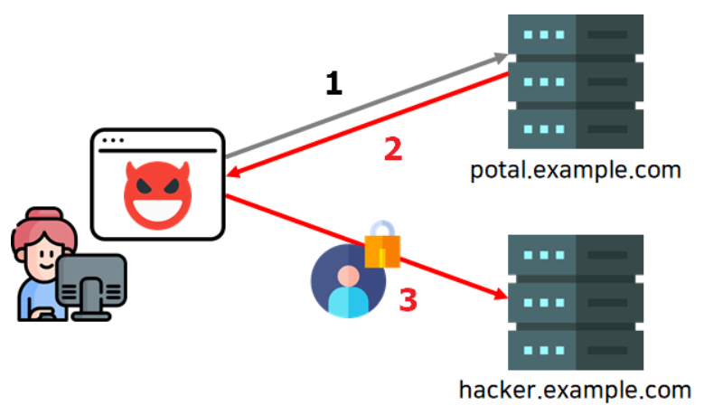
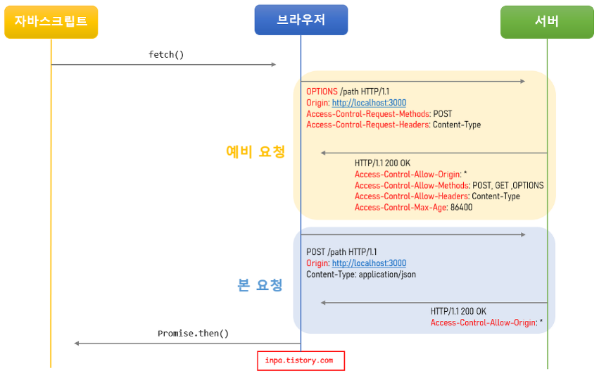
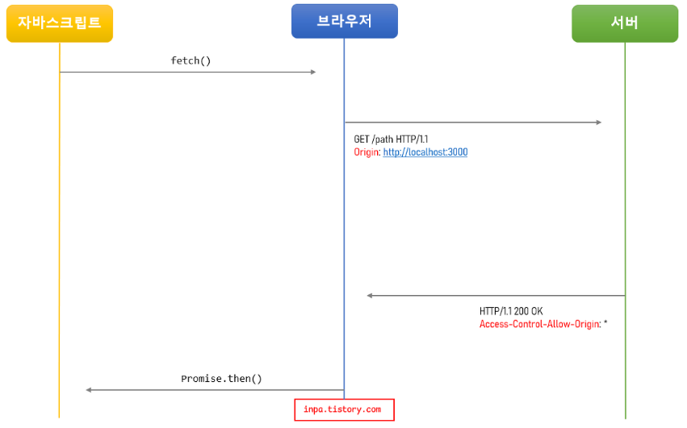

# 프로젝트 drf CORS

> Cross-Origin Resource Sharing
>
> 하나의 출처에서 실행 중인 웹 애플리케이션이 도메인 또는 포트가 다른 서버의 자원에 접근할 수 있는 권한을 부여하도록 브라우저에 알려주는 정책

## 출처

- **동일 출처(Origin) = Protocal + Host + Port(생략)**


- Protocol(Scheme) : http, https
- Host : 사이트 도메인
- Port : 포트 번호
- Path : 사이트 내부 경로
- Query string : 요청의 key와 value값
- Fragment : 해시 태크

### 동일 출처 예

- `http://Example.com:80`와 `http://example.com`
  - HTTP 기본 Port인 80번이 생략되어있으므로 동일 출처
- `http://example.com/app1/index.html`와 `http://example.com/app2/index.html`
  - Protocol, Host, Port(생략)이 같으며, Path부터 다르므로 동일 출처

### 다른 출처 예

- `http://example.com/app1`와 `https://example.com/app2`
  - 다른 Protocol
- `http://www.example.com`와 `http://myapp.example.com`
  - 다른 Host
- `http://example.com`와 `http://example.com:8080`
  - 다른 Port

> 다른 출처 요청인 경우, CORS 정책에 준수하여 요청해야만 정상적으로 응답을 받을 수 있다.

## SOP(Same-Origin Policy) - 동일 출처 정책
> 동일 출처(Same-Origin) 서버에 있는 리소스는 자유로이 가져올수 있지만, 다른 출처(Cross-Origin) 서버에 있는 이미지나 유튜브 영상 같은 리소스는 상호작용이 불가능하다.

### 동일 출처 정책이 필요한 이유
- 출처가 다른 두 어플리케이션이 자유롭게 소통할 수 있는 환경에서 제약이 없다면 해커가 CSRF(Cross-Site Request Forgery)나 XSS(Cross-Site Scripting) 등의 방법을 이용해서 우리가 만든 어플리케이션에서 해커가 심어놓은 코드가 실행하여 개인 정보를 가로챌 수 있다.



1. 사용자가 악성 사이트에 접속한다.
2. 이때 해커가 몰래 심어놓은 악의적인 자바스크립트가 실행되어, 사용자가 모르는 사이에 어느 포털 사이트에 요청을 보낸다.
3. 그럼 포털 사이트에서 해당 브라우저의 쿠키를 이용하여 로그인을 하거나 등 상호작용에 따른 개인 정보를 응답 값을 받은뒤, 사이트에서 해커 서버(hacker.example.com)로 재차 보낸다.
4. 이외에도 사용자가 접속중인 내부망의 아이피와 포트를 가져오거나, 해커가 사용자 브라우저를 프록시처럼 악용할 수도 있다.

- 따라서 이러한 악의적인 경우를 방지하기 위해, SOP 정책으로 동일하지 않는 다른 출처의 스크립트가 실행되지 않도록 브라우저에서 사전에 방지하는 것이다.

## 브라우저의 CORS 기본 동작
1. 클라이언트에서 HTTP요청의 헤더에 Origin을 담아 전달
    - 기본적으로 웹은 HTTP 프로토콜을 이용하여 서버에 요청을 보내게 되는데, 이때 브라우저는 요청 헤더에 Origin 이라는 필드에 출처를 함께 담아 보낸다.
2. 서버는 응답헤더에 Access-Control-Allow-Origin을 담아 클라이언트로 전달한다.
    - 이후 서버가 이 요청에 대한 응답을 할 때 응답 헤더에 Access-Control-Allow-Origin이라는 필드를 추가하고 값으로 '이 리소스를 접근하는 것이 허용된 출처'를 내려보낸다.
3. 클라이언트에서 자신이 보냈던 요청의 Origin과 서버가 보내준 Access-Control-Allow-Origin을 비교한다.
    - 이후 응답을 받은 브라우저는 자신이 보냈던 요청의 Origin과 서버가 보내준 응답의 Access-Control-Allow-Origin을 비교해본 후 차단할지 말지를 결정한다.
    - 만약 유효하지 않다면 그 응답을 사용하지 않고 버린다. (CORS 에러)
- 결론은 서버에서 Access-Control-Allow-Origin 헤더에 허용할 출처를 기재해서 클라이언트에 응답하면 된다.

## CORS 작동 방식 3가지 시나리오
### 예비 요청 (Preflight Request)
- 브라우저는 요청을 보낼때 한번에 바로 보내지않고, 먼저 예비 요청을 보내 서버와 잘 통신되는지 확인한 후 본 요청을 보낸다.
- 이때 브라우저가 예비요청을 보내는 것을 Preflight라고 부르며, 이 예비요청의 HTTP 메소드를 GET이나 POST가 아닌 OPTIONS라는 요청이 사용된다.

예) 자바스크립트로 다음 api 요청

1. 자바스크립트의 fetch() 메서드를 통해 리소스를 받아오려고 한다.
2. 브라우저는 서버로 HTTP OPTIONS 메소드로 예비 요청(Preflight)을 먼저 보낸다.
    1. Origin 헤더에 자신의 출처를 넣는다.
    2. Access-Control-Request-Method 헤더에 실제 요청에 사용할 메소드를 설정한다.
    3. Access-Control-Request-Headers 헤더에 실제 요청에 사용할 헤더들을 설정한다.
3. 서버는 이 예비 요청에 대한 응답으로 어떤 것을 허용하고 어떤것을 금지하고 있는지에 대한 헤더 정보를 담아서 브라우저로 보내준다.
    1. Access-Control-Allow-Origin 헤더에 허용되는 Origin들의 목록을 설정한다.
    2. Access-Control-Allow-Methods 헤더에 허용되는 메소드들의 목록을 설정한다.
    3. Access-Control-Allow-Headers 헤더에 허용되는 헤더들의 목록을 설정한다.
    4. Access-Control-Max-Age 헤더에 해당 예비 요청이 브라우저에 캐시 될 수 있는 시간을 초 단위로 설정한다.
4. 이후 브라우저는 보낸 요청과 서버가 응답해준 정책을 비교하여, 해당 요청이 안전한지 확인하고 본 요청을 보내게 된다.
5. 서버가 본 요청에 대한 응답을 하면 최종적으로 이 응답 데이터를 자바스립트로 넘겨준다.

### 단순 요청 (Simple Request)
- 예비 요청(Prefilght)을 생략하고 바로 서버에 직행으로 본 요청을 보낸 후, 서버가 이에 대한 응답의 헤더에 Access-Control-Allow-Origin 헤더를 보내주면 브라우저가 CORS정책 위반 여부를 검사하는 방식이다.

예) 자바스크립트로 다음 api 요청


- 대표적으로 아래 3가지 경우를 만족할때만 예비 요청을 생략할 수 있다.
  - 요청의 메소드는 GET, HEAD, POST 중 하나여야 한다.
  - `Accept`, `Accept-Language`, `Content-Language`, `Content-Type`, `DPR`, `Downlink`, `Save-Data`, `Viewport-Width`, `Width` 헤더일 경우 에만 적용된다.
  - Content-Type 헤더가 `application/x-www-form-urlencoded`, `multipart/form-data`, `text/plain`중 하나여야한다. 아닐 경우 예비 요청으로 동작된다.

- 이처럼 다소 까다로운 조건들이 많기 때문에, 대부분의 API 요청은 그냥 예비 요청(preflight)으로 이루어진다 라고 이해하면 된다.

### 인증된 요청 (Credentialed Request)
- 인증된 요청은 클라이언트에서 서버에게 자격 인증 정보(Credential)를 실어 요청할때 사용되는 요청이다.
  - 자격 인증 정보 : 세션 ID가 저장되어있는 쿠키(Cookie) 혹은 Authorization 헤더에 설정하는 토큰 값 등
#### 클라이언트에서 인증 정보를 보내도록 설정하기
- 기본적으로 브라우저가 제공하는 요청 API 들은 별도의 옵션 없이 브라우저의 쿠키와 같은 인증과 관련된 데이터를 함부로 요청 데이터에 담지 않도록 되어있다.
- `credentials` 옵션 : 요청에 인증과 관련된 정보를 담을 수 있게 해주는 옵션
  - same-origin(기본값) : 같은 출처 간 요청에만 인증 정보를 담을 수 있다.
  - include : 모든 요청에 인증 정보를 담을 수 있다.
  - omit : 모든 요청에 인증 정보를 담지 않는다.
- 만일 이러한 별도의 설정을 해주지 않으면 쿠키 등의 인증 정보는 절대로 자동으로 서버에게 전송되지 않는다.

```js
axios.post('https://example.com:1234/users/login', {
    profile: { username: username, password: password }
}, {
	withCredentials: true // 클라이언트와 서버가 통신할때 쿠키와 같은 인증 정보 값을 공유하겠다는 설정
})
```

#### 서버에서 인증된 요청에 대한 헤더 설정하기
- 서버에서도 인증된 요청에 대해 일반적인 CORS 요청과는 다르게 대응해줘야 한다.
  - 응답 헤더의 Access-Control-Allow-Credentials 항목을 true로 설정해야 한다.
  - 응답 헤더의 Access-Control-Allow-Origin 의 값에 와일드카드 문자("*")는 사용할 수 없다.
  - 응답 헤더의 Access-Control-Allow-Methods 의 값에 와일드카드 문자("*")는 사용할 수 없다.
  - 응답 헤더의 Access-Control-Allow-Headers 의 값에 와일드카드 문자("*")는 사용할 수 없다.
- 응답의 Access-Control-Allow-Origin 헤더가 와일드카드(*)가 아닌 분명한 Origin으로 설정되어야 하고, Access-Control-Allow-Credentials 헤더는 true로 설정되어야 한다.

## Django에서 CORS 설정하기
### django-cors-headers 설치
```bash
pip install django-cors-headers
```
### settings.py 에 설정 추가
```python
INSTALLED_APPS =[
...
'corsheaders',
]
...

MIDDLEWARE = [
	'corsheaders.middleware.CorsMiddleware',     # 최상단에 기입
...
]
...

CORS_ORIGIN_WHITELIST = ['http://172.30.1.22:8080'
                         ,'http://localhost:8080']
CORS_ALLOW_CREDENTIALS = True
```