# 프로젝트 DRF CRUD
> APIView > Mixins > Generic CBV > ViewSet 순으로 학습
>
> 오른쪽으로 갈수록 상속(CBV 특성)을 활용해서 view를 더 간단하게 구현 가능

## Serializer
- django에서 활용되는 form과 매우 유사한 개념
  - form : HTML form 생성
  - serializer : JSON 문자열 생성
- Django Rest Framework에서는 serializer를 통해 client의 입력 데이터를 직렬화하여 전달

## APIView
- 원하는 HTTP method를 커스터마이징 할 수 있다는 장점이 있다.

[DRF APIView 공식문서](https://www.django-rest-framework.org/tutorial/3-class-based-views/)

### models.py
- 게시판 기능을 위해 title, body라는 field 생성
```python
from django.db import models
from django.conf import settings

class Blog(models.Model):
    title = models.CharField(max_length=100)
    body = models.TextField()
```

### serializers.py
- fields를 `__all__`로 설정해서 Blog의 title과 body 모두 직렬화
```python
from .models import Blog
from rest_framework import serializers

class BlogSerializer(serializers.ModelSerializer):
    class Meta:
        model = Blog
        fields = '__all__'
```

### views.py
- Blog 전체 목록을 보여주는 역할을 하는 BlogList 클래스 : 2가지 HTTP method
  - 전체 목록 보여주기 (GET)
  - 새로운 Blog 객체 등록하기 (POST)
- Blog 객체의 detail을 보여주는 BlogDetail 클래스 : 3가지 HTTP method
  - Blog 객체의 detail 보여주기 (GET)
  - Blog 객체 수정하기 (PUT)
  - Blog 객체 삭제하기 (DELETE)

```python
# 데이터 처리
from .models import Blog
from .serializers import BlogSerializer

# APIView를 사용하기 위해 import
from rest_framework.views import APIView
from rest_framework.response import Response
from rest_framework import status
from django.http import Http404

# Blog의 목록
class BlogList(APIView):
    # Blog list를 보여줄 때
    def get(self, request):
        blogs = Blog.objects.all()
        # 여러 개의 객체를 serialization하기 위해 many=True로 설정
        serializer = BlogSerializer(blogs, many=True)
        return Response(serializer.data)

    # 새로운 Blog 글을 작성할 때
    def post(self, request):
        # request.data는 사용자의 입력 데이터
        serializer = BlogSerializer(data=request.data)
        if serializer.is_valid(): #유효성 검사
            serializer.save() # 저장
            return Response(serializer.data, status=status.HTTP_201_CREATED)
        return Response(serializer.errors, status=status.HTTP_400_BAD_REQUEST)

# Blog의 detail
class BlogDetail(APIView):
    # Blog 객체 가져오기
    def get_object(self, pk):
        try:
            return Blog.objects.get(pk=pk)
        except Blog.DoesNotExist:
            raise Http404
    
    # Blog의 detail 보기
    def get(self, request, pk, format=None):
        blog = self.get_object(pk)
        serializer = BlogSerializer(blog)
        return Response(serializer.data)

    # Blog 수정하기
    def put(self, request, pk, format=None):
        blog = self.get_object(pk)
        serializer = BlogSerializer(blog, data=request.data) 
        if serializer.is_valid():
            serializer.save()
            return Response(serializer.data) 
        return Response(serializer.errors, status=status.HTTP_400_BAD_REQUEST)

    # Blog 삭제하기
    def delete(self, request, pk, format=None):
        blog = self.get_object(pk)
        blog.delete()
        return Response(status=status.HTTP_204_NO_CONTENT)    
```

### urls.py
- 앱 단위의 urls.py
```python
from django.urls import path
from rest_framework.urlpatterns import format_suffix_patterns
from . import views

urlpatterns =[
    path('blog/', views.BlogList.as_view()),
    path('blog/<int:pk>/', views.BlogDetail.as_view()),
]

urlpatterns = format_suffix_patterns(urlpatterns)
```

- 프로젝트 단위의 urls.py
```python
from django.contrib import admin
from django.urls import path, include

urlpatterns = [
    path('admin/', admin.site.urls),
    path('', include('blog.urls')),
]
```

### 마이그레이션 후 런서버
- `http://127.0.0.1:8000/blog/`
  - blog 페이지 접속
  - 위에는 Blog 객체를 보여주는 GET 방식
  - 아래에는 Blog 객체를 등록할 수 있는 POST 방식

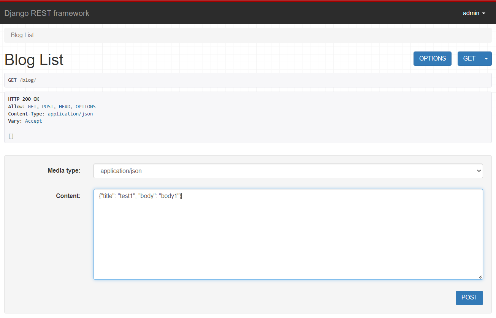

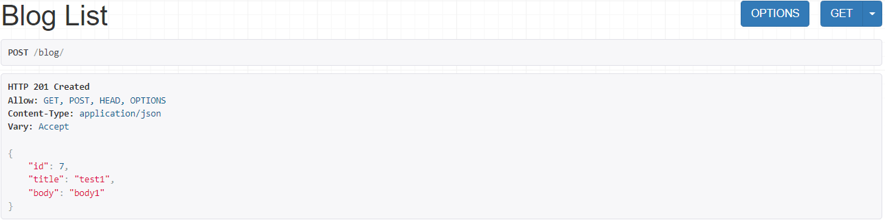

- `http://127.0.0.1:8000/blog/<int:pk>`
  - blog의 detail 정보 확인 (GET)
  - 아래에 PUT을 통해 내용을 수정
  - DELETE를 통해 해당 객체 삭제

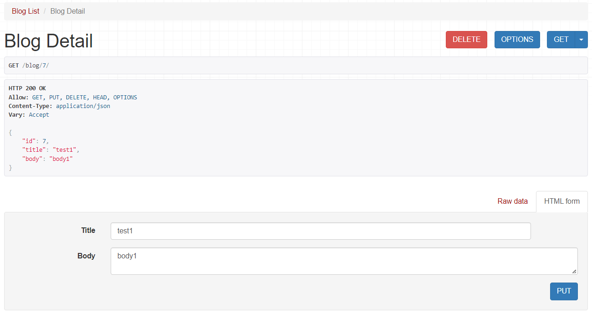

> APIView를 통해 views.py를 작성하다보면 각 클래스마다 필요한 method 함수를 계속 작성하다보니 특정 함수를 계속 반복하고 코드가 길어진다. mixins 방식으로 코드를 더욱 줄일 수 있다.

## Mixins
- CBV(Class Based View)의 상속 특성을 활용하여 불필요한 코드의 중복을 줄여 view를 더 간단하게 구현할 수 있다.

[DRF Mixins 공식문서](https://www.django-rest-framework.org/tutorial/3-class-based-views/#using-mixins)

### models.py, serializers.py 코드는 위와 같다.

### views.py
- BlogList와 BlogDetail라는 클래스를 살펴보면 인자로 `mixins.ListModelMixin`, `mixins.CreateModelMixin` 등을 받는다.
- 이러한 인자 값은 views.py 상단에 import 해준 mixins에서 상속을 받은 것이다.
- 이 외에도 `RetrieveModelMixin`, `UpdateModelMixin`, `DestroyModelMixin`이 이미 정의되어있다.
    - [mixins.py의 원본 코드](https://github.com/encode/django-rest-framework/blob/master/rest_framework/mixins.py)

-  BlogList와 BlogDetail에서 선언해준 queryset과 serializer_class는 인자로 상속받은 generics.GenericAPIView에서 온 값이다.
    - [generics.py의 원본 코드](https://github.com/encode/django-rest-framework/blob/master/rest_framework/generics.py)


```python
from .models import Blog
from .serializers import BlogSerializer
from rest_framework import generics
from rest_framework import mixins

# Blog의 목록
class BlogList(mixins.ListModelMixin, 
                  mixins.CreateModelMixin, 
                  generics.GenericAPIView):
    queryset = Blog.objects.all()
    serializer_class =BlogSerializer

	# Blog list를 보여줄 때
    def get(self, request, *args, **kwargs):
        return self.list(request, *args, **kwargs)
	
	# 새로운 Blog 글을 작성할 때
    def post(self, request, *args, **kwargs):
        return self.create(request, *args, **kwargs)

# Blog의 detail
class BlogDetail(mixins.RetrieveModelMixin,
                     mixins.UpdateModelMixin,
                     mixins.DestroyModelMixin,
                     generics.GenericAPIView):
    queryset = Blog.objects.all()
    serializer_class = BlogSerializer

	# Blog의 detail 보기
    def get(self, request, *args, **kwargs):
        return self.retrieve(request, *args, **kwargs)

	# Blog 수정하기
    def put(self, request, *args, **kwargs):
        return self.update(request, *args, **kwargs)

	# Blog 삭제하기
    def delete(self, request, *args, **kwargs):
        return self.destroy(request, *args, **kwargs)
```

### urls.py 코드는 위와 같다.

### 런서버
- `http://127.0.0.1:8000/blog/`
  - blog 페이지 접속
  - Blog 객체를 보여주는 GET 방식

    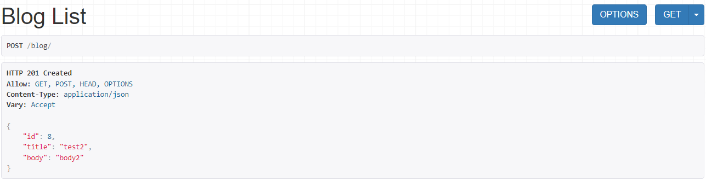
  - Blog 객체를 등록할 수 있는 POST 방식

    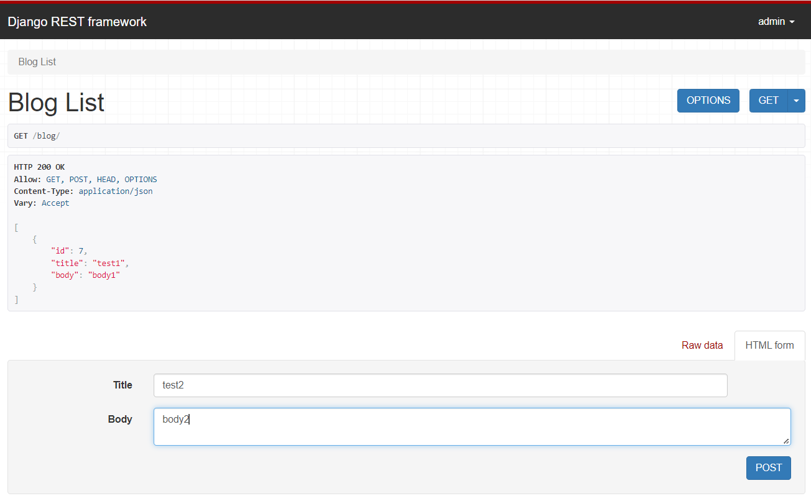

- `http://127.0.0.1:8000/blog/<int:pk>`
  - blog의 detail 정보 확인 (GET)
  - 아래에 PUT을 통해 내용을 수정
  - DELETE를 통해 해당 객체 삭제

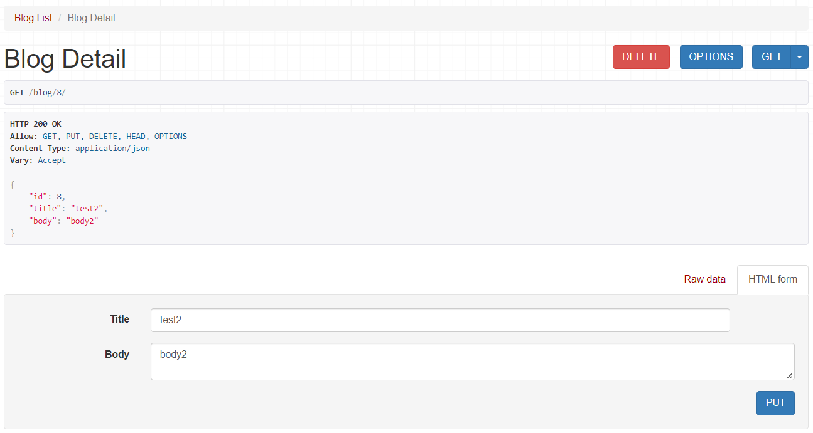

> Mixins를 통해 views.py를 작성하니 APIView를 사용했을 때보다 더 간단하게 CRUD를 구현할 수 있다. 하지만 여전히 def get()을 여러번 사용하는 등 반복되는 코드가 많다. Generic CBV를 사용하여 코드를 더욱 줄일 수 있다.

## Generic CBV
> 상속의 개념을 활용해 코드를 간결하게 할 수 있다.

[DRF Generic CBV 공식문서](https://www.django-rest-framework.org/tutorial/3-class-based-views/#using-generic-class-based-views)

### models.py, serializers.py 코드는 위와 같다.

### views.py
- Generic CBV에서 상속받은 generics.py 코드를 확인해보면 각각의 HTTP method 기능을 하는 클래스가 구현되어 있다.
- Blog 객체의 전체 목록 보기 + 새로운 객체 등록을 위해 `ListCreateAPIView` 클래스와 Blog detail 보기 + 객체 수정 + 객체 삭제를 위해 `RetrieveUpdateDestroyAPIView` 클래스를 상속했다.
- `generics.py`에서 사용한 클래스에서는 `GenericAPIView`를 다시 상속받고 있기 때문에 Generic CBV에서도 queryset과 serializer_class를 별도로 지정했다.
- POST의 기능을 하는 `CreateAPIView`, GET의 기능을 하는 `ListAPIView` 등이 있다.
  -   - [generics.py의 원본 코드](github.com/encode/django-rest-framework/blob/master/rest_framework/generics.py)


```python
from .models import Blog
from .serializers import BlogSerializer
from rest_framework import generics

# Blog의 목록을 보여주는 역할
class BlogList(generics.ListCreateAPIView):
    queryset = Blog.objects.all()
    serializer_class = BlogSerializer

# Blog의 detail을 보여주는 역할
class BlogDetail(generics.RetrieveUpdateDestroyAPIView):
    queryset = Blog.objects.all()
    serializer_class = BlogSerializer
```

### urls.py 코드는 위와 같다.

### 런서버
- `http://127.0.0.1:8000/blog/`
  - blog 페이지 접속
  - Blog 객체를 보여주는 GET 방식

    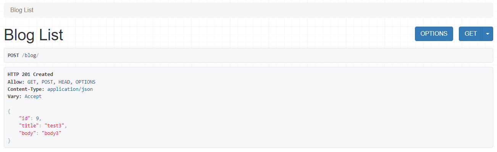
  - Blog 객체를 등록할 수 있는 POST 방식

    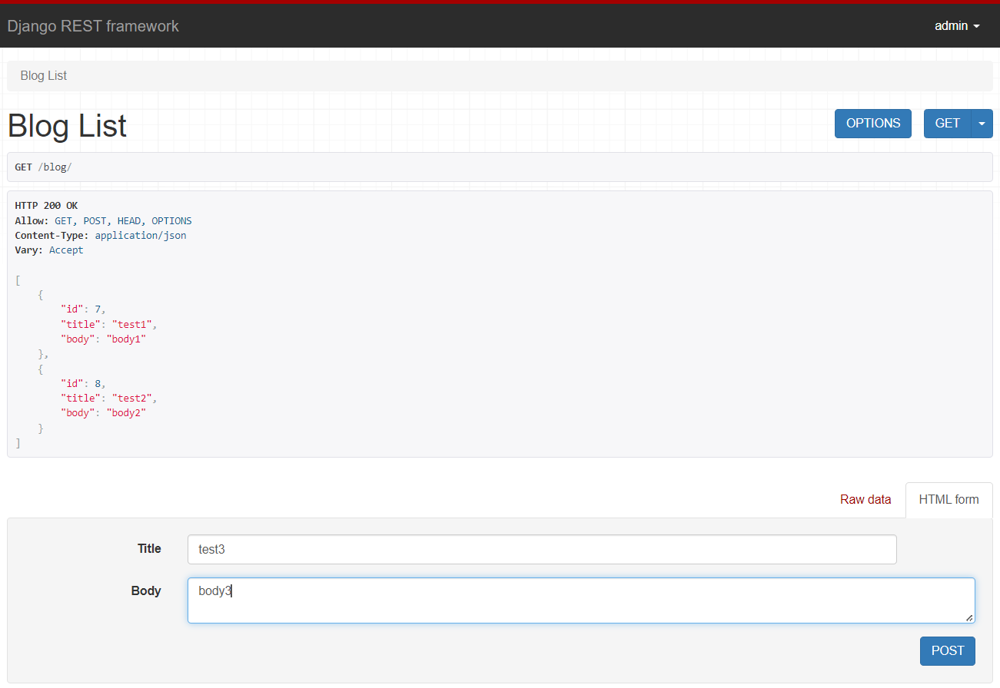

- `http://127.0.0.1:8000/blog/<int:pk>`
  - blog의 detail 정보 확인 (GET)
  - 아래에 PUT을 통해 내용을 수정
  - DELETE를 통해 해당 객체 삭제

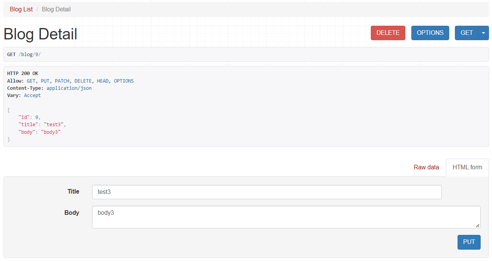

> Generic CBV로 상속 개념을 활용해 불필요한 코드를 줄였다. APIView는 커스터마이징이 용이하기 때문에 필요에 따라 APIView 등을 상속 받아 사용할 수 있다.

## ViewSets
> 상속을 여러번 거쳐서 코드가 매우 간결해졌다.

[DRF ViewSets 공식문서](https://www.django-rest-framework.org/tutorial/6-viewsets-and-routers/)

### models.py, serializers.py 코드는 위와 같다.

### views.py
- 상속 받아 사용한 ModelViewSet 클래스는 Mixins 클래스를 상속받고 있다.
- 상속 받아 사용한 GenericViewSet의 내부를 살펴보면 generics의 GenericAPIView를 상속 받는다.
  - [DRF ViewSets 공식문서](github.com/encode/django-rest-framework/blob/19655edbf782aa1fbdd7f8cd56ff9e0b7786ad3c/rest_framework/viewsets.py)
```python
from .models import Blog
from .serializers import BlogSerializer
from rest_framework import viewsets

# Blog의 목록, detail 보여주기, 수정하기, 삭제하기 모두 가능
class BlogViewSet(viewsets.ModelViewSet):
    queryset = Blog.objects.all()
    serializer_class = BlogSerializer
```

### urls.py
- ViewSet은 하나의 class에 Blog 목록과 detail을 보여주는 기능이 모두 존재한다.
- Blog 목록을 보여주는 url 경우에는 pk 값이 필요 없지만, detail을 보여주기 위해서는 pk 값이 반드시 필요하기 때문에 하나의 path 함수로 표현할 수 없다.
- 서로 다른 path 함수를 하나로 묶어주기 위해 두가지 방법이 존재한다.

#### `as_view()` 함수 활용
- as_view() 함수를 사용하여 mapping 관계를 처리한다.
- 함수의 인자로는 http method와 처리할 함수의 이름을 작성한다.
```python
from django.urls import path
from .views import BlogViewSet

# Blog 목록 보여주기
blog_list = BlogViewSet.as_view({
    'get': 'list',
    'post': 'create'
})

# Blog detail 보여주기 + 수정 + 삭제
blog_detail = BlogViewSet.as_view({
    'get': 'retrieve',
    'put': 'update',
    'delete': 'destroy'
})

urlpatterns =[
    path('blog/', blog_list),
    path('blog/<int:pk>/', blog_detail),
]
```

#### `router` 활용
-  rest framework의 DefaultRouter라는 객체를 생성하여, mapping 하고자 하는 view를 등록한다.
```python
from django.urls import path, include
from .views import BlogViewSet
from rest_framework.routers import DefaultRouter

router = DefaultRouter()
# 첫 번째 인자는 url의 prefix
# 두 번째 인자는 ViewSet
router.register('blog', BlogViewSet)

urlpatterns =[
    path('', include(router.urls))
]
```

### 런서버
- `http://127.0.0.1:8000/blog/`
  - blog 페이지 접속
  - Blog 객체를 보여주는 GET 방식

    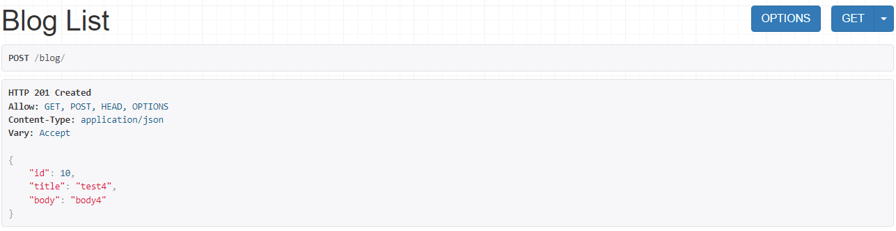
  - Blog 객체를 등록할 수 있는 POST 방식

    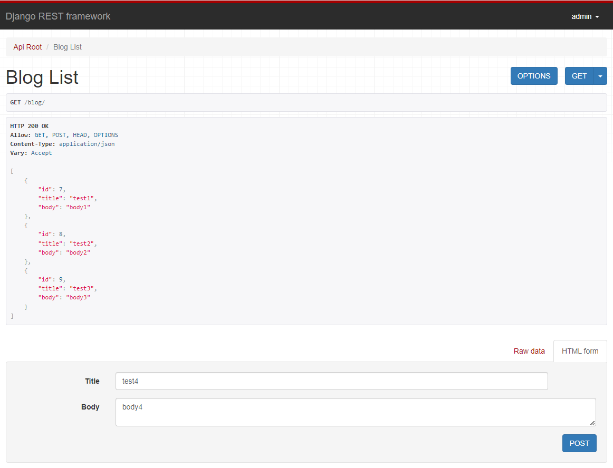

- `http://127.0.0.1:8000/blog/<int:pk>`
  - blog의 detail 정보 확인 (GET)
  - 아래에 PUT을 통해 내용을 수정
  - DELETE를 통해 해당 객체 삭제

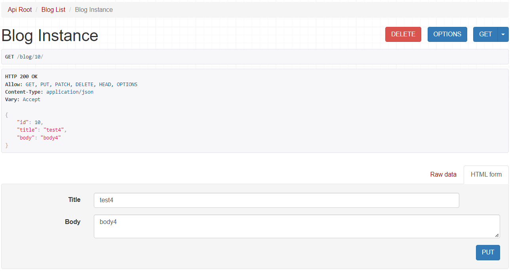

> 다양한 방식을 활용하여 Django REST Framework에서의 CRUD 구현했다. FBV(Function Based View)로 CRUD를 구현하면 코드가 긴 views.py 파일이 필요했었지만 CBV(Class Based View)로 구현하니 상속의 특징을 활용하여 매우 간결하게 CRUD를 구현할 수 있었다.