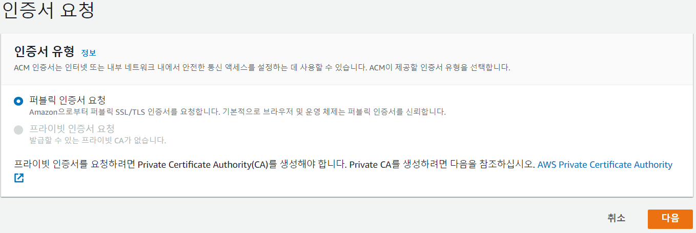

# 프로젝트 drf https
> https 프로토콜을 사용하는 클라이언트에서 http 프로토콜을 사용하는 서버로 요청을 보내니 mixed content 에러가 났다. 이를 해결하기 위해 서버를 https 프로토콜로 변경했다.

## 도메인 구매
- AWS에서 도메인을 얻을 수 있지만 유료이기 때문에 무료 도메인을 사용했다.

[freenom](https://www.freenom.com/en/index.html?lang=en)

## AWS Route53 호스팅 영역 생성
- 발급받은 나의 도메인을 입력하고 외부에서 접근이 가능하도록 퍼블릭 유형으로 설정한다.

- 호스팅 영역이 잘 생성되었다.

## 네임서버 등록
- 위의 NS 유형에 적힌 라우팅 대상 4개를 freenom - Services - My Domains - Management Tools - Nameservers에 등록한다.

## ACM (AWS Cerificate Manager)
> 웹 사이트에서 사용하는 SSL/TLS 인증서를 발급 및 관리해주는 서비스
>
> SSL이란 웹사이트에서 나가고 들어오는 데이터를 암호화하는 기능을 가진 보안 인증서로 클라이언트와 서버 간의 통신을 제 3자가 보증해주는 전자 문서, https를 사용하기 위해서는 SSL 인증이 필수

- 퍼블릭 인증서로 요청한다

- `pjtpjt.tk`와 `*.pjtpjt.tk` 도메인 두개를 등록한다.

- 처음에는 검증 보류가 뜨고 시간이 지나면 발급이 완료된다.

## EB 환경에 SSL 인증서 업데이트
- EB 콘솔로 이동한 후 구성 > 로드밸런서 > 편집으로 들어간 후 리스너를 추가한다.
- 포트 : 443, 프로토콜 : HTTPS, 아까 발급받은 SSL 인증서를 선택한 후 추가하고 편집된 내용을 적용한다.

- eb 환경에 https 포트가 생성되었다.

## Route53 레코드 생성
- 레코드 생성을 누른 후, 빠른 생성으로 전환한다.

- 호스팅 영역 > 레코드 생성해서 레코드 이름은 비운채 레코드 유형 A, 별칭에 체크하면 AWS 서비스에 대해 선택이 가능하다. 트래픽 라우팅 대상은 EB, 리전은 서울, 그리고 EB 환경을 선택한 후 등록한다.

- 같은 방식으로 www를 붙인 레코드도 추가한다.

## 도메인 주소 접속 확인
- 성공적으로 인증이 완료되었다. 이제 https로 프로토콜이 맞춰졌으니 클라이언트와 서버 간 통신이 잘 된다.

## 회고
프론트와 백 서버를 배포한 후에 통신 연결을 하려고 했더니 에러가 나서 당황했다. 프로토콜이 달라서 생긴 문제였는데, https가 http보다 보안적으로 우수하기때문에 https로 통일시켜주기로 했다. 서버를 https 프로토콜로 변경하면서 직접 도메인을 발급받아 나만의 서버가 생긴 것 같아서 뿌듯했다. route53과 acm을 사용하여 SSL 인증을 하는 일은 어려운 일은 아니었지만 중간 단계가 빠져있는 문서가 많아서 시간이 조금 걸렸다. 그래서 내가 완벽한 문서를 만들었다.