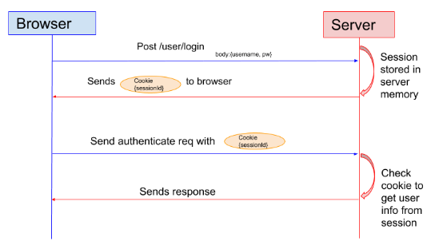
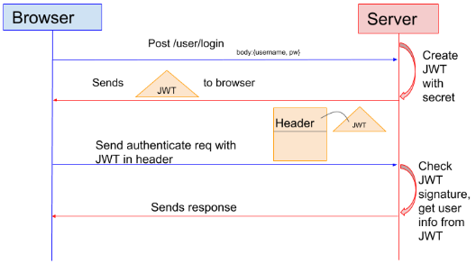
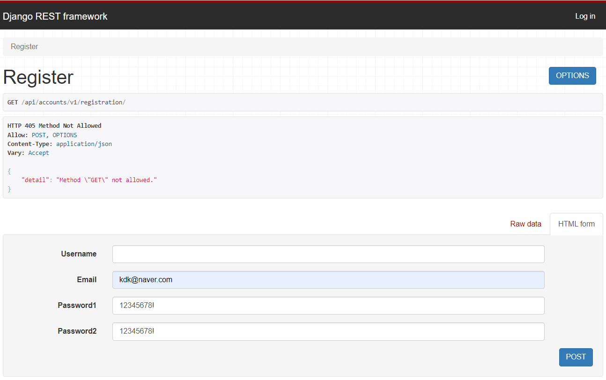
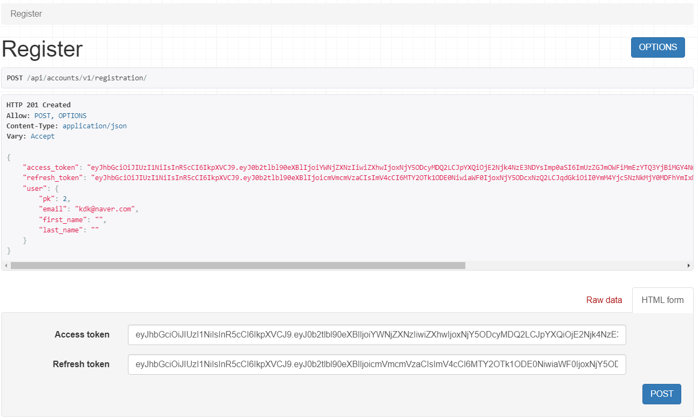
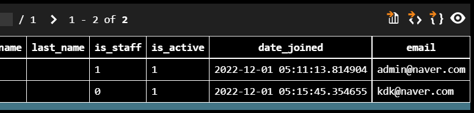
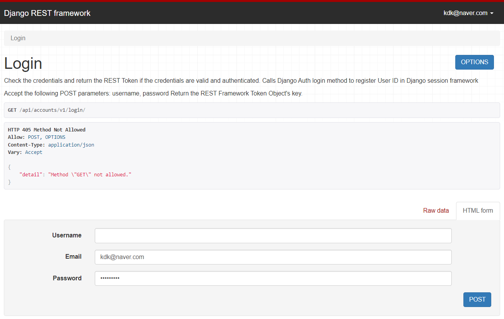
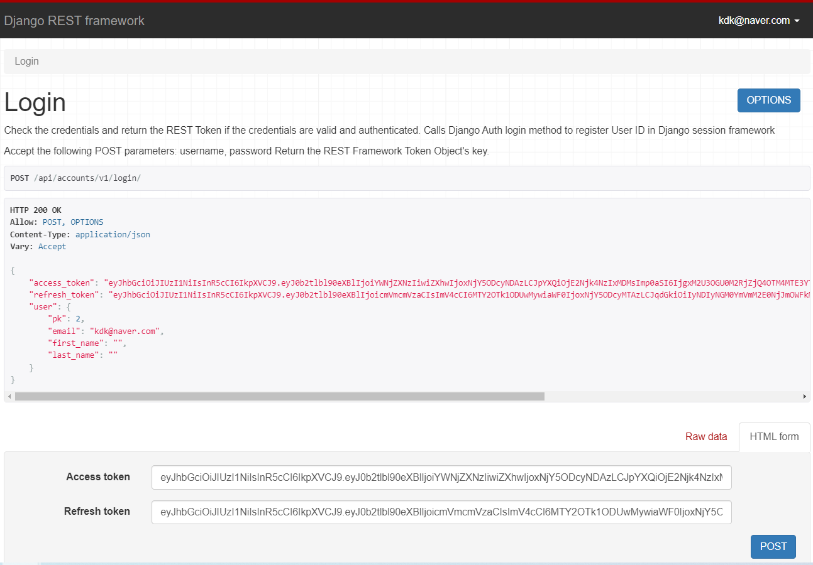

# 프로젝트 drf JWT로 로그인 및 회원가입
> JWT 파헤치기

## Session based authentication
> JWT를 사용하기 전 django로 로그인/회원가입을 진행할 때 session을 이용한 인증이 이루어졌었다.
### Session의 인증 과정


1. 클라이언트에서 사용자의 인증 정보를 서버에 전달한다.
2. 서버는 인증을 처리한 뒤 해당 user에 대해 session을 생성한다.
3. session 정보는 서버에 저장되고, 클라이언트는 session id를 받아 브라우저에 저장한다.
4. 클라이언트는 이후 이루어지는 요청에 session id를 이용한다.
5. 서버는 전달 받은 session id를 이용하여 저장 중인 session 정보로 인증을 처리한다.
6. 만약 session id가 만료되었을 경우에는 1번 과정부터 다시 이루어진다.

- 클라이언트도 브라우저에 session id를 저장하여 사용하지만 session id 자체는 중요한 정보가 담겨있지 않은 일종의 임시 비밀번호이며 실제 session의 정보를 관리하는 것은 전적으로 서버의 역할이다.
### 단점
- 매 요청마다 인증을 위해 스토리지를 탐색해야 하는데, 모든 요청에 인증을 처리하기 위해 불필요한 I/O가 추가된다.


## JWT - Token based authentication
> 유저를 인증하고 식별하기 위한 토큰 기반 인증
>
> 토큰은 서버가 아닌 클라이언트에 저장되어 서버의 부담을 덜 수 있다.
>
> HTTP 헤더에 토큰을 첨부해서 데이터 요청/응답받기 가능

### Session의 인증 과정


1. (session 인증과 마찬가지로) 클라이언트에서 사용자의 인증 정보를 서버에 전달한다.
2. 서버는 인증 정보로 인증을 처리하고 (session 대신) JWT를 생성하여 클라이언트에 전달한다.
3. 클라이언트는 JWT를 브라우저에 저장한다.
4. 클라이언트는 이후 이루어지는 요청에 JWT를 이용한다.
5. 서버는 JWT를 검증하여 인증을 처리한다.
6. JWT가 만료되면 토큰을 refresh 한다.

- session을 사용하면 3번 과정에서 session 정보가 서버에 저장되지만 JWT 인증에서는 서버에 아무것도 저장되지 않는다.
- session을 사용하면 5번 과정에서 session 확인을 위해 데이터 베이스를 탐색하지만, JWT 인증에서는 토큰을 바로 검증한다.

### JWT 구조
**`xxxxx.yyyyy.zzzzz`**
- JWT는 `.`을 이용하여 크게 세 개의 영역으로 구분되고 각각의 영역은 고유의 역할이 있다.

#### Header 영역
- `xxxxx` 부분은 Header 영역이다.
- JWT의 메타 정보를 나타낸다.
- token의 타입을 정의하고(typ), 어떤 signing 알고리즘이 쓰였는지(alg)를 나타낸다.

```json
{
  "typ": "JWT",
  "alg": "HS256"
}
```
- 위의 JSON 정보는 Base64Url로 인코딩 되어 JWT의 첫 번째 영역이 된다.

#### Payload 영역
- `yyyyy` 부분은 Payload로 불리는 영역이다.
- 토큰이 만료되는 시간, 유저의 정보와 같은 실질적인 데이터가 담긴다.

```json
{
  "token_type": "access",
  "exp": 1649145719,
  "jti": "1foo2jwt3id4",
  "user_id": 123
}
```
- 위의 JSON 정보는 Base64Url로 인코딩 되어 JWT의 두 번째 영역이 된다.

#### Signature 영역
- `zzzzz` 부분은 JWT의 핵심인 Signature 영역이다.
- `header + payload` 의 인코딩 값을 합친 후 주어진 시크릿 키로, 해쉬 및 base64 인코딩을 통해 생성된다.
- Payload 영역에 담긴 유저 정보는 인코딩만 되어 있지 별도의 암호화 처리가 되어 있지 않아 누군가에 의해 쉽게 디코딩, 변조 될 수 있다.
- payload에는 유저를 특정할 수 있는 user id만 담았기 때문에 위의 토큰이 디코딩되어 user id가 노출되는 것은 보안상 큰 문제가 되지 않고, 변조의 문제만 해결하면 된다.
- 이러한 토큰의 변조는 signature 영역에서 해결된다.

<hr>

1. Sinature는 인코딩 된 header, payload, secret을 합친 뒤 이를 header에 지정한 알고리즘으로 해싱한다.
2. 이렇게 생성된 JWT는 클라이언트에 전달 되었다가 이후 요청에 HTTP Header에 담겨서 서버로 전달된다.
3. header, payload 그리고 secret을 이용하여 signature를 해싱한 뒤 전달받은 JWT의 signature와 같은지 확인한다.
4. 토큰이 검증되면 서버는 payload에 담긴 유저의 정보를 통해 유저를 특정하고 인증된 유저로 처리한다.

<hr>

- 이러한 일련이 과정때문에 JWT 인증은 별도의 데이터베이스 탐색 없이도 빠르게 유저 인증을 수행할 수 있다.

## 본격적으로 jwt로 로그인/회원가입 기능을 구현하자!
## 회원가입

### 앱 추가
```python
NSTALLED_APPS = [
    'django.contrib.admin',
    'django.contrib.auth',
    'django.contrib.contenttypes',
    'django.contrib.sessions',
    'django.contrib.messages',
    'django.contrib.staticfiles',
    # 새로 추가한 앱
    'accounts',
]
```
### accounts/managers.py 추가
- 일반 유저를 만들때와 슈퍼 유저를 만들떼 함수 작성
```python
from django.contrib.auth.base_user import BaseUserManager
from django.utils.translation import gettext_lazy as _

class UserManager(BaseUserManager):
    def create_user(self, email, password, **extra_fields):
        if not email:
            raise ValueError(_('The Email must be set'))
        email = self.normalize_email(email)
        user = self.model(email=email, **extra_fields)
        user.set_password(password)
        user.save()
        return user

    def create_superuser(self, email, password, **extra_fields):
        extra_fields.setdefault('is_staff', True)
        extra_fields.setdefault('is_superuser', True)
        extra_fields.setdefault('is_active', True)

        if extra_fields.get('is_staff') is not True:
            raise ValueError(_('Superuser must have is_staff=True.'))
        if extra_fields.get('is_superuser') is not True:
            raise ValueError(_('Superuser must have is_superuser=True.'))
        return self.create_user(email, password, **extra_fields)
```

### accounts/models.py 에 Custom User 추가
- Project 중간에 User Model을 건드리기는 매우 힘들기때문에 Custome User를 프로젝트 시작 전에 만들어야한다.
- email로 로그인 및 계정 생성 가능
```python
from django.contrib.auth.models import AbstractUser
from django.db import models
from django.utils.translation import gettext_lazy as _

from .managers import UserManager

class User(AbstractUser):
    username = None
    email = models.EmailField(_('email address'), unique=True)

    USERNAME_FIELD = 'email'
    REQUIRED_FIELDS = []

    objects = UserManager()

    def __str__(self):
        return self.email
```
### api/settings.py 사용할 User 모델 선언
```python
AUTH_USER_MODEL = 'accounts.User'
```
### makemigrations, migrate

## 라이브러리를 활용하여 회원가입 구현하기
- djangorestframework : Django를 rest api 형태로 사용할 수 있도록 도와준다.
- dj-rest-auth : REST API 형태로 제공해주는 로그인, 비밀번호 찾기 등의 기능을 제공한다. django-rest-auth는 업데이트가 종료되어서 해당 라이브러리를 사용한다.
- django-allauth: 회원가입 기능을 제공한다.
- djangorestframework-simplejwt: Django에서 JWT Token을 사용하도록 도와준다.
### 라이브러리 설치
```bash
pip install djangorestframework dj-rest-auth django-allauth djangorestframework-simplejwt
```

### api/settings.py 에 새로 설치한 앱(Package) 추가
```python
INSTALLED_APPS = [
    'django.contrib.admin',
    'django.contrib.auth',
    'django.contrib.contenttypes',
    'django.contrib.sessions',
    'django.contrib.messages',
    'django.contrib.staticfiles',
    # 새로 추가한 앱
    'accounts',
    # 설치한 라이브러리들
    'rest_framework',
    'rest_framework.authtoken',
    'dj_rest_auth',
    'django.contrib.sites',
    'allauth',
    'allauth.account',
    'allauth.socialaccount',
    'dj_rest_auth.registration',
]

REST_USE_JWT = True
JWT_AUTH_COOKIE = 'my-app-auth'
JWT_AUTH_REFRESH_COOKIE = 'my-refresh-token'

SITE_ID = 1
ACCOUNT_UNIQUE_EMAIL = True
ACCOUNT_USER_MODEL_USERNAME_FIELD = None
ACCOUNT_USERNAME_REQUIRED = False
ACCOUNT_EMAIL_REQUIRED = True
ACCOUNT_AUTHENTICATION_METHOD = 'email'
ACCOUNT_EMAIL_VERIFICATION = 'none'
```

#### 변수 목록
- dj-rest-auth
  - REST_USE_JWT: JWT 사용 여부
  - JWT_AUTH_COOKIE: 호출할 Cookie Key값
  - JWT_AUTH_REFRESH_COOKIE: Refresh Token Cookie Key 값 (사용하는 경우)

- django-allauth
  - SITE_ID: 해당 도메인의 id (django_site 테이블의 id, oauth 글에서 다룰 예정)
  - ACCOUNT_UNIQUE_EMAIL: User email unique 사용 여부
  - ACCOUNT_USER_MODEL_USERNAME_FIELD: User username type
  - ACCOUNT_USERNAME_REQUIRED: User username 필수 여부
  - ACCOUNT_EMAIL_REQUIRED: User email 필수 여부
  - ACCOUNT_AUTHENTICATION_METHOD: 로그인 인증 수단
  - ACCOUNT_EMAIL_VERIFICATION: Email 인증 필수 여부

### migrate

### accounts/urls.py 추가
- urls에 회원가입을 할 수 있도록 추가한다.
```python
from django.urls import path, include

urlpatterns = [
    path('registration/', include('dj_rest_auth.registration.urls')),
]
```
### pjt/urls.py 추가
```python
from django.contrib import admin
from django.urls import path, include

urlpatterns = [
    path('admin/', admin.site.urls),
    path('api/accounts/v1/', include('accounts.urls')),
]
```

### 런서버
- `http://127.0.0.1:8000/api/accounts/v1/registration/` 에 접속



- 회원 정보를 post 하면 access_token, refresh_token을 발급해주고 db에도 잘 저장된 것을 볼 수 있다.




## 로그인
### accounts/urls.py
```python
from django.urls import path, include

urlpatterns = [
    path('', include('dj_rest_auth.urls')), # 해당 라인 추가
    path('registration/', include('dj_rest_auth.registration.urls')),
]
```
- 아래의 url 모두 사용 가능
```python
http://localhost:8000/api/accounts/v1/password/reset/
http://localhost:8000/api/accounts/v1/password/reset/confirm/
http://localhost:8000/api/accounts/v1/login/
http://localhost:8000/api/accounts/v1/logout/
http://localhost:8000/api/accounts/v1/user/
http://localhost:8000/api/accounts/v1/password/change/
http://localhost:8000/api/accounts/v1/token/verify/
http://localhost:8000/api/accounts/v1/token/refresh/
```

### 런서버
- `http://127.0.0.1:8000/api/accounts/v1/login/` 에 접속



- 회원 정보를 post 하면 access_token, refresh_token을 발급해주고 db에도 잘 저장된 것을 볼 수 있다.




## 힘들었던 점
라이브러리를 사용하기 전에 simplejwt를 이용한 로그인/회원가입 로직을 직접 구현했지만 refresh 토큰 등의 문제가 있어 라이브러리를 사용하여 구현하는 쪽을 방향을 바꿨다. 이 전에는 모든 로직을 한땀한땀 구현했지만 라이브러리를 사용하니 대부분의 기능이 모두 구현되어 있어서 많은 편리함이 있었다. custom이 힘들다는 단점이 있지만 이번 프로젝트에서는 custom이 필요 없기때문에 쉽게 구현할 수 있었다.

## REFERENCE
- [Django](https://www.djangoproject.com/)
- [Django REST framework](https://www.django-rest-framework.org/)
- [dj-rest-auth](https://dj-rest-auth.readthedocs.io/en/latest/index.html)
- [django-all-auth](https://django-allauth.readthedocs.io/en/latest/)
- [Creating a Custom User Model in Django](https://testdriven.io/blog/django-custom-user-model/)
- [jwt 공식문서](https://jwt.io/introduction)